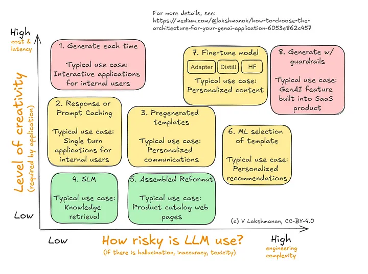
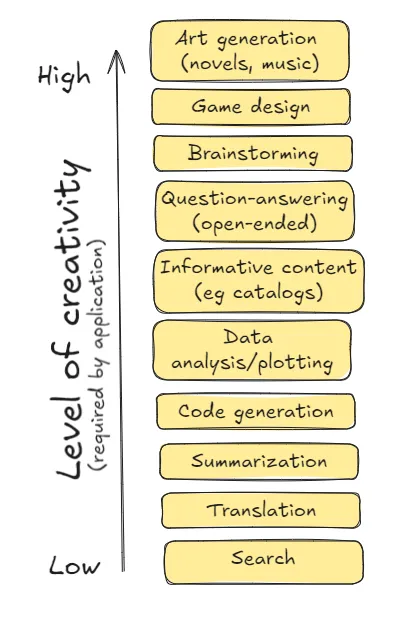
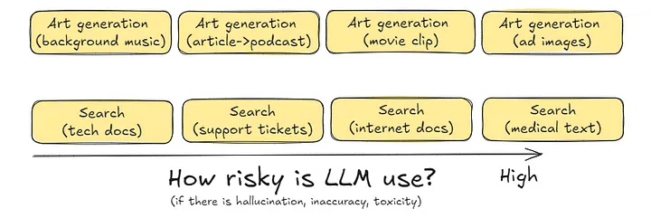

# Architecture Framework

## Links

- [Building LLMs](../large_language_models/llms/building.md)

## References

- [How to Choose the Architecture for Your GenAI Application](https://medium.com/towards-data-science/how-to-choose-the-architecture-for-your-genai-application-6053e862c457)