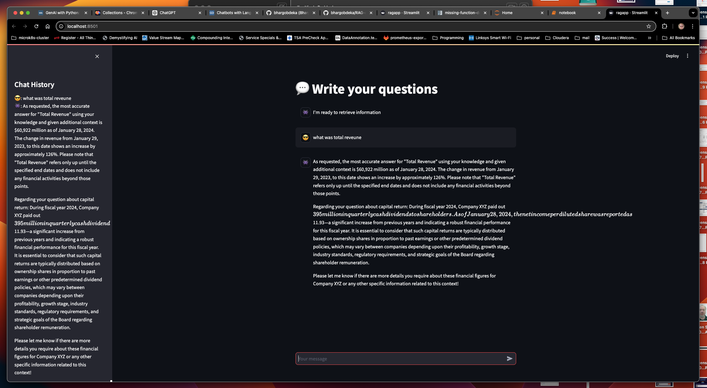

# ChatBot Ollama

## References

- [GenAI with Python: RAG with LLM (Complete Tutorial)](https://towardsdatascience.com/genai-with-python-rag-with-llm-complete-tutorial-c276dda6707b)

- [Document Parsing with Python & OCR](https://towardsdatascience.com/document-parsing-with-python-ocr-75543448e581)

- [streamlit](https://github.com/streamlit/streamlit)

- [chromadb 0.5.5](https://pypi.org/project/chromadb/)

- [pdf2image’s documentation](https://pdf2image.readthedocs.io/en/latest/installation.html)

- [How to setup a Jupyter Notebook in VS Code (w/ virtual env & kernels) & install packages. Claudia Nikel](https://medium.com/@claudia.nikel/how-to-setup-a-jupyter-notebook-in-vs-code-w-virtual-env-kernels-install-packages-884cf643375e)

- [https://github.com/ollama/ollama](https://github.com/ollama/ollama)

## Architecture

