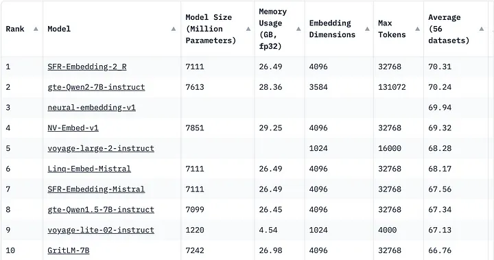

# Selection

## References

- [MTEB](https://huggingface.co/spaces/mteb/leaderboard)

- [Embedding models](https://ollama.com/blog/embedding-models)

- [all-MiniLM-L6-v2](https://huggingface.co/sentence-transformers/all-MiniLM-L6-v2)

- [Unlocking the Power of Embeddings: How to Choose the Best Embedding Model for RAG](https://medium.com/gopenai/unlocking-the-power-of-embeddings-how-to-choose-the-best-embedding-model-for-rag-0d084126d36a)

- [Mastering RAG: How to Select an Embedding Model](https://www.rungalileo.io/blog/mastering-rag-how-to-select-an-embedding-model)

- [Mastering the Art of Embeddings: Choosing the Right Model for Your RAG Architecture](https://medium.com/@eordaxd/mastering-the-art-of-embeddings-choosing-the-right-model-for-your-rag-architecture-38e15a9adcbc)