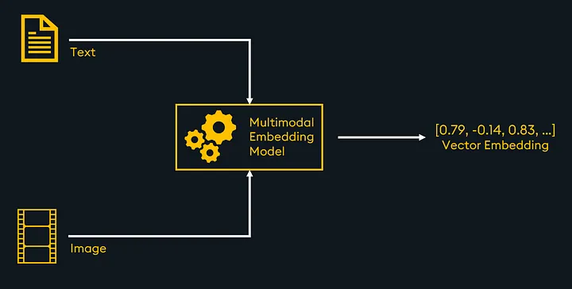

# Using

## Reference

- [[Bug]: Fail: [ONNXRuntimeError] : 1 : FAIL : Non-zero status code returned while running CoreML #2013](https://github.com/chroma-core/chroma/issues/2013)

- [Guide to Multimodal RAG for Images and Text](https://medium.com/kx-systems/guide-to-multimodal-rag-for-images-and-text-10dab36e3117)

- [Sentence Transformers (Part 3)
Vipra Singh
](https://medium.com/@vipra_singh/building-llm-applications-sentence-transformers-part-3-a9e2529f99c1)

- [Semantic search using Sentence-BERT](https://medium.com/@jeremyarancio/semantic-search-using-sequence-bert-2116dabecfa3)

## Architectures (some kinds of embeddings)

Bag of Words (BoW), TF-IDF, Word2Vec, GloVe, FastText, ELMO, BERT,SBERT

## Choosing

- 

- [Boosting RAG: Picking the Best Embedding & Reranker models](https://www.llamaindex.ai/blog/boosting-rag-picking-the-best-embedding-reranker-models-42d079022e83)