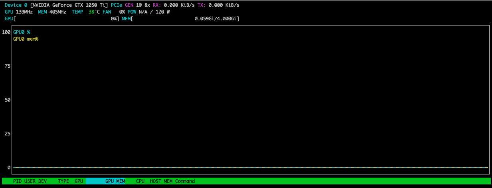

# GPU


## References

- [Run the strongest open-source LLM model: Llama3 70B with just a single 4GB GPU!](https://medium.com/ai-advances/run-the-strongest-open-source-llm-model-llama3-70b-with-just-a-single-4gb-gpu-7e0ea2ad8ba2)

- [How to install the NVIDIA drivers on Ubuntu 22.04](https://linuxconfig.org/how-to-install-the-nvidia-drivers-on-ubuntu-22-04)

- [Calculate : How much GPU Memory you need to serve any LLM ?](https://ksingh7.medium.com/calculate-how-much-gpu-memory-you-need-to-serve-any-llm-67301a844f21)

- [How Much GPU Memory is Needed to Serve a Large Language Model (LLM)?
Mastering LLM (Large Language Model)(https://masteringllm.medium.com/how-much-gpu-memory-is-needed-to-serve-a-large-languagemodel-llm-b1899bb2ab5d)
]

- [GPU Operator with MIG](https://docs.nvidia.com/datacenter/cloud-native/gpu-operator/latest/gpu-operator-mig.html)

- [A Practical Guide to Running NVIDIA GPUs on Kubernetes](https://www.jimangel.io/posts/nvidia-rtx-gpu-kubernetes-setup/)

- [NVIDIA/dcgm-exporter](https://github.com/NVIDIA/dcgm-exporter)

## Example


## Setup

### AMD

#### dbuddenbaum@amd64-03:~$ sudo apt install ubuntu-drivers-common
```
Reading package lists... Done
Building dependency tree... Done
Reading state information... Done
The following additional packages will be installed:
  python3-xkit
Suggested packages:
  python3-aptdaemon.pkcompat
The following NEW packages will be installed:
  python3-xkit ubuntu-drivers-common
0 upgraded, 2 newly installed, 0 to remove and 1 not upgraded.
Need to get 77.2 kB of archives.
After this operation, 415 kB of additional disk space will be used.
Do you want to continue? [Y/n] y
Get:1 http://us.archive.ubuntu.com/ubuntu jammy/main amd64 python3-xkit all 0.5.0ubuntu5 [18.5 kB]
Get:2 http://us.archive.ubuntu.com/ubuntu jammy-updates/main amd64 ubuntu-drivers-common amd64 1:0.9.6.2~0.22.04.6 [58.7 kB]
Fetched 77.2 kB in 1s (133 kB/s)
Preconfiguring packages ...
Selecting previously unselected package python3-xkit.
(Reading database ... 76714 files and directories currently installed.)
Preparing to unpack .../python3-xkit_0.5.0ubuntu5_all.deb ...
Unpacking python3-xkit (0.5.0ubuntu5) ...
Selecting previously unselected package ubuntu-drivers-common.
Preparing to unpack .../ubuntu-drivers-common_1%3a0.9.6.2~0.22.04.6_amd64.deb ...
Unpacking ubuntu-drivers-common (1:0.9.6.2~0.22.04.6) ...
Setting up python3-xkit (0.5.0ubuntu5) ...
Setting up ubuntu-drivers-common (1:0.9.6.2~0.22.04.6) ...
Created symlink /etc/systemd/system/display-manager.service.wants/gpu-manager.service → /lib/systemd/system/gpu-manager.service.
Unit /lib/systemd/system/gpu-manager.service is added as a dependency to a non-existent unit display-manager.service.
Created symlink /etc/systemd/system/oem-config.service.wants/gpu-manager.service → /lib/systemd/system/gpu-manager.service.
Unit /lib/systemd/system/gpu-manager.service is added as a dependency to a non-existent unit oem-config.service.
Scanning processes...
Scanning processor microcode...
Scanning linux images...

Running kernel seems to be up-to-date.

The processor microcode seems to be up-to-date.

No services need to be restarted.

No containers need to be restarted.

No user sessions are running outdated binaries.

No VM guests are running outdated hypervisor (qemu) binaries on this host.
```

#### dbuddenbaum@amd64-03:~$ ubuntu-drivers devices
```
ERROR:root:aplay command not found
== /sys/devices/pci0000:00/0000:00:03.0/0000:01:00.0 ==
modalias : pci:v000010DEd00001C82sv00001458sd00003733bc03sc00i00
vendor   : NVIDIA Corporation
model    : GP107 [GeForce GTX 1050 Ti]
driver   : nvidia-driver-390 - distro non-free
driver   : nvidia-driver-418-server - distro non-free
driver   : nvidia-driver-450-server - distro non-free
driver   : nvidia-driver-470 - distro non-free
driver   : nvidia-driver-535 - distro non-free recommended
driver   : nvidia-driver-545 - distro non-free
driver   : nvidia-driver-535-server - distro non-free
driver   : nvidia-driver-470-server - distro non-free
driver   : xserver-xorg-video-nouveau - distro free builtin
```

#### dbuddenbaum@amd64-03:~$ sudo apt install nvidia-driver-535

````
Reading package lists... Done
Building dependency tree... Done
Reading state information... Done
The following additional packages will be installed:
  adwaita-icon-theme at-spi2-core build-essential cpp-12 dconf-gsettings-backend dconf-service dctrl-tools dkms dpkg-dev fakeroot fontconfig g++ g++-11 gcc gcc-11 gcc-12
  gsettings-desktop-schemas gtk-update-icon-cache hicolor-icon-theme humanity-icon-theme libalgorithm-diff-perl libalgorithm-diff-xs-perl libalgorithm-merge-perl libasan6
  libasan8 libatk-bridge2.0-0 libatk1.0-0 libatk1.0-data libatomic1 libatspi2.0-0 libavahi-client3 libavahi-common-data libavahi-common3 libc-dev-bin libc-devtools libc6-dev
  libcairo-gobject2 libcairo2 libcc1-0 libcolord2 libcrypt-dev libcups2 libdatrie1 libdconf1 libdeflate0 libdpkg-perl libepoxy0 libfakeroot libfile-fcntllock-perl
  libgcc-11-dev libgcc-12-dev libgd3 libgdk-pixbuf-2.0-0 libgdk-pixbuf2.0-bin libgdk-pixbuf2.0-common libgomp1 libgraphite2-3 libgtk-3-0 libgtk-3-bin libgtk-3-common
  libharfbuzz0b libitm1 libjbig0 libjpeg-turbo8 libjpeg8 liblcms2-2 liblsan0 libnsl-dev libnvidia-cfg1-535 libnvidia-common-535 libnvidia-compute-535 libnvidia-decode-535
  libnvidia-encode-535 libnvidia-extra-535 libnvidia-fbc1-535 libnvidia-gl-535 libpango-1.0-0 libpangocairo-1.0-0 libpangoft2-1.0-0 libpixman-1-0 libquadmath0 librsvg2-2
  librsvg2-common libstdc++-11-dev libthai-data libthai0 libtiff5 libtirpc-dev libtsan0 libtsan2 libubsan1 libvdpau1 libwayland-cursor0 libwebp7 libxcb-render0 libxcvt0
  libxdamage1 libxfont2 libxkbcommon0 libxnvctrl0 linux-libc-dev lto-disabled-list make manpages-dev mesa-vdpau-drivers nvidia-compute-utils-535 nvidia-dkms-535
  nvidia-firmware-535-535.183.01 nvidia-kernel-common-535 nvidia-kernel-source-535 nvidia-prime nvidia-settings nvidia-utils-535 pkg-config rpcsvc-proto
  screen-resolution-extra session-migration ubuntu-mono vdpau-driver-all x11-xkb-utils xcvt xfonts-base xfonts-encodings xfonts-utils xserver-common xserver-xorg-core
  xserver-xorg-video-nvidia-535
Suggested packages:
  gcc-12-locales cpp-12-doc debtags menu debian-keyring g++-multilib g++-11-multilib gcc-11-doc gcc-multilib autoconf automake libtool flex bison gdb gcc-doc gcc-11-multilib
  gcc-11-locales gcc-12-multilib gcc-12-doc glibc-doc colord cups-common bzr libgd-tools gvfs liblcms2-utils librsvg2-bin libstdc++-11-doc make-doc libvdpau-va-gl1 xfs
  | xserver xfonts-100dpi | xfonts-75dpi xfonts-scalable
Recommended packages:
  libnvidia-compute-535:i386 libnvidia-decode-535:i386 libnvidia-encode-535:i386 libnvidia-fbc1-535:i386 libnvidia-gl-535:i386
The following NEW packages will be installed:
  adwaita-icon-theme at-spi2-core build-essential cpp-12 dconf-gsettings-backend dconf-service dctrl-tools dkms dpkg-dev fakeroot fontconfig g++ g++-11 gcc gcc-11 gcc-12
  gsettings-desktop-schemas gtk-update-icon-cache hicolor-icon-theme humanity-icon-theme libalgorithm-diff-perl libalgorithm-diff-xs-perl libalgorithm-merge-perl libasan6
  libasan8 libatk-bridge2.0-0 libatk1.0-0 libatk1.0-data libatomic1 libatspi2.0-0 libavahi-client3 libavahi-common-data libavahi-common3 libc-dev-bin libc-devtools libc6-dev
  libcairo-gobject2 libcairo2 libcc1-0 libcolord2 libcrypt-dev libcups2 libdatrie1 libdconf1 libdeflate0 libdpkg-perl libepoxy0 libfakeroot libfile-fcntllock-perl
  libgcc-11-dev libgcc-12-dev libgd3 libgdk-pixbuf-2.0-0 libgdk-pixbuf2.0-bin libgdk-pixbuf2.0-common libgomp1 libgraphite2-3 libgtk-3-0 libgtk-3-bin libgtk-3-common
  libharfbuzz0b libitm1 libjbig0 libjpeg-turbo8 libjpeg8 liblcms2-2 liblsan0 libnsl-dev libnvidia-cfg1-535 libnvidia-common-535 libnvidia-compute-535 libnvidia-decode-535
  libnvidia-encode-535 libnvidia-extra-535 libnvidia-fbc1-535 libnvidia-gl-535 libpango-1.0-0 libpangocairo-1.0-0 libpangoft2-1.0-0 libpixman-1-0 libquadmath0 librsvg2-2
  librsvg2-common libstdc++-11-dev libthai-data libthai0 libtiff5 libtirpc-dev libtsan0 libtsan2 libubsan1 libvdpau1 libwayland-cursor0 libwebp7 libxcb-render0 libxcvt0
  libxdamage1 libxfont2 libxkbcommon0 libxnvctrl0 linux-libc-dev lto-disabled-list make manpages-dev mesa-vdpau-drivers nvidia-compute-utils-535 nvidia-dkms-535
  nvidia-driver-535 nvidia-firmware-535-535.183.01 nvidia-kernel-common-535 nvidia-kernel-source-535 nvidia-prime nvidia-settings nvidia-utils-535 pkg-config rpcsvc-proto
  screen-resolution-extra session-migration ubuntu-mono vdpau-driver-all x11-xkb-utils xcvt xfonts-base xfonts-encodings xfonts-utils xserver-common xserver-xorg-core
  xserver-xorg-video-nvidia-535
0 upgraded, 128 newly installed, 0 to remove and 1 not upgraded.
Need to get 446 MB of archives.
After this operation, 1,217 MB of additional disk space will be used.
Do you want to continue? [Y/n] y
Get:1 http://us.archive.ubuntu.com/ubuntu jammy-updates/main amd64 libcc1-0 amd64 12.3.0-1ubuntu1~22.04 [48.3 kB]
Get:2 http://us.archive.ubuntu.com/ubuntu jammy-updates/main amd64 libgomp1 amd64 12.3.0-1ubuntu1~22.04 [126 kB]
Get:3 http://us.archive.ubuntu.com/ubuntu jammy-updates/main amd64 libitm1 amd64 12.3.0-1ubuntu1~22.04 [30.2 kB]
Get:4 http://us.archive.ubuntu.com/ubuntu jammy-updates/main amd64 libatomic1 amd64 12.3.0-1ubuntu1~22.04 [10.4 kB]
Get:5 http://us.archive.ubuntu.com/ubuntu jammy-updates/main amd64 libasan6 amd64 11.4.0-1ubuntu1~22.04 [2,282 kB]
Get:6 http://us.archive.ubuntu.com/ubuntu jammy-updates/main amd64 liblsan0 amd64 12.3.0-1ubuntu1~22.04 [1,069 kB]
Get:7 http://us.archive.ubuntu.com/ubuntu jammy-updates/main amd64 libtsan0 amd64 11.4.0-1ubuntu1~22.04 [2,260 kB]
Get:8 http://us.archive.ubuntu.com/ubuntu jammy-updates/main amd64 libubsan1 amd64 12.3.0-1ubuntu1~22.04 [976 kB]
Get:9 http://us.archive.ubuntu.com/ubuntu jammy-updates/main amd64 libquadmath0 amd64 12.3.0-1ubuntu1~22.04 [154 kB]
Get:10 http://us.archive.ubuntu.com/ubuntu jammy-updates/main amd64 libgcc-11-dev amd64 11.4.0-1ubuntu1~22.04 [2,517 kB]
Get:11 http://us.archive.ubuntu.com/ubuntu jammy-updates/main amd64 gcc-11 amd64 11.4.0-1ubuntu1~22.04 [20.1 MB]
Get:12 http://us.archive.ubuntu.com/ubuntu jammy/main amd64 gcc amd64 4:11.2.0-1ubuntu1 [5,112 B]
Get:13 http://us.archive.ubuntu.com/ubuntu jammy-updates/main amd64 cpp-12 amd64 12.3.0-1ubuntu1~22.04 [10.8 MB]
Get:14 http://us.archive.ubuntu.com/ubuntu jammy-updates/main amd64 libasan8 amd64 12.3.0-1ubuntu1~22.04 [2,442 kB]
Get:15 http://us.archive.ubuntu.com/ubuntu jammy-updates/main amd64 libtsan2 amd64 12.3.0-1ubuntu1~22.04 [2,477 kB]
Get:16 http://us.archive.ubuntu.com/ubuntu jammy-updates/main amd64 libgcc-12-dev amd64 12.3.0-1ubuntu1~22.04 [2,618 kB]
Get:17 http://us.archive.ubuntu.com/ubuntu jammy-updates/main amd64 gcc-12 amd64 12.3.0-1ubuntu1~22.04 [21.7 MB]
Get:18 http://us.archive.ubuntu.com/ubuntu jammy-updates/main amd64 libdpkg-perl all 1.21.1ubuntu2.3 [237 kB]
Get:19 http://us.archive.ubuntu.com/ubuntu jammy/main amd64 make amd64 4.3-4.1build1 [180 kB]
Get:20 http://us.archive.ubuntu.com/ubuntu jammy/main amd64 lto-disabled-list all 24 [12.5 kB]
Get:21 http://us.archive.ubuntu.com/ubuntu jammy-updates/main amd64 dpkg-dev all 1.21.1ubuntu2.3 [922 kB]
Get:22 http://us.archive.ubuntu.com/ubuntu jammy-updates/main amd64 libc-dev-bin amd64 2.35-0ubuntu3.8 [20.3 kB]
Get:23 http://us.archive.ubuntu.com/ubuntu jammy-updates/main amd64 linux-libc-dev amd64 5.15.0-118.128 [1,342 kB]
Get:24 http://us.archive.ubuntu.com/ubuntu jammy/main amd64 libcrypt-dev amd64 1:4.4.27-1 [112 kB]
Get:25 http://us.archive.ubuntu.com/ubuntu jammy/main amd64 rpcsvc-proto amd64 1.4.2-0ubuntu6 [68.5 kB]
Get:26 http://us.archive.ubuntu.com/ubuntu jammy-updates/main amd64 libtirpc-dev amd64 1.3.2-2ubuntu0.1 [192 kB]
Get:27 http://us.archive.ubuntu.com/ubuntu jammy/main amd64 libnsl-dev amd64 1.3.0-2build2 [71.3 kB]
Get:28 http://us.archive.ubuntu.com/ubuntu jammy-updates/main amd64 libc6-dev amd64 2.35-0ubuntu3.8 [2,100 kB]
Get:29 http://us.archive.ubuntu.com/ubuntu jammy-updates/main amd64 libstdc++-11-dev amd64 11.4.0-1ubuntu1~22.04 [2,101 kB]
Get:30 http://us.archive.ubuntu.com/ubuntu jammy-updates/main amd64 g++-11 amd64 11.4.0-1ubuntu1~22.04 [11.4 MB]
Get:31 http://us.archive.ubuntu.com/ubuntu jammy/main amd64 g++ amd64 4:11.2.0-1ubuntu1 [1,412 B]
Get:32 http://us.archive.ubuntu.com/ubuntu jammy/main amd64 build-essential amd64 12.9ubuntu3 [4,744 B]
Get:33 http://us.archive.ubuntu.com/ubuntu jammy/main amd64 dctrl-tools amd64 2.24-3build2 [66.9 kB]
Get:34 http://us.archive.ubuntu.com/ubuntu jammy-updates/main amd64 dkms all 2.8.7-2ubuntu2.2 [70.1 kB]
Get:35 http://us.archive.ubuntu.com/ubuntu jammy/main amd64 hicolor-icon-theme all 0.17-2 [9,976 B]
Get:36 http://us.archive.ubuntu.com/ubuntu jammy-updates/main amd64 libgdk-pixbuf2.0-common all 2.42.8+dfsg-1ubuntu0.3 [5,630 B]
Get:37 http://us.archive.ubuntu.com/ubuntu jammy/main amd64 libjpeg-turbo8 amd64 2.1.2-0ubuntu1 [134 kB]
Get:38 http://us.archive.ubuntu.com/ubuntu jammy/main amd64 libjpeg8 amd64 8c-2ubuntu10 [2,264 B]
Get:39 http://us.archive.ubuntu.com/ubuntu jammy/main amd64 libdeflate0 amd64 1.10-2 [70.9 kB]
Get:40 http://us.archive.ubuntu.com/ubuntu jammy-updates/main amd64 libjbig0 amd64 2.1-3.1ubuntu0.22.04.1 [29.2 kB]
Get:41 http://us.archive.ubuntu.com/ubuntu jammy-updates/main amd64 libwebp7 amd64 1.2.2-2ubuntu0.22.04.2 [206 kB]
Get:42 http://us.archive.ubuntu.com/ubuntu jammy-updates/main amd64 libtiff5 amd64 4.3.0-6ubuntu0.9 [185 kB]
Get:43 http://us.archive.ubuntu.com/ubuntu jammy-updates/main amd64 libgdk-pixbuf-2.0-0 amd64 2.42.8+dfsg-1ubuntu0.3 [148 kB]
Get:44 http://us.archive.ubuntu.com/ubuntu jammy-updates/main amd64 gtk-update-icon-cache amd64 3.24.33-1ubuntu2.2 [31.4 kB]
Get:45 http://us.archive.ubuntu.com/ubuntu jammy/main amd64 humanity-icon-theme all 0.6.16 [1,282 kB]
Get:46 http://us.archive.ubuntu.com/ubuntu jammy/main amd64 ubuntu-mono all 20.10-0ubuntu2 [153 kB]
Get:47 http://us.archive.ubuntu.com/ubuntu jammy/main amd64 adwaita-icon-theme all 41.0-1ubuntu1 [3,444 kB]
Get:48 http://us.archive.ubuntu.com/ubuntu jammy/main amd64 libatspi2.0-0 amd64 2.44.0-3 [80.9 kB]
Get:49 http://us.archive.ubuntu.com/ubuntu jammy/main amd64 libdconf1 amd64 0.40.0-3 [40.5 kB]
Get:50 http://us.archive.ubuntu.com/ubuntu jammy/main amd64 dconf-service amd64 0.40.0-3 [28.5 kB]
Get:51 http://us.archive.ubuntu.com/ubuntu jammy/main amd64 dconf-gsettings-backend amd64 0.40.0-3 [22.8 kB]
Get:52 http://us.archive.ubuntu.com/ubuntu jammy/main amd64 session-migration amd64 0.3.6 [9,774 B]
Get:53 http://us.archive.ubuntu.com/ubuntu jammy/main amd64 gsettings-desktop-schemas all 42.0-1ubuntu1 [31.1 kB]
Get:54 http://us.archive.ubuntu.com/ubuntu jammy/main amd64 at-spi2-core amd64 2.44.0-3 [54.4 kB]
Get:55 http://us.archive.ubuntu.com/ubuntu jammy/main amd64 libfakeroot amd64 1.28-1ubuntu1 [31.5 kB]
Get:56 http://us.archive.ubuntu.com/ubuntu jammy/main amd64 fakeroot amd64 1.28-1ubuntu1 [60.4 kB]
Get:57 http://us.archive.ubuntu.com/ubuntu jammy/main amd64 fontconfig amd64 2.13.1-4.2ubuntu5 [177 kB]
Get:58 http://us.archive.ubuntu.com/ubuntu jammy/main amd64 libalgorithm-diff-perl all 1.201-1 [41.8 kB]
Get:59 http://us.archive.ubuntu.com/ubuntu jammy/main amd64 libalgorithm-diff-xs-perl amd64 0.04-6build3 [11.9 kB]
Get:60 http://us.archive.ubuntu.com/ubuntu jammy/main amd64 libalgorithm-merge-perl all 0.08-3 [12.0 kB]
Get:61 http://us.archive.ubuntu.com/ubuntu jammy/main amd64 libatk1.0-data all 2.36.0-3build1 [2,824 B]
Get:62 http://us.archive.ubuntu.com/ubuntu jammy/main amd64 libatk1.0-0 amd64 2.36.0-3build1 [51.9 kB]
Get:63 http://us.archive.ubuntu.com/ubuntu jammy/main amd64 libatk-bridge2.0-0 amd64 2.38.0-3 [66.6 kB]
Get:64 http://us.archive.ubuntu.com/ubuntu jammy-updates/main amd64 libavahi-common-data amd64 0.8-5ubuntu5.2 [23.8 kB]
Get:65 http://us.archive.ubuntu.com/ubuntu jammy-updates/main amd64 libavahi-common3 amd64 0.8-5ubuntu5.2 [23.9 kB]
Get:66 http://us.archive.ubuntu.com/ubuntu jammy-updates/main amd64 libavahi-client3 amd64 0.8-5ubuntu5.2 [28.0 kB]
Get:67 http://us.archive.ubuntu.com/ubuntu jammy/main amd64 libgd3 amd64 2.3.0-2ubuntu2 [129 kB]
Get:68 http://us.archive.ubuntu.com/ubuntu jammy-updates/main amd64 libc-devtools amd64 2.35-0ubuntu3.8 [28.9 kB]
Get:69 http://us.archive.ubuntu.com/ubuntu jammy-updates/main amd64 libpixman-1-0 amd64 0.40.0-1ubuntu0.22.04.1 [264 kB]
Get:70 http://us.archive.ubuntu.com/ubuntu jammy/main amd64 libxcb-render0 amd64 1.14-3ubuntu3 [16.4 kB]
Get:71 http://us.archive.ubuntu.com/ubuntu jammy/main amd64 libcairo2 amd64 1.16.0-5ubuntu2 [628 kB]
Get:72 http://us.archive.ubuntu.com/ubuntu jammy/main amd64 libcairo-gobject2 amd64 1.16.0-5ubuntu2 [19.4 kB]
Get:73 http://us.archive.ubuntu.com/ubuntu jammy/main amd64 liblcms2-2 amd64 2.12~rc1-2build2 [159 kB]
Get:74 http://us.archive.ubuntu.com/ubuntu jammy/main amd64 libcolord2 amd64 1.4.6-1 [155 kB]
Get:75 http://us.archive.ubuntu.com/ubuntu jammy-updates/main amd64 libcups2 amd64 2.4.1op1-1ubuntu4.10 [263 kB]
Get:76 http://us.archive.ubuntu.com/ubuntu jammy/main amd64 libdatrie1 amd64 0.2.13-2 [19.9 kB]
Get:77 http://us.archive.ubuntu.com/ubuntu jammy/main amd64 libepoxy0 amd64 1.5.10-1 [237 kB]
Get:78 http://us.archive.ubuntu.com/ubuntu jammy/main amd64 libfile-fcntllock-perl amd64 0.22-3build7 [33.9 kB]
Get:79 http://us.archive.ubuntu.com/ubuntu jammy-updates/main amd64 libgdk-pixbuf2.0-bin amd64 2.42.8+dfsg-1ubuntu0.3 [14.2 kB]
Get:80 http://us.archive.ubuntu.com/ubuntu jammy/main amd64 libgraphite2-3 amd64 1.3.14-1build2 [71.3 kB]
Get:81 http://us.archive.ubuntu.com/ubuntu jammy-updates/main amd64 libharfbuzz0b amd64 2.7.4-1ubuntu3.1 [352 kB]
Get:82 http://us.archive.ubuntu.com/ubuntu jammy/main amd64 libthai-data all 0.1.29-1build1 [162 kB]
Get:83 http://us.archive.ubuntu.com/ubuntu jammy/main amd64 libthai0 amd64 0.1.29-1build1 [19.2 kB]
Get:84 http://us.archive.ubuntu.com/ubuntu jammy-updates/main amd64 libpango-1.0-0 amd64 1.50.6+ds-2ubuntu1 [230 kB]
Get:85 http://us.archive.ubuntu.com/ubuntu jammy-updates/main amd64 libpangoft2-1.0-0 amd64 1.50.6+ds-2ubuntu1 [54.0 kB]
Get:86 http://us.archive.ubuntu.com/ubuntu jammy-updates/main amd64 libpangocairo-1.0-0 amd64 1.50.6+ds-2ubuntu1 [39.8 kB]
Get:87 http://us.archive.ubuntu.com/ubuntu jammy-updates/main amd64 libwayland-cursor0 amd64 1.20.0-1ubuntu0.1 [10.7 kB]
Get:88 http://us.archive.ubuntu.com/ubuntu jammy/main amd64 libxdamage1 amd64 1:1.1.5-2build2 [7,154 B]
Get:89 http://us.archive.ubuntu.com/ubuntu jammy/main amd64 libxkbcommon0 amd64 1.4.0-1 [125 kB]
Get:90 http://us.archive.ubuntu.com/ubuntu jammy-updates/main amd64 libgtk-3-common all 3.24.33-1ubuntu2.2 [239 kB]
Get:91 http://us.archive.ubuntu.com/ubuntu jammy-updates/main amd64 libgtk-3-0 amd64 3.24.33-1ubuntu2.2 [3,053 kB]
Get:92 http://us.archive.ubuntu.com/ubuntu jammy-updates/main amd64 libgtk-3-bin amd64 3.24.33-1ubuntu2.2 [69.6 kB]
Get:93 http://us.archive.ubuntu.com/ubuntu jammy-updates/restricted amd64 libnvidia-cfg1-535 amd64 535.183.01-0ubuntu0.22.04.1 [110 kB]
Get:94 http://us.archive.ubuntu.com/ubuntu jammy-updates/restricted amd64 libnvidia-common-535 all 535.183.01-0ubuntu0.22.04.1 [15.8 kB]
Get:95 http://us.archive.ubuntu.com/ubuntu jammy-updates/restricted amd64 libnvidia-compute-535 amd64 535.183.01-0ubuntu0.22.04.1 [40.7 MB]
Get:96 http://us.archive.ubuntu.com/ubuntu jammy-updates/restricted amd64 libnvidia-decode-535 amd64 535.183.01-0ubuntu0.22.04.1 [1,893 kB]
Get:97 http://us.archive.ubuntu.com/ubuntu jammy-updates/restricted amd64 libnvidia-encode-535 amd64 535.183.01-0ubuntu0.22.04.1 [98.3 kB]
Get:98 http://us.archive.ubuntu.com/ubuntu jammy-updates/restricted amd64 libnvidia-extra-535 amd64 535.183.01-0ubuntu0.22.04.1 [72.7 kB]
Get:99 http://us.archive.ubuntu.com/ubuntu jammy-updates/restricted amd64 libnvidia-fbc1-535 amd64 535.183.01-0ubuntu0.22.04.1 [56.2 kB]
Get:100 http://us.archive.ubuntu.com/ubuntu jammy-updates/restricted amd64 libnvidia-gl-535 amd64 535.183.01-0ubuntu0.22.04.1 [195 MB]
Get:101 http://us.archive.ubuntu.com/ubuntu jammy-updates/main amd64 librsvg2-2 amd64 2.52.5+dfsg-3ubuntu0.2 [2,974 kB]
Get:102 http://us.archive.ubuntu.com/ubuntu jammy-updates/main amd64 librsvg2-common amd64 2.52.5+dfsg-3ubuntu0.2 [17.7 kB]
Get:103 http://us.archive.ubuntu.com/ubuntu jammy/main amd64 libvdpau1 amd64 1.4-3build2 [27.0 kB]
Get:104 http://us.archive.ubuntu.com/ubuntu jammy/main amd64 libxcvt0 amd64 0.1.1-3 [5,494 B]
Get:105 http://us.archive.ubuntu.com/ubuntu jammy/main amd64 libxfont2 amd64 1:2.0.5-1build1 [94.5 kB]
Get:106 http://us.archive.ubuntu.com/ubuntu jammy/main amd64 libxnvctrl0 amd64 510.47.03-0ubuntu1 [11.5 kB]
Get:107 http://us.archive.ubuntu.com/ubuntu jammy/main amd64 manpages-dev all 5.10-1ubuntu1 [2,309 kB]
Get:108 http://us.archive.ubuntu.com/ubuntu jammy-updates/main amd64 mesa-vdpau-drivers amd64 23.2.1-1ubuntu3.1~22.04.2 [3,820 kB]
Get:109 http://us.archive.ubuntu.com/ubuntu jammy-updates/restricted amd64 nvidia-compute-utils-535 amd64 535.183.01-0ubuntu0.22.04.1 [124 kB]
Get:110 http://us.archive.ubuntu.com/ubuntu jammy-updates/restricted amd64 nvidia-kernel-source-535 amd64 535.183.01-0ubuntu0.22.04.1 [45.2 MB]
Get:111 http://us.archive.ubuntu.com/ubuntu jammy-updates/restricted amd64 nvidia-firmware-535-535.183.01 amd64 535.183.01-0ubuntu0.22.04.1 [39.6 MB]
Get:112 http://us.archive.ubuntu.com/ubuntu jammy-updates/restricted amd64 nvidia-kernel-common-535 amd64 535.183.01-0ubuntu0.22.04.1 [211 kB]
Get:113 http://us.archive.ubuntu.com/ubuntu jammy-updates/restricted amd64 nvidia-dkms-535 amd64 535.183.01-0ubuntu0.22.04.1 [36.1 kB]
Get:114 http://us.archive.ubuntu.com/ubuntu jammy-updates/restricted amd64 nvidia-utils-535 amd64 535.183.01-0ubuntu0.22.04.1 [415 kB]
Get:115 http://us.archive.ubuntu.com/ubuntu jammy/main amd64 x11-xkb-utils amd64 7.7+5build4 [172 kB]
Get:116 http://us.archive.ubuntu.com/ubuntu jammy-updates/main amd64 xserver-common all 2:21.1.4-2ubuntu1.7~22.04.11 [28.6 kB]
Get:117 http://us.archive.ubuntu.com/ubuntu jammy-updates/main amd64 xserver-xorg-core amd64 2:21.1.4-2ubuntu1.7~22.04.11 [1,477 kB]
Get:118 http://us.archive.ubuntu.com/ubuntu jammy-updates/restricted amd64 xserver-xorg-video-nvidia-535 amd64 535.183.01-0ubuntu0.22.04.1 [1,599 kB]
Get:119 http://us.archive.ubuntu.com/ubuntu jammy-updates/restricted amd64 nvidia-driver-535 amd64 535.183.01-0ubuntu0.22.04.1 [488 kB]
Get:120 http://us.archive.ubuntu.com/ubuntu jammy/main amd64 nvidia-prime all 0.8.17.1 [9,956 B]
Get:121 http://us.archive.ubuntu.com/ubuntu jammy/main amd64 pkg-config amd64 0.29.2-1ubuntu3 [48.2 kB]
Get:122 http://us.archive.ubuntu.com/ubuntu jammy/main amd64 screen-resolution-extra all 0.18.2 [4,396 B]
Get:123 http://us.archive.ubuntu.com/ubuntu jammy/main amd64 nvidia-settings amd64 510.47.03-0ubuntu1 [960 kB]
Get:124 http://us.archive.ubuntu.com/ubuntu jammy/main amd64 vdpau-driver-all amd64 1.4-3build2 [4,510 B]
Get:125 http://us.archive.ubuntu.com/ubuntu jammy/main amd64 xcvt amd64 0.1.1-3 [7,140 B]
Get:126 http://us.archive.ubuntu.com/ubuntu jammy/main amd64 xfonts-encodings all 1:1.0.5-0ubuntu2 [578 kB]
Get:127 http://us.archive.ubuntu.com/ubuntu jammy/main amd64 xfonts-utils amd64 1:7.7+6build2 [94.6 kB]
Get:128 http://us.archive.ubuntu.com/ubuntu jammy/main amd64 xfonts-base all 1:1.0.5 [5,896 kB]
Fetched 446 MB in 42s (10.7 MB/s)
Extracting templates from packages: 100%
Selecting previously unselected package libcc1-0:amd64.
(Reading database ... 76768 files and directories currently installed.)
Preparing to unpack .../000-libcc1-0_12.3.0-1ubuntu1~22.04_amd64.deb ...
Unpacking libcc1-0:amd64 (12.3.0-1ubuntu1~22.04) ...
Selecting previously unselected package libgomp1:amd64.
Preparing to unpack .../001-libgomp1_12.3.0-1ubuntu1~22.04_amd64.deb ...
Unpacking libgomp1:amd64 (12.3.0-1ubuntu1~22.04) ...
Selecting previously unselected package libitm1:amd64.
Preparing to unpack .../002-libitm1_12.3.0-1ubuntu1~22.04_amd64.deb ...
Unpacking libitm1:amd64 (12.3.0-1ubuntu1~22.04) ...
Selecting previously unselected package libatomic1:amd64.
Preparing to unpack .../003-libatomic1_12.3.0-1ubuntu1~22.04_amd64.deb ...
Unpacking libatomic1:amd64 (12.3.0-1ubuntu1~22.04) ...
Selecting previously unselected package libasan6:amd64.
Preparing to unpack .../004-libasan6_11.4.0-1ubuntu1~22.04_amd64.deb ...
Unpacking libasan6:amd64 (11.4.0-1ubuntu1~22.04) ...
Selecting previously unselected package liblsan0:amd64.
Preparing to unpack .../005-liblsan0_12.3.0-1ubuntu1~22.04_amd64.deb ...
Unpacking liblsan0:amd64 (12.3.0-1ubuntu1~22.04) ...
Selecting previously unselected package libtsan0:amd64.
Preparing to unpack .../006-libtsan0_11.4.0-1ubuntu1~22.04_amd64.deb ...
Unpacking libtsan0:amd64 (11.4.0-1ubuntu1~22.04) ...
Selecting previously unselected package libubsan1:amd64.
Preparing to unpack .../007-libubsan1_12.3.0-1ubuntu1~22.04_amd64.deb ...
Unpacking libubsan1:amd64 (12.3.0-1ubuntu1~22.04) ...
Selecting previously unselected package libquadmath0:amd64.
Preparing to unpack .../008-libquadmath0_12.3.0-1ubuntu1~22.04_amd64.deb ...
Unpacking libquadmath0:amd64 (12.3.0-1ubuntu1~22.04) ...
Selecting previously unselected package libgcc-11-dev:amd64.
Preparing to unpack .../009-libgcc-11-dev_11.4.0-1ubuntu1~22.04_amd64.deb ...
Unpacking libgcc-11-dev:amd64 (11.4.0-1ubuntu1~22.04) ...
Selecting previously unselected package gcc-11.
Preparing to unpack .../010-gcc-11_11.4.0-1ubuntu1~22.04_amd64.deb ...
Unpacking gcc-11 (11.4.0-1ubuntu1~22.04) ...
Selecting previously unselected package gcc.
Preparing to unpack .../011-gcc_4%3a11.2.0-1ubuntu1_amd64.deb ...
Unpacking gcc (4:11.2.0-1ubuntu1) ...
Selecting previously unselected package cpp-12.
Preparing to unpack .../012-cpp-12_12.3.0-1ubuntu1~22.04_amd64.deb ...
Unpacking cpp-12 (12.3.0-1ubuntu1~22.04) ...
Selecting previously unselected package libasan8:amd64.
Preparing to unpack .../013-libasan8_12.3.0-1ubuntu1~22.04_amd64.deb ...
Unpacking libasan8:amd64 (12.3.0-1ubuntu1~22.04) ...
Selecting previously unselected package libtsan2:amd64.
Preparing to unpack .../014-libtsan2_12.3.0-1ubuntu1~22.04_amd64.deb ...
Unpacking libtsan2:amd64 (12.3.0-1ubuntu1~22.04) ...
Selecting previously unselected package libgcc-12-dev:amd64.
Preparing to unpack .../015-libgcc-12-dev_12.3.0-1ubuntu1~22.04_amd64.deb ...
Unpacking libgcc-12-dev:amd64 (12.3.0-1ubuntu1~22.04) ...
Selecting previously unselected package gcc-12.
Preparing to unpack .../016-gcc-12_12.3.0-1ubuntu1~22.04_amd64.deb ...
Unpacking gcc-12 (12.3.0-1ubuntu1~22.04) ...
Selecting previously unselected package libdpkg-perl.
Preparing to unpack .../017-libdpkg-perl_1.21.1ubuntu2.3_all.deb ...
Unpacking libdpkg-perl (1.21.1ubuntu2.3) ...
Selecting previously unselected package make.
Preparing to unpack .../018-make_4.3-4.1build1_amd64.deb ...
Unpacking make (4.3-4.1build1) ...
Selecting previously unselected package lto-disabled-list.
Preparing to unpack .../019-lto-disabled-list_24_all.deb ...
Unpacking lto-disabled-list (24) ...
Selecting previously unselected package dpkg-dev.
Preparing to unpack .../020-dpkg-dev_1.21.1ubuntu2.3_all.deb ...
Unpacking dpkg-dev (1.21.1ubuntu2.3) ...
Selecting previously unselected package libc-dev-bin.
Preparing to unpack .../021-libc-dev-bin_2.35-0ubuntu3.8_amd64.deb ...
Unpacking libc-dev-bin (2.35-0ubuntu3.8) ...
Selecting previously unselected package linux-libc-dev:amd64.
Preparing to unpack .../022-linux-libc-dev_5.15.0-118.128_amd64.deb ...
Unpacking linux-libc-dev:amd64 (5.15.0-118.128) ...
Selecting previously unselected package libcrypt-dev:amd64.
Preparing to unpack .../023-libcrypt-dev_1%3a4.4.27-1_amd64.deb ...
Unpacking libcrypt-dev:amd64 (1:4.4.27-1) ...
Selecting previously unselected package rpcsvc-proto.
Preparing to unpack .../024-rpcsvc-proto_1.4.2-0ubuntu6_amd64.deb ...
Unpacking rpcsvc-proto (1.4.2-0ubuntu6) ...
Selecting previously unselected package libtirpc-dev:amd64.
Preparing to unpack .../025-libtirpc-dev_1.3.2-2ubuntu0.1_amd64.deb ...
Unpacking libtirpc-dev:amd64 (1.3.2-2ubuntu0.1) ...
Selecting previously unselected package libnsl-dev:amd64.
Preparing to unpack .../026-libnsl-dev_1.3.0-2build2_amd64.deb ...
Unpacking libnsl-dev:amd64 (1.3.0-2build2) ...
Selecting previously unselected package libc6-dev:amd64.
Preparing to unpack .../027-libc6-dev_2.35-0ubuntu3.8_amd64.deb ...
Unpacking libc6-dev:amd64 (2.35-0ubuntu3.8) ...
Selecting previously unselected package libstdc++-11-dev:amd64.
Preparing to unpack .../028-libstdc++-11-dev_11.4.0-1ubuntu1~22.04_amd64.deb ...
Unpacking libstdc++-11-dev:amd64 (11.4.0-1ubuntu1~22.04) ...
Selecting previously unselected package g++-11.
Preparing to unpack .../029-g++-11_11.4.0-1ubuntu1~22.04_amd64.deb ...
Unpacking g++-11 (11.4.0-1ubuntu1~22.04) ...
Selecting previously unselected package g++.
Preparing to unpack .../030-g++_4%3a11.2.0-1ubuntu1_amd64.deb ...
Unpacking g++ (4:11.2.0-1ubuntu1) ...
Selecting previously unselected package build-essential.
Preparing to unpack .../031-build-essential_12.9ubuntu3_amd64.deb ...
Unpacking build-essential (12.9ubuntu3) ...
Selecting previously unselected package dctrl-tools.
Preparing to unpack .../032-dctrl-tools_2.24-3build2_amd64.deb ...
Unpacking dctrl-tools (2.24-3build2) ...
Selecting previously unselected package dkms.
Preparing to unpack .../033-dkms_2.8.7-2ubuntu2.2_all.deb ...
Unpacking dkms (2.8.7-2ubuntu2.2) ...
Selecting previously unselected package hicolor-icon-theme.
Preparing to unpack .../034-hicolor-icon-theme_0.17-2_all.deb ...
Unpacking hicolor-icon-theme (0.17-2) ...
Selecting previously unselected package libgdk-pixbuf2.0-common.
Preparing to unpack .../035-libgdk-pixbuf2.0-common_2.42.8+dfsg-1ubuntu0.3_all.deb ...
Unpacking libgdk-pixbuf2.0-common (2.42.8+dfsg-1ubuntu0.3) ...
Selecting previously unselected package libjpeg-turbo8:amd64.
Preparing to unpack .../036-libjpeg-turbo8_2.1.2-0ubuntu1_amd64.deb ...
Unpacking libjpeg-turbo8:amd64 (2.1.2-0ubuntu1) ...
Selecting previously unselected package libjpeg8:amd64.
Preparing to unpack .../037-libjpeg8_8c-2ubuntu10_amd64.deb ...
Unpacking libjpeg8:amd64 (8c-2ubuntu10) ...
Selecting previously unselected package libdeflate0:amd64.
Preparing to unpack .../038-libdeflate0_1.10-2_amd64.deb ...
Unpacking libdeflate0:amd64 (1.10-2) ...
Selecting previously unselected package libjbig0:amd64.
Preparing to unpack .../039-libjbig0_2.1-3.1ubuntu0.22.04.1_amd64.deb ...
Unpacking libjbig0:amd64 (2.1-3.1ubuntu0.22.04.1) ...
Selecting previously unselected package libwebp7:amd64.
Preparing to unpack .../040-libwebp7_1.2.2-2ubuntu0.22.04.2_amd64.deb ...
Unpacking libwebp7:amd64 (1.2.2-2ubuntu0.22.04.2) ...
Selecting previously unselected package libtiff5:amd64.
Preparing to unpack .../041-libtiff5_4.3.0-6ubuntu0.9_amd64.deb ...
Unpacking libtiff5:amd64 (4.3.0-6ubuntu0.9) ...
Selecting previously unselected package libgdk-pixbuf-2.0-0:amd64.
Preparing to unpack .../042-libgdk-pixbuf-2.0-0_2.42.8+dfsg-1ubuntu0.3_amd64.deb ...
Unpacking libgdk-pixbuf-2.0-0:amd64 (2.42.8+dfsg-1ubuntu0.3) ...
Selecting previously unselected package gtk-update-icon-cache.
Preparing to unpack .../043-gtk-update-icon-cache_3.24.33-1ubuntu2.2_amd64.deb ...
Unpacking gtk-update-icon-cache (3.24.33-1ubuntu2.2) ...
Selecting previously unselected package humanity-icon-theme.
Preparing to unpack .../044-humanity-icon-theme_0.6.16_all.deb ...
Unpacking humanity-icon-theme (0.6.16) ...
Selecting previously unselected package ubuntu-mono.
Preparing to unpack .../045-ubuntu-mono_20.10-0ubuntu2_all.deb ...
Unpacking ubuntu-mono (20.10-0ubuntu2) ...
Selecting previously unselected package adwaita-icon-theme.
Preparing to unpack .../046-adwaita-icon-theme_41.0-1ubuntu1_all.deb ...
Unpacking adwaita-icon-theme (41.0-1ubuntu1) ...
Selecting previously unselected package libatspi2.0-0:amd64.
Preparing to unpack .../047-libatspi2.0-0_2.44.0-3_amd64.deb ...
Unpacking libatspi2.0-0:amd64 (2.44.0-3) ...
Selecting previously unselected package libdconf1:amd64.
Preparing to unpack .../048-libdconf1_0.40.0-3_amd64.deb ...
Unpacking libdconf1:amd64 (0.40.0-3) ...
Selecting previously unselected package dconf-service.
Preparing to unpack .../049-dconf-service_0.40.0-3_amd64.deb ...
Unpacking dconf-service (0.40.0-3) ...
Selecting previously unselected package dconf-gsettings-backend:amd64.
Preparing to unpack .../050-dconf-gsettings-backend_0.40.0-3_amd64.deb ...
Unpacking dconf-gsettings-backend:amd64 (0.40.0-3) ...
Selecting previously unselected package session-migration.
Preparing to unpack .../051-session-migration_0.3.6_amd64.deb ...
Unpacking session-migration (0.3.6) ...
Selecting previously unselected package gsettings-desktop-schemas.
Preparing to unpack .../052-gsettings-desktop-schemas_42.0-1ubuntu1_all.deb ...
Unpacking gsettings-desktop-schemas (42.0-1ubuntu1) ...
Selecting previously unselected package at-spi2-core.
Preparing to unpack .../053-at-spi2-core_2.44.0-3_amd64.deb ...
Unpacking at-spi2-core (2.44.0-3) ...
Selecting previously unselected package libfakeroot:amd64.
Preparing to unpack .../054-libfakeroot_1.28-1ubuntu1_amd64.deb ...
Unpacking libfakeroot:amd64 (1.28-1ubuntu1) ...
Selecting previously unselected package fakeroot.
Preparing to unpack .../055-fakeroot_1.28-1ubuntu1_amd64.deb ...
Unpacking fakeroot (1.28-1ubuntu1) ...
Selecting previously unselected package fontconfig.
Preparing to unpack .../056-fontconfig_2.13.1-4.2ubuntu5_amd64.deb ...
Unpacking fontconfig (2.13.1-4.2ubuntu5) ...
Selecting previously unselected package libalgorithm-diff-perl.
Preparing to unpack .../057-libalgorithm-diff-perl_1.201-1_all.deb ...
Unpacking libalgorithm-diff-perl (1.201-1) ...
Selecting previously unselected package libalgorithm-diff-xs-perl.
Preparing to unpack .../058-libalgorithm-diff-xs-perl_0.04-6build3_amd64.deb ...
Unpacking libalgorithm-diff-xs-perl (0.04-6build3) ...
Selecting previously unselected package libalgorithm-merge-perl.
Preparing to unpack .../059-libalgorithm-merge-perl_0.08-3_all.deb ...
Unpacking libalgorithm-merge-perl (0.08-3) ...
Selecting previously unselected package libatk1.0-data.
Preparing to unpack .../060-libatk1.0-data_2.36.0-3build1_all.deb ...
Unpacking libatk1.0-data (2.36.0-3build1) ...
Selecting previously unselected package libatk1.0-0:amd64.
Preparing to unpack .../061-libatk1.0-0_2.36.0-3build1_amd64.deb ...
Unpacking libatk1.0-0:amd64 (2.36.0-3build1) ...
Selecting previously unselected package libatk-bridge2.0-0:amd64.
Preparing to unpack .../062-libatk-bridge2.0-0_2.38.0-3_amd64.deb ...
Unpacking libatk-bridge2.0-0:amd64 (2.38.0-3) ...
Selecting previously unselected package libavahi-common-data:amd64.
Preparing to unpack .../063-libavahi-common-data_0.8-5ubuntu5.2_amd64.deb ...
Unpacking libavahi-common-data:amd64 (0.8-5ubuntu5.2) ...
Selecting previously unselected package libavahi-common3:amd64.
Preparing to unpack .../064-libavahi-common3_0.8-5ubuntu5.2_amd64.deb ...
Unpacking libavahi-common3:amd64 (0.8-5ubuntu5.2) ...
Selecting previously unselected package libavahi-client3:amd64.
Preparing to unpack .../065-libavahi-client3_0.8-5ubuntu5.2_amd64.deb ...
Unpacking libavahi-client3:amd64 (0.8-5ubuntu5.2) ...
Selecting previously unselected package libgd3:amd64.
Preparing to unpack .../066-libgd3_2.3.0-2ubuntu2_amd64.deb ...
Unpacking libgd3:amd64 (2.3.0-2ubuntu2) ...
Selecting previously unselected package libc-devtools.
Preparing to unpack .../067-libc-devtools_2.35-0ubuntu3.8_amd64.deb ...
Unpacking libc-devtools (2.35-0ubuntu3.8) ...
Selecting previously unselected package libpixman-1-0:amd64.
Preparing to unpack .../068-libpixman-1-0_0.40.0-1ubuntu0.22.04.1_amd64.deb ...
Unpacking libpixman-1-0:amd64 (0.40.0-1ubuntu0.22.04.1) ...
Selecting previously unselected package libxcb-render0:amd64.
Preparing to unpack .../069-libxcb-render0_1.14-3ubuntu3_amd64.deb ...
Unpacking libxcb-render0:amd64 (1.14-3ubuntu3) ...
Selecting previously unselected package libcairo2:amd64.
Preparing to unpack .../070-libcairo2_1.16.0-5ubuntu2_amd64.deb ...
Unpacking libcairo2:amd64 (1.16.0-5ubuntu2) ...
Selecting previously unselected package libcairo-gobject2:amd64.
Preparing to unpack .../071-libcairo-gobject2_1.16.0-5ubuntu2_amd64.deb ...
Unpacking libcairo-gobject2:amd64 (1.16.0-5ubuntu2) ...
Selecting previously unselected package liblcms2-2:amd64.
Preparing to unpack .../072-liblcms2-2_2.12~rc1-2build2_amd64.deb ...
Unpacking liblcms2-2:amd64 (2.12~rc1-2build2) ...
Selecting previously unselected package libcolord2:amd64.
Preparing to unpack .../073-libcolord2_1.4.6-1_amd64.deb ...
Unpacking libcolord2:amd64 (1.4.6-1) ...
Selecting previously unselected package libcups2:amd64.
Preparing to unpack .../074-libcups2_2.4.1op1-1ubuntu4.10_amd64.deb ...
Unpacking libcups2:amd64 (2.4.1op1-1ubuntu4.10) ...
Selecting previously unselected package libdatrie1:amd64.
Preparing to unpack .../075-libdatrie1_0.2.13-2_amd64.deb ...
Unpacking libdatrie1:amd64 (0.2.13-2) ...
Selecting previously unselected package libepoxy0:amd64.
Preparing to unpack .../076-libepoxy0_1.5.10-1_amd64.deb ...
Unpacking libepoxy0:amd64 (1.5.10-1) ...
Selecting previously unselected package libfile-fcntllock-perl.
Preparing to unpack .../077-libfile-fcntllock-perl_0.22-3build7_amd64.deb ...
Unpacking libfile-fcntllock-perl (0.22-3build7) ...
Selecting previously unselected package libgdk-pixbuf2.0-bin.
Preparing to unpack .../078-libgdk-pixbuf2.0-bin_2.42.8+dfsg-1ubuntu0.3_amd64.deb ...
Unpacking libgdk-pixbuf2.0-bin (2.42.8+dfsg-1ubuntu0.3) ...
Selecting previously unselected package libgraphite2-3:amd64.
Preparing to unpack .../079-libgraphite2-3_1.3.14-1build2_amd64.deb ...
Unpacking libgraphite2-3:amd64 (1.3.14-1build2) ...
Selecting previously unselected package libharfbuzz0b:amd64.
Preparing to unpack .../080-libharfbuzz0b_2.7.4-1ubuntu3.1_amd64.deb ...
Unpacking libharfbuzz0b:amd64 (2.7.4-1ubuntu3.1) ...
Selecting previously unselected package libthai-data.
Preparing to unpack .../081-libthai-data_0.1.29-1build1_all.deb ...
Unpacking libthai-data (0.1.29-1build1) ...
Selecting previously unselected package libthai0:amd64.
Preparing to unpack .../082-libthai0_0.1.29-1build1_amd64.deb ...
Unpacking libthai0:amd64 (0.1.29-1build1) ...
Selecting previously unselected package libpango-1.0-0:amd64.
Preparing to unpack .../083-libpango-1.0-0_1.50.6+ds-2ubuntu1_amd64.deb ...
Unpacking libpango-1.0-0:amd64 (1.50.6+ds-2ubuntu1) ...
Selecting previously unselected package libpangoft2-1.0-0:amd64.
Preparing to unpack .../084-libpangoft2-1.0-0_1.50.6+ds-2ubuntu1_amd64.deb ...
Unpacking libpangoft2-1.0-0:amd64 (1.50.6+ds-2ubuntu1) ...
Selecting previously unselected package libpangocairo-1.0-0:amd64.
Preparing to unpack .../085-libpangocairo-1.0-0_1.50.6+ds-2ubuntu1_amd64.deb ...
Unpacking libpangocairo-1.0-0:amd64 (1.50.6+ds-2ubuntu1) ...
Selecting previously unselected package libwayland-cursor0:amd64.
Preparing to unpack .../086-libwayland-cursor0_1.20.0-1ubuntu0.1_amd64.deb ...
Unpacking libwayland-cursor0:amd64 (1.20.0-1ubuntu0.1) ...
Selecting previously unselected package libxdamage1:amd64.
Preparing to unpack .../087-libxdamage1_1%3a1.1.5-2build2_amd64.deb ...
Unpacking libxdamage1:amd64 (1:1.1.5-2build2) ...
Selecting previously unselected package libxkbcommon0:amd64.
Preparing to unpack .../088-libxkbcommon0_1.4.0-1_amd64.deb ...
Unpacking libxkbcommon0:amd64 (1.4.0-1) ...
Selecting previously unselected package libgtk-3-common.
Preparing to unpack .../089-libgtk-3-common_3.24.33-1ubuntu2.2_all.deb ...
Unpacking libgtk-3-common (3.24.33-1ubuntu2.2) ...
Selecting previously unselected package libgtk-3-0:amd64.
Preparing to unpack .../090-libgtk-3-0_3.24.33-1ubuntu2.2_amd64.deb ...
Unpacking libgtk-3-0:amd64 (3.24.33-1ubuntu2.2) ...
Selecting previously unselected package libgtk-3-bin.
Preparing to unpack .../091-libgtk-3-bin_3.24.33-1ubuntu2.2_amd64.deb ...
Unpacking libgtk-3-bin (3.24.33-1ubuntu2.2) ...
Selecting previously unselected package libnvidia-cfg1-535:amd64.
Preparing to unpack .../092-libnvidia-cfg1-535_535.183.01-0ubuntu0.22.04.1_amd64.deb ...
Unpacking libnvidia-cfg1-535:amd64 (535.183.01-0ubuntu0.22.04.1) ...
Selecting previously unselected package libnvidia-common-535.
Preparing to unpack .../093-libnvidia-common-535_535.183.01-0ubuntu0.22.04.1_all.deb ...
Unpacking libnvidia-common-535 (535.183.01-0ubuntu0.22.04.1) ...
Selecting previously unselected package libnvidia-compute-535:amd64.
Preparing to unpack .../094-libnvidia-compute-535_535.183.01-0ubuntu0.22.04.1_amd64.deb ...
Unpacking libnvidia-compute-535:amd64 (535.183.01-0ubuntu0.22.04.1) ...
Selecting previously unselected package libnvidia-decode-535:amd64.
Preparing to unpack .../095-libnvidia-decode-535_535.183.01-0ubuntu0.22.04.1_amd64.deb ...
Unpacking libnvidia-decode-535:amd64 (535.183.01-0ubuntu0.22.04.1) ...
Selecting previously unselected package libnvidia-encode-535:amd64.
Preparing to unpack .../096-libnvidia-encode-535_535.183.01-0ubuntu0.22.04.1_amd64.deb ...
Unpacking libnvidia-encode-535:amd64 (535.183.01-0ubuntu0.22.04.1) ...
Selecting previously unselected package libnvidia-extra-535:amd64.
Preparing to unpack .../097-libnvidia-extra-535_535.183.01-0ubuntu0.22.04.1_amd64.deb ...
Unpacking libnvidia-extra-535:amd64 (535.183.01-0ubuntu0.22.04.1) ...
Selecting previously unselected package libnvidia-fbc1-535:amd64.
Preparing to unpack .../098-libnvidia-fbc1-535_535.183.01-0ubuntu0.22.04.1_amd64.deb ...
Unpacking libnvidia-fbc1-535:amd64 (535.183.01-0ubuntu0.22.04.1) ...
Selecting previously unselected package libnvidia-gl-535:amd64.
Preparing to unpack .../099-libnvidia-gl-535_535.183.01-0ubuntu0.22.04.1_amd64.deb ...
Unpacking libnvidia-gl-535:amd64 (535.183.01-0ubuntu0.22.04.1) ...
Selecting previously unselected package librsvg2-2:amd64.
Preparing to unpack .../100-librsvg2-2_2.52.5+dfsg-3ubuntu0.2_amd64.deb ...
Unpacking librsvg2-2:amd64 (2.52.5+dfsg-3ubuntu0.2) ...
Selecting previously unselected package librsvg2-common:amd64.
Preparing to unpack .../101-librsvg2-common_2.52.5+dfsg-3ubuntu0.2_amd64.deb ...
Unpacking librsvg2-common:amd64 (2.52.5+dfsg-3ubuntu0.2) ...
Selecting previously unselected package libvdpau1:amd64.
Preparing to unpack .../102-libvdpau1_1.4-3build2_amd64.deb ...
Unpacking libvdpau1:amd64 (1.4-3build2) ...
Selecting previously unselected package libxcvt0:amd64.
Preparing to unpack .../103-libxcvt0_0.1.1-3_amd64.deb ...
Unpacking libxcvt0:amd64 (0.1.1-3) ...
Selecting previously unselected package libxfont2:amd64.
Preparing to unpack .../104-libxfont2_1%3a2.0.5-1build1_amd64.deb ...
Unpacking libxfont2:amd64 (1:2.0.5-1build1) ...
Selecting previously unselected package libxnvctrl0:amd64.
Preparing to unpack .../105-libxnvctrl0_510.47.03-0ubuntu1_amd64.deb ...
Unpacking libxnvctrl0:amd64 (510.47.03-0ubuntu1) ...
Selecting previously unselected package manpages-dev.
Preparing to unpack .../106-manpages-dev_5.10-1ubuntu1_all.deb ...
Unpacking manpages-dev (5.10-1ubuntu1) ...
Selecting previously unselected package mesa-vdpau-drivers:amd64.
Preparing to unpack .../107-mesa-vdpau-drivers_23.2.1-1ubuntu3.1~22.04.2_amd64.deb ...
Unpacking mesa-vdpau-drivers:amd64 (23.2.1-1ubuntu3.1~22.04.2) ...
Selecting previously unselected package nvidia-compute-utils-535.
Preparing to unpack .../108-nvidia-compute-utils-535_535.183.01-0ubuntu0.22.04.1_amd64.deb ...
Unpacking nvidia-compute-utils-535 (535.183.01-0ubuntu0.22.04.1) ...
Selecting previously unselected package nvidia-kernel-source-535.
Preparing to unpack .../109-nvidia-kernel-source-535_535.183.01-0ubuntu0.22.04.1_amd64.deb ...
Unpacking nvidia-kernel-source-535 (535.183.01-0ubuntu0.22.04.1) ...
Selecting previously unselected package nvidia-firmware-535-535.183.01.
Preparing to unpack .../110-nvidia-firmware-535-535.183.01_535.183.01-0ubuntu0.22.04.1_amd64.deb ...
Unpacking nvidia-firmware-535-535.183.01 (535.183.01-0ubuntu0.22.04.1) ...
Selecting previously unselected package nvidia-kernel-common-535.
Preparing to unpack .../111-nvidia-kernel-common-535_535.183.01-0ubuntu0.22.04.1_amd64.deb ...
Unpacking nvidia-kernel-common-535 (535.183.01-0ubuntu0.22.04.1) ...
Selecting previously unselected package nvidia-dkms-535.
Preparing to unpack .../112-nvidia-dkms-535_535.183.01-0ubuntu0.22.04.1_amd64.deb ...
Unpacking nvidia-dkms-535 (535.183.01-0ubuntu0.22.04.1) ...
Selecting previously unselected package nvidia-utils-535.
Preparing to unpack .../113-nvidia-utils-535_535.183.01-0ubuntu0.22.04.1_amd64.deb ...
Unpacking nvidia-utils-535 (535.183.01-0ubuntu0.22.04.1) ...
Selecting previously unselected package x11-xkb-utils.
Preparing to unpack .../114-x11-xkb-utils_7.7+5build4_amd64.deb ...
Unpacking x11-xkb-utils (7.7+5build4) ...
Selecting previously unselected package xserver-common.
Preparing to unpack .../115-xserver-common_2%3a21.1.4-2ubuntu1.7~22.04.11_all.deb ...
Unpacking xserver-common (2:21.1.4-2ubuntu1.7~22.04.11) ...
Selecting previously unselected package xserver-xorg-core.
Preparing to unpack .../116-xserver-xorg-core_2%3a21.1.4-2ubuntu1.7~22.04.11_amd64.deb ...
Unpacking xserver-xorg-core (2:21.1.4-2ubuntu1.7~22.04.11) ...
Selecting previously unselected package xserver-xorg-video-nvidia-535.
Preparing to unpack .../117-xserver-xorg-video-nvidia-535_535.183.01-0ubuntu0.22.04.1_amd64.deb ...
Unpacking xserver-xorg-video-nvidia-535 (535.183.01-0ubuntu0.22.04.1) ...
Selecting previously unselected package nvidia-driver-535.
Preparing to unpack .../118-nvidia-driver-535_535.183.01-0ubuntu0.22.04.1_amd64.deb ...
Unpacking nvidia-driver-535 (535.183.01-0ubuntu0.22.04.1) ...
Selecting previously unselected package nvidia-prime.
Preparing to unpack .../119-nvidia-prime_0.8.17.1_all.deb ...
Unpacking nvidia-prime (0.8.17.1) ...
Selecting previously unselected package pkg-config.
Preparing to unpack .../120-pkg-config_0.29.2-1ubuntu3_amd64.deb ...
Unpacking pkg-config (0.29.2-1ubuntu3) ...
Selecting previously unselected package screen-resolution-extra.
Preparing to unpack .../121-screen-resolution-extra_0.18.2_all.deb ...
Unpacking screen-resolution-extra (0.18.2) ...
Selecting previously unselected package nvidia-settings.
Preparing to unpack .../122-nvidia-settings_510.47.03-0ubuntu1_amd64.deb ...
Unpacking nvidia-settings (510.47.03-0ubuntu1) ...
Selecting previously unselected package vdpau-driver-all:amd64.
Preparing to unpack .../123-vdpau-driver-all_1.4-3build2_amd64.deb ...
Unpacking vdpau-driver-all:amd64 (1.4-3build2) ...
Selecting previously unselected package xcvt.
Preparing to unpack .../124-xcvt_0.1.1-3_amd64.deb ...
Unpacking xcvt (0.1.1-3) ...
Selecting previously unselected package xfonts-encodings.
Preparing to unpack .../125-xfonts-encodings_1%3a1.0.5-0ubuntu2_all.deb ...
Unpacking xfonts-encodings (1:1.0.5-0ubuntu2) ...
Selecting previously unselected package xfonts-utils.
Preparing to unpack .../126-xfonts-utils_1%3a7.7+6build2_amd64.deb ...
Unpacking xfonts-utils (1:7.7+6build2) ...
Selecting previously unselected package xfonts-base.
Preparing to unpack .../127-xfonts-base_1%3a1.0.5_all.deb ...
Unpacking xfonts-base (1:1.0.5) ...
Setting up libgraphite2-3:amd64 (1.3.14-1build2) ...
Setting up liblcms2-2:amd64 (2.12~rc1-2build2) ...
Setting up libpixman-1-0:amd64 (0.40.0-1ubuntu0.22.04.1) ...
Setting up nvidia-firmware-535-535.183.01 (535.183.01-0ubuntu0.22.04.1) ...
Setting up manpages-dev (5.10-1ubuntu1) ...
Setting up session-migration (0.3.6) ...
Created symlink /etc/systemd/user/graphical-session-pre.target.wants/session-migration.service → /usr/lib/systemd/user/session-migration.service.
Setting up fontconfig (2.13.1-4.2ubuntu5) ...
Regenerating fonts cache... done.
Setting up lto-disabled-list (24) ...
Setting up cpp-12 (12.3.0-1ubuntu1~22.04) ...
Setting up libxdamage1:amd64 (1:1.1.5-2build2) ...
Setting up hicolor-icon-theme (0.17-2) ...
Setting up libdatrie1:amd64 (0.2.13-2) ...
Setting up libfile-fcntllock-perl (0.22-3build7) ...
Setting up libxcb-render0:amd64 (1.14-3ubuntu3) ...
Setting up libalgorithm-diff-perl (1.201-1) ...
Setting up nvidia-prime (0.8.17.1) ...
Setting up x11-xkb-utils (7.7+5build4) ...
Setting up libgdk-pixbuf2.0-common (2.42.8+dfsg-1ubuntu0.3) ...
Setting up libdeflate0:amd64 (1.10-2) ...
Setting up linux-libc-dev:amd64 (5.15.0-118.128) ...
Setting up libnvidia-fbc1-535:amd64 (535.183.01-0ubuntu0.22.04.1) ...
Setting up libatspi2.0-0:amd64 (2.44.0-3) ...
Setting up nvidia-kernel-common-535 (535.183.01-0ubuntu0.22.04.1) ...
update-initramfs: deferring update (trigger activated)
Created symlink /etc/systemd/system/systemd-hibernate.service.wants/nvidia-hibernate.service → /lib/systemd/system/nvidia-hibernate.service.
Created symlink /etc/systemd/system/systemd-suspend.service.wants/nvidia-resume.service → /lib/systemd/system/nvidia-resume.service.
Created symlink /etc/systemd/system/systemd-hibernate.service.wants/nvidia-resume.service → /lib/systemd/system/nvidia-resume.service.
Created symlink /etc/systemd/system/systemd-suspend.service.wants/nvidia-suspend.service → /lib/systemd/system/nvidia-suspend.service.
Setting up libgomp1:amd64 (12.3.0-1ubuntu1~22.04) ...
Setting up libjbig0:amd64 (2.1-3.1ubuntu0.22.04.1) ...
Setting up libcairo2:amd64 (1.16.0-5ubuntu2) ...
Setting up libcolord2:amd64 (1.4.6-1) ...
Setting up libfakeroot:amd64 (1.28-1ubuntu1) ...
Setting up libasan6:amd64 (11.4.0-1ubuntu1~22.04) ...
Setting up libxnvctrl0:amd64 (510.47.03-0ubuntu1) ...
Setting up fakeroot (1.28-1ubuntu1) ...
update-alternatives: using /usr/bin/fakeroot-sysv to provide /usr/bin/fakeroot (fakeroot) in auto mode
Setting up libdconf1:amd64 (0.40.0-3) ...
Setting up libtirpc-dev:amd64 (1.3.2-2ubuntu0.1) ...
Setting up rpcsvc-proto (1.4.2-0ubuntu6) ...
Setting up make (4.3-4.1build1) ...
Setting up libepoxy0:amd64 (1.5.10-1) ...
Setting up libnvidia-common-535 (535.183.01-0ubuntu0.22.04.1) ...
Setting up libavahi-common-data:amd64 (0.8-5ubuntu5.2) ...
Setting up xfonts-encodings (1:1.0.5-0ubuntu2) ...
Setting up libquadmath0:amd64 (12.3.0-1ubuntu1~22.04) ...
Setting up libatomic1:amd64 (12.3.0-1ubuntu1~22.04) ...
Setting up libnvidia-extra-535:amd64 (535.183.01-0ubuntu0.22.04.1) ...
Setting up libnvidia-cfg1-535:amd64 (535.183.01-0ubuntu0.22.04.1) ...
Setting up libjpeg-turbo8:amd64 (2.1.2-0ubuntu1) ...
Setting up libdpkg-perl (1.21.1ubuntu2.3) ...
Setting up libwebp7:amd64 (1.2.2-2ubuntu0.22.04.2) ...
Setting up libubsan1:amd64 (12.3.0-1ubuntu1~22.04) ...
Setting up screen-resolution-extra (0.18.2) ...
Setting up libatk1.0-data (2.36.0-3build1) ...
Setting up libnsl-dev:amd64 (1.3.0-2build2) ...
Setting up libvdpau1:amd64 (1.4-3build2) ...
Setting up libcrypt-dev:amd64 (1:4.4.27-1) ...
Setting up libwayland-cursor0:amd64 (1.20.0-1ubuntu0.1) ...
Setting up libasan8:amd64 (12.3.0-1ubuntu1~22.04) ...
Setting up nvidia-kernel-source-535 (535.183.01-0ubuntu0.22.04.1) ...
Setting up libnvidia-gl-535:amd64 (535.183.01-0ubuntu0.22.04.1) ...
Setting up libxcvt0:amd64 (0.1.1-3) ...
Setting up libharfbuzz0b:amd64 (2.7.4-1ubuntu3.1) ...
Setting up libthai-data (0.1.29-1build1) ...
Setting up libcairo-gobject2:amd64 (1.16.0-5ubuntu2) ...
Setting up libatk1.0-0:amd64 (2.36.0-3build1) ...
Setting up libnvidia-compute-535:amd64 (535.183.01-0ubuntu0.22.04.1) ...
Setting up xserver-common (2:21.1.4-2ubuntu1.7~22.04.11) ...
Setting up libtsan2:amd64 (12.3.0-1ubuntu1~22.04) ...
Setting up libc-dev-bin (2.35-0ubuntu3.8) ...
Setting up libxfont2:amd64 (1:2.0.5-1build1) ...
Setting up libalgorithm-diff-xs-perl (0.04-6build3) ...
Setting up libcc1-0:amd64 (12.3.0-1ubuntu1~22.04) ...
Setting up liblsan0:amd64 (12.3.0-1ubuntu1~22.04) ...
Setting up dctrl-tools (2.24-3build2) ...
Setting up libitm1:amd64 (12.3.0-1ubuntu1~22.04) ...
Setting up nvidia-utils-535 (535.183.01-0ubuntu0.22.04.1) ...
Setting up libalgorithm-merge-perl (0.08-3) ...
Setting up libtsan0:amd64 (11.4.0-1ubuntu1~22.04) ...
Setting up libxkbcommon0:amd64 (1.4.0-1) ...
Setting up libjpeg8:amd64 (8c-2ubuntu10) ...
Setting up mesa-vdpau-drivers:amd64 (23.2.1-1ubuntu3.1~22.04.2) ...
Setting up nvidia-compute-utils-535 (535.183.01-0ubuntu0.22.04.1) ...
Warning: The home dir /nonexistent you specified can't be accessed: No such file or directory
Adding system user `nvidia-persistenced' (UID 114) ...
Adding new group `nvidia-persistenced' (GID 119) ...
Adding new user `nvidia-persistenced' (UID 114) with group `nvidia-persistenced' ...
Not creating home directory `/nonexistent'.
Setting up xserver-xorg-core (2:21.1.4-2ubuntu1.7~22.04.11) ...
Setting up libavahi-common3:amd64 (0.8-5ubuntu5.2) ...
Setting up dconf-service (0.40.0-3) ...
Setting up libnvidia-decode-535:amd64 (535.183.01-0ubuntu0.22.04.1) ...
Setting up xfonts-utils (1:7.7+6build2) ...
Setting up dpkg-dev (1.21.1ubuntu2.3) ...
Setting up xcvt (0.1.1-3) ...
Setting up libatk-bridge2.0-0:amd64 (2.38.0-3) ...
Setting up libthai0:amd64 (0.1.29-1build1) ...
Setting up xfonts-base (1:1.0.5) ...
Setting up xserver-xorg-video-nvidia-535 (535.183.01-0ubuntu0.22.04.1) ...
Setting up libgcc-12-dev:amd64 (12.3.0-1ubuntu1~22.04) ...
Setting up pkg-config (0.29.2-1ubuntu3) ...
Setting up libgcc-11-dev:amd64 (11.4.0-1ubuntu1~22.04) ...
Setting up vdpau-driver-all:amd64 (1.4-3build2) ...
Setting up gcc-11 (11.4.0-1ubuntu1~22.04) ...
Setting up libc6-dev:amd64 (2.35-0ubuntu3.8) ...
Setting up libtiff5:amd64 (4.3.0-6ubuntu0.9) ...
Setting up libavahi-client3:amd64 (0.8-5ubuntu5.2) ...
Setting up dconf-gsettings-backend:amd64 (0.40.0-3) ...
Setting up libpango-1.0-0:amd64 (1.50.6+ds-2ubuntu1) ...
Setting up libnvidia-encode-535:amd64 (535.183.01-0ubuntu0.22.04.1) ...
Setting up gcc (4:11.2.0-1ubuntu1) ...
Setting up gcc-12 (12.3.0-1ubuntu1~22.04) ...
Setting up libgd3:amd64 (2.3.0-2ubuntu2) ...
Setting up libstdc++-11-dev:amd64 (11.4.0-1ubuntu1~22.04) ...
Setting up libcups2:amd64 (2.4.1op1-1ubuntu4.10) ...
Setting up libgdk-pixbuf-2.0-0:amd64 (2.42.8+dfsg-1ubuntu0.3) ...
Setting up libpangoft2-1.0-0:amd64 (1.50.6+ds-2ubuntu1) ...
Setting up libgtk-3-common (3.24.33-1ubuntu2.2) ...
Setting up libpangocairo-1.0-0:amd64 (1.50.6+ds-2ubuntu1) ...
Setting up libc-devtools (2.35-0ubuntu3.8) ...
Setting up gsettings-desktop-schemas (42.0-1ubuntu1) ...
Setting up gtk-update-icon-cache (3.24.33-1ubuntu2.2) ...
Setting up g++-11 (11.4.0-1ubuntu1~22.04) ...
Setting up dkms (2.8.7-2ubuntu2.2) ...
Setting up librsvg2-2:amd64 (2.52.5+dfsg-3ubuntu0.2) ...
Setting up librsvg2-common:amd64 (2.52.5+dfsg-3ubuntu0.2) ...
Setting up g++ (4:11.2.0-1ubuntu1) ...
update-alternatives: using /usr/bin/g++ to provide /usr/bin/c++ (c++) in auto mode
Setting up libgdk-pixbuf2.0-bin (2.42.8+dfsg-1ubuntu0.3) ...
Setting up build-essential (12.9ubuntu3) ...
Setting up nvidia-dkms-535 (535.183.01-0ubuntu0.22.04.1) ...
update-initramfs: deferring update (trigger activated)
INFO:Enable nvidia
DEBUG:Parsing /usr/share/ubuntu-drivers-common/quirks/lenovo_thinkpad
DEBUG:Parsing /usr/share/ubuntu-drivers-common/quirks/dell_latitude
DEBUG:Parsing /usr/share/ubuntu-drivers-common/quirks/put_your_quirks_here
Loading new nvidia-535.183.01 DKMS files...
Building for 5.15.0-118-generic
Building for architecture x86_64
Building initial module for 5.15.0-118-generic
Done.

nvidia.ko:
Running module version sanity check.
 - Original module
   - No original module exists within this kernel
 - Installation
   - Installing to /lib/modules/5.15.0-118-generic/updates/dkms/

nvidia-modeset.ko:
Running module version sanity check.
 - Original module
   - No original module exists within this kernel
 - Installation
   - Installing to /lib/modules/5.15.0-118-generic/updates/dkms/

nvidia-drm.ko:
Running module version sanity check.
 - Original module
   - No original module exists within this kernel
 - Installation
   - Installing to /lib/modules/5.15.0-118-generic/updates/dkms/

nvidia-uvm.ko:
Running module version sanity check.
 - Original module
   - No original module exists within this kernel
 - Installation
   - Installing to /lib/modules/5.15.0-118-generic/updates/dkms/

nvidia-peermem.ko:
Running module version sanity check.
 - Original module
   - No original module exists within this kernel
 - Installation
   - Installing to /lib/modules/5.15.0-118-generic/updates/dkms/

depmod....
Setting up nvidia-driver-535 (535.183.01-0ubuntu0.22.04.1) ...
Setting up adwaita-icon-theme (41.0-1ubuntu1) ...
update-alternatives: using /usr/share/icons/Adwaita/cursor.theme to provide /usr/share/icons/default/index.theme (x-cursor-theme) in auto mode
Setting up humanity-icon-theme (0.6.16) ...
Setting up ubuntu-mono (20.10-0ubuntu2) ...
Processing triggers for man-db (2.10.2-1) ...
Processing triggers for mailcap (3.70+nmu1ubuntu1) ...
Processing triggers for initramfs-tools (0.140ubuntu13.4) ...
update-initramfs: Generating /boot/initrd.img-5.15.0-118-generic
Processing triggers for libglib2.0-0:amd64 (2.72.4-0ubuntu2.3) ...
Setting up libgtk-3-0:amd64 (3.24.33-1ubuntu2.2) ...
Processing triggers for libc-bin (2.35-0ubuntu3.8) ...
Setting up libgtk-3-bin (3.24.33-1ubuntu2.2) ...
Setting up at-spi2-core (2.44.0-3) ...
Setting up nvidia-settings (510.47.03-0ubuntu1) ...
Processing triggers for libgdk-pixbuf-2.0-0:amd64 (2.42.8+dfsg-1ubuntu0.3) ...
Processing triggers for libc-bin (2.35-0ubuntu3.8) ...
Scanning processes...
Scanning processor microcode...
Scanning linux images...

Running kernel seems to be up-to-date.

The processor microcode seems to be up-to-date.

No services need to be restarted.

No containers need to be restarted.

No user sessions are running outdated binaries.

No VM guests are running outdated hypervisor (qemu) binaries on this host.
````

## GPU Test

### Host Test

dbuddenbaum@amd64-03:~$ nvtop



###  Kubernetes Test

#### #( 08/19/24@12:44PM )( donbuddenbaum@donbs-imac ):~/Documents/Kalaxy2/yaml/gpu@main✗✗✗
   kubectl apply -f gpu-test-job.yaml

    job.batch/gpu-test-job created

#### #( 08/19/24@12:46PM )( donbuddenbaum@donbs-imac ):~/Documents/Kalaxy2/yaml/gpu@main✗✗✗
   kubectl logs job/gpu-test-job

```
Mon Aug 19 16:44:59 2024
+---------------------------------------------------------------------------------------+
| NVIDIA-SMI 535.183.01             Driver Version: 535.183.01   CUDA Version: 12.2     |
|-----------------------------------------+----------------------+----------------------+
| GPU  Name                 Persistence-M | Bus-Id        Disp.A | Volatile Uncorr. ECC |
| Fan  Temp   Perf          Pwr:Usage/Cap |         Memory-Usage | GPU-Util  Compute M. |
|                                         |                      |               MIG M. |
|=========================================+======================+======================|
|   0  NVIDIA GeForce GTX 1050 Ti     Off | 00000000:01:00.0 Off |                  N/A |
|  0%   34C    P8              N/A / 120W |      2MiB /  4096MiB |      0%      Default |
|                                         |                      |                  N/A |
+-----------------------------------------+----------------------+----------------------+

+---------------------------------------------------------------------------------------+
| Processes:                                                                            |
|  GPU   GI   CI        PID   Type   Process name                            GPU Memory |
|        ID   ID                                                             Usage      |
|=======================================================================================|
|  No running processes found                                                           |
+---------------------------------------------------------------------------------------+
```


