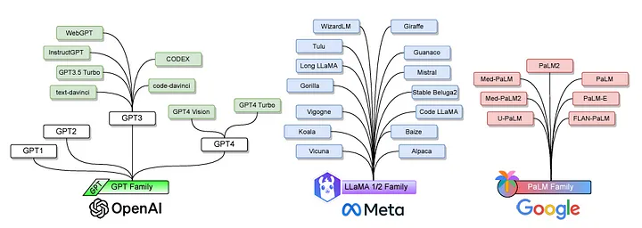
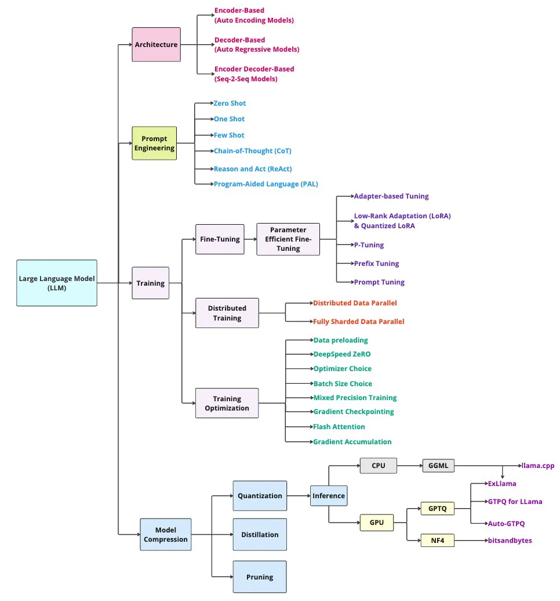
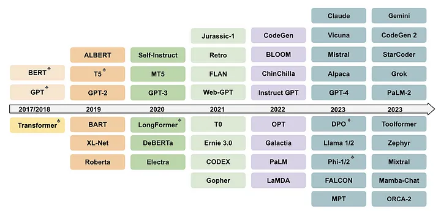
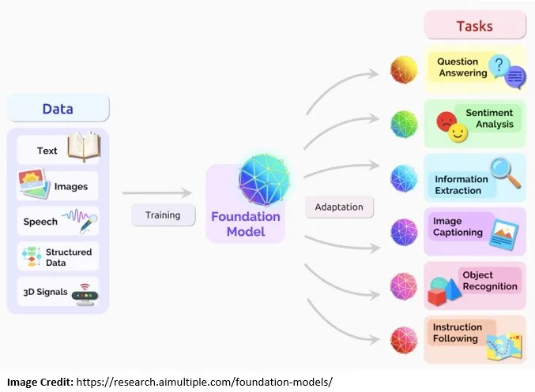
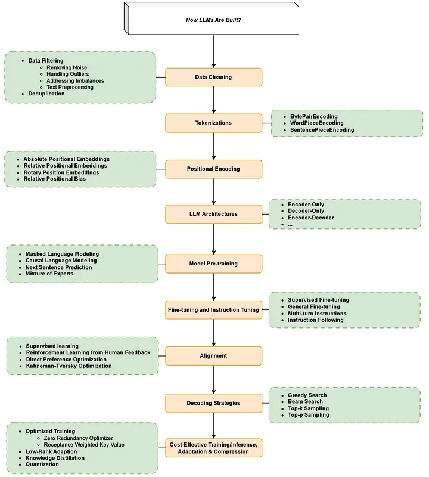
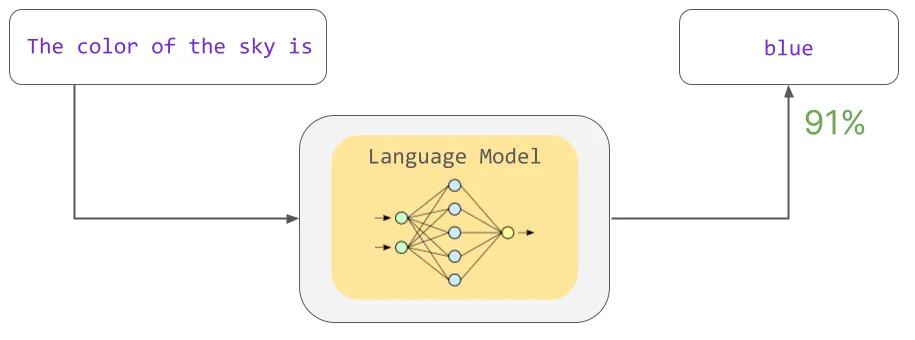
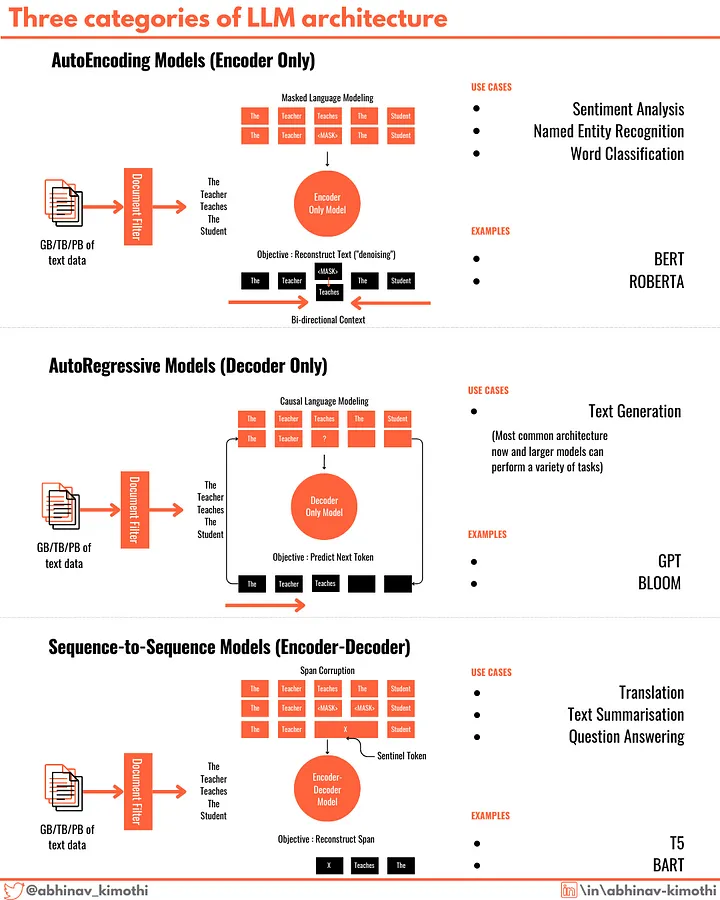

#  Large Language Models

## References

- [kalaxy2](architecture_framework.md)

- [Let's build GPT: from scratch, in code, spelled out](https://www.youtube.com/watch?v=kCc8FmEb1nY)

- [How to Build a Large Language Model from Scratch Using Python](https://www.freecodecamp.org/news/how-to-build-a-large-language-model-from-scratch-using-python/)

- [LLM Applications: Large Language Models (Part 6)](https://medium.com/@vipra_singh/building-llm-applications-large-language-models-part-6-ea8bd982bdee)

## Architecture

