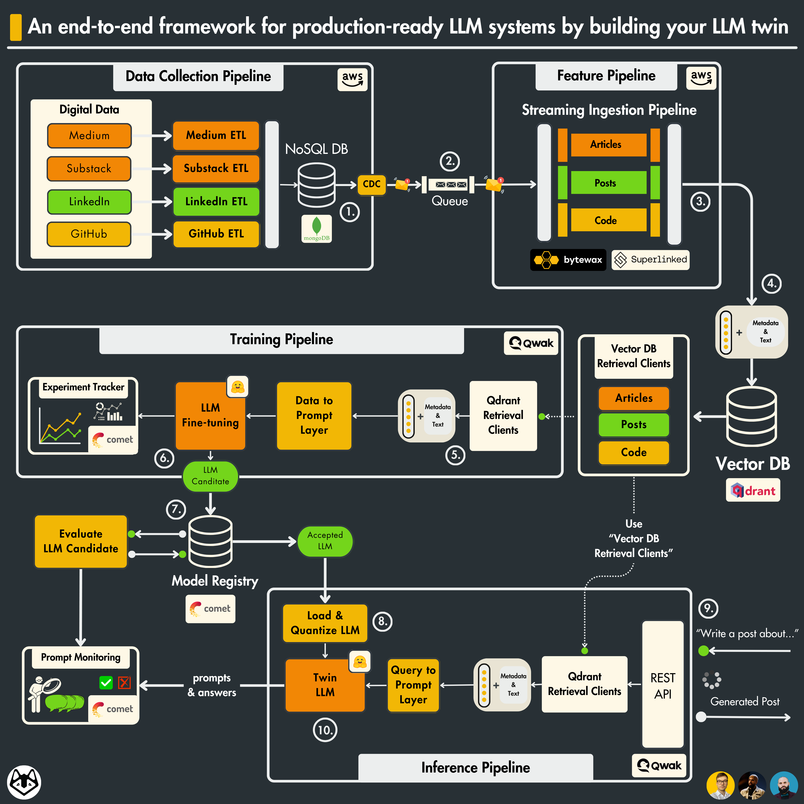

# Production Ready LLM

## Architecture

## References

- [Production-Ready LLM Twin Course](https://medium.com/decodingml/llm-twin-course/home)

- [The LLM-Twin Free Course on Production-Ready RAG applications.](https://medium.com/decodingml/the-llm-twin-free-course-on-production-ready-rag-pipelines-c96472f4e8c8)

- [Build End-to-End RAG Pipeline with Monitoring and Evaluation using Langchain, Azure AI Search, OpenAI, Langfuse, Nemo-gaurdrails, ragas](https://medium.com/codex/build-end-to-end-rag-pipeline-with-monitoring-and-evaluation-using-langchain-azure-ai-search-6f190fffab2a)

- [decodingml/llm-twin-course](https://github.com/decodingml/llm-twin-course)