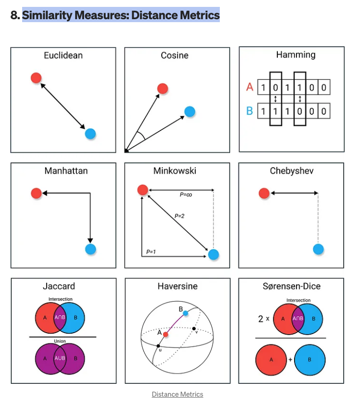
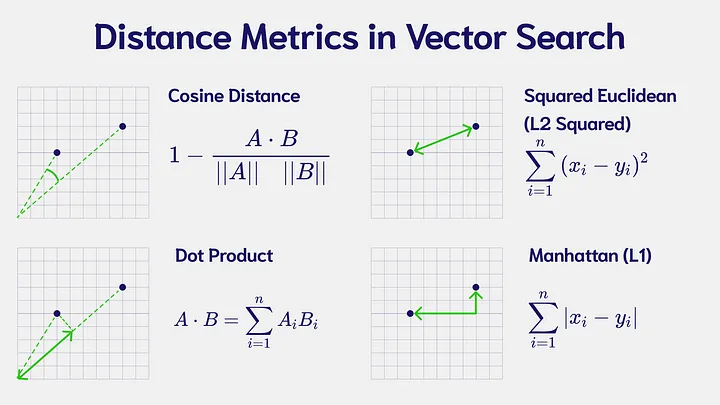
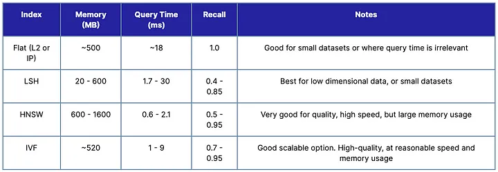
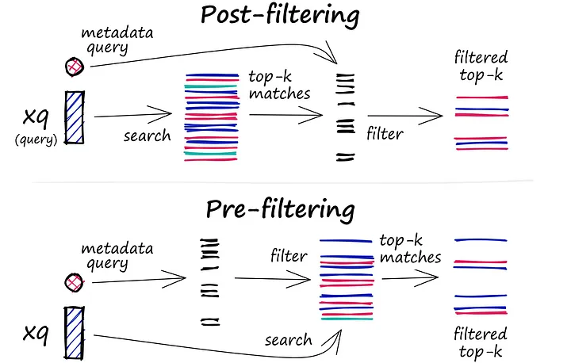

# Similarity Measures

## References

-[Vector Database (Part 4)](https://medium.com/@vipra_singh/building-llm-applications-vector-database-part-4-2bb29e7c798d)

- [kalaxy vectordb](vector.md)
- [Kalaxy chromadb](../../databases/chromadb.md)

##  Measurements

## FILTERING

## CHOOSING

- [Picking a vector database: a comparison and guide for 2023](https://benchmark.vectorview.ai/vectordbs.html)