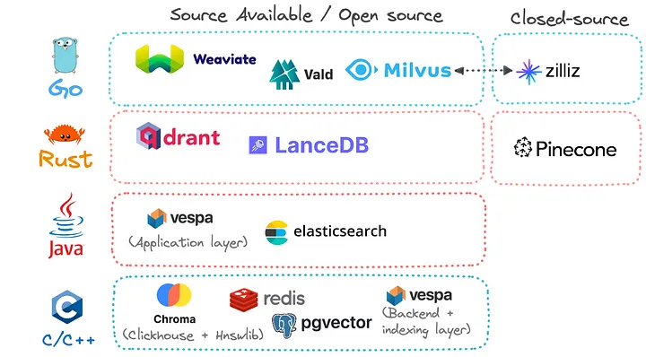
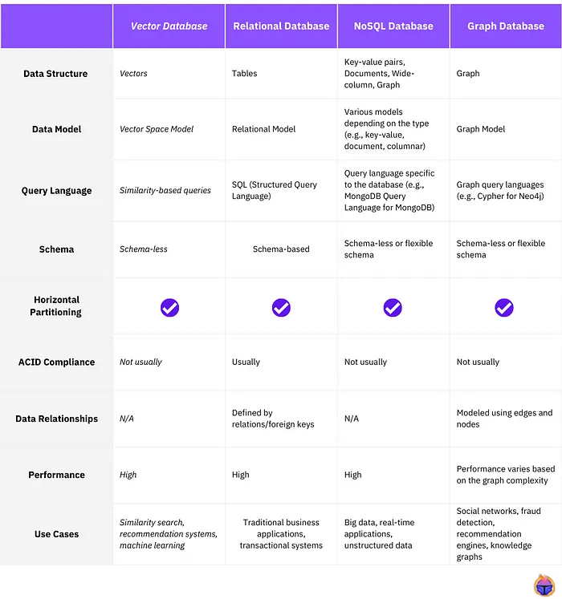

# Vector Databases

## Architecture

## References

- [Kalaxy similarity](similarity.md)

- [Optimize Vector Databases, Enhance RAG-Driven Generative AI](https://medium.com/intel-tech/optimize-vector-databases-enhance-rag-driven-generative-ai-90c10416cb9c)

- [openai-cookbook/examples/vector_databases/](https://github.com/openai/openai-cookbook/tree/main/examples/vector_databases)

- [Kalaxy chromaDB](../../databases/chromadb.md)
