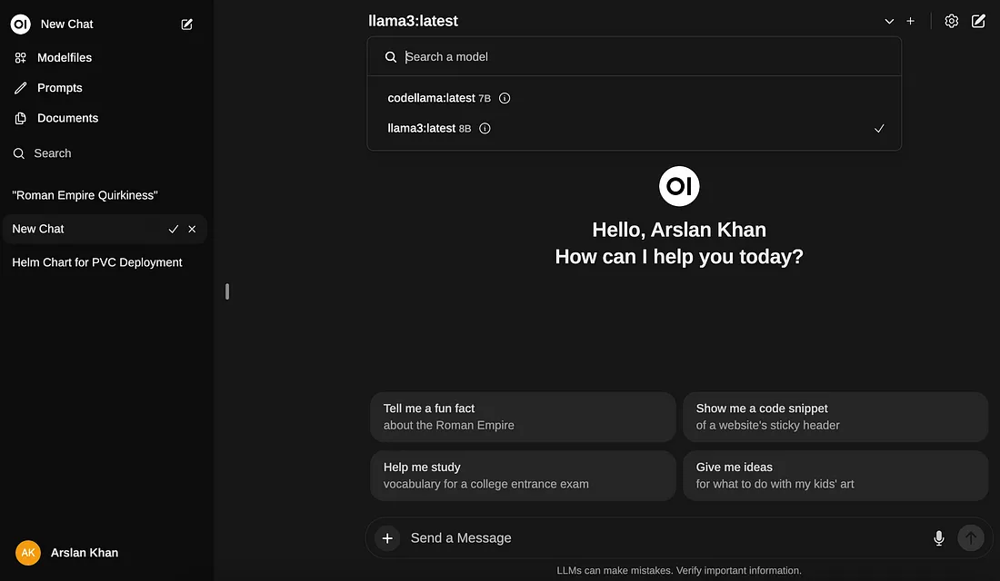

# Ollama Server



## References

- [Ollama & open-webui on Kubernetes](https://medium.com/@arslankhanali/ollama-open-webui-on-kubernetes-3c18497a3ed2)

- [Ollama — Build a ChatBot with Langchain, Ollama & Deploy on Docker](https://medium.com/@abvijaykumar/ollama-build-a-chatbot-with-langchain-ollama-deploy-on-docker-5dfcfd140363)

## Test Execution

### #( 08/19/24@11:58AM )( donbuddenbaum@donbs-imac ):~
   curl http://192.168.2.39:11434/api/generate -d '{
  "model": "llama3.1",
  "prompt": "Why is the sky blue?",
  "stream": false
}'

```
{"model":"llama3.1","created_at":"2024-08-19T16:00:07.085354218Z","response":"The sky appears blue to us because of a phenomenon called Rayleigh scattering. Here's a simplified explanation:\n\n1. **Sunlight enters Earth's atmosphere**: When sunlight enters our atmosphere, it consists of a broad spectrum of colors, including all the colors of the rainbow.\n2. **Scattering occurs**: As sunlight travels through the air molecules and tiny particles (like nitrogen and oxygen), they scatter the shorter (blue) wavelengths more than the longer (red) wavelengths. This is known as Rayleigh scattering.\n3. **Blue light reaches our eyes**: Because blue light is scattered in all directions, it reaches our eyes from every direction, giving the sky its blue appearance.\n\nThis effect is most pronounced during the daytime when the sun is overhead and the sunlight has to travel through a lot of air molecules to reach our eyes. At sunrise and sunset, the sky can take on hues of red and orange due to a different atmospheric phenomenon called Mie scattering, where larger particles like dust and water droplets scatter longer wavelengths (like red light) more.\n\nSo, in summary, the sky appears blue because of the way Earth's atmosphere scatters sunlight, favoring shorter (blue) wavelengths.","done":true,"done_reason":"stop","context":[128009,128006,882,128007,271,10445,374,279,13180,6437,30,128009,128006,78191,128007,271,791,13180,8111,6437,311,603,1606,315,264,25885,2663,13558,64069,72916,13,5810,596,264,44899,16540,1473,16,13,3146,31192,4238,29933,9420,596,16975,96618,3277,40120,29933,1057,16975,11,433,17610,315,264,7353,20326,315,8146,11,2737,682,279,8146,315,279,48713,627,17,13,3146,3407,31436,13980,96618,1666,40120,35292,1555,279,3805,35715,323,13987,19252,320,4908,47503,323,24463,705,814,45577,279,24210,320,12481,8,93959,810,1109,279,5129,320,1171,8,93959,13,1115,374,3967,439,13558,64069,72916,627,18,13,3146,10544,3177,25501,1057,6548,96618,9393,6437,3177,374,38067,304,682,18445,11,433,25501,1057,6548,505,1475,5216,11,7231,279,13180,1202,6437,11341,382,2028,2515,374,1455,38617,2391,279,62182,994,279,7160,374,32115,323,279,40120,706,311,5944,1555,264,2763,315,3805,35715,311,5662,1057,6548,13,2468,64919,323,44084,11,279,13180,649,1935,389,82757,315,2579,323,19087,4245,311,264,2204,45475,25885,2663,386,648,72916,11,1405,8294,19252,1093,16174,323,3090,7118,90592,45577,5129,93959,320,4908,2579,3177,8,810,382,4516,11,304,12399,11,279,13180,8111,6437,1606,315,279,1648,9420,596,16975,1156,10385,40120,11,4799,287,24210,320,12481,8,93959,13],"total_duration":43339568427,"load_duration":6550234915,"prompt_eval_count":17,"prompt_eval_duration":859306000,"eval_count":239,"eval_duration":35888539000}%
```