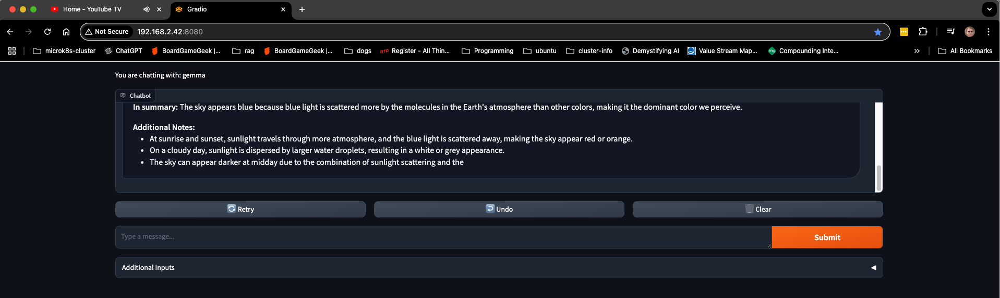

# vLLM


## References

- [vLLM is a fast and easy-to-use library for LLM inference and serving.](https://docs.vllm.ai/en/latest/index.html)

- [Serve Gemma open models using GPUs on GKE with vLLM ](https://cloud.google.com/kubernetes-engine/docs/tutorials/serve-gemma-gpu-vllm)

## Setup

### (base) #( 11/04/24@ 6:02PM )( donbuddenbaum@donbs-imac ):~/Documents/Kalaxy2/yaml/vllm/templates@main✗✗✗
   kubectl create -f ns.yaml
    
    namespace/vllm created
### (base) #( 11/04/24@ 6:03PM )( donbuddenbaum@donbs-imac ):~/Documents/Kalaxy2/yaml/vllm/templates@main✗✗✗
   kubectl create -f secret.yaml

    secret/hf-secret created

### (base) #( 11/04/24@ 6:13PM )( donbuddenbaum@donbs-imac ):~/Documents/Kalaxy2/yaml/vllm/templates@main✗✗✗
   kubectl create -f deployment.yaml

    deployment.apps/vllm-gemma-deployment created
    service/llm-service created

### (base) #( 11/04/24@10:07PM )( donbuddenbaum@donbs-imac ):~/Documents/Kalaxy2/yaml/vllm/templates@main✗✗✗
   kubectl logs -f -l app=gemma-server -n vllm

```
INFO 11-05 03:06:33 launcher.py:28] Route: /ping, Methods: GET
INFO 11-05 03:06:33 launcher.py:28] Route: /health, Methods: GET
INFO 11-05 03:06:33 launcher.py:28] Route: /v1/chat/completions, Methods: POST
INFO 11-05 03:06:33 launcher.py:28] Route: /generate, Methods: POST
INFO:     Started server process [1]
INFO:     Waiting for application startup.
INFO:     Application startup complete.
INFO:     Uvicorn running on http://0.0.0.0:8000 (Press CTRL+C to quit)
INFO:     10.1.120.192:7372 - "GET / HTTP/1.1" 404 Not Found
INFO:     10.1.120.192:7372 - "GET /favicon.ico HTTP/1.1" 404 Not Found
```

### (base) #( 11/04/24@10:13PM )( donbuddenbaum@donbs-imac ):~/Documents/Kalaxy2/yaml/vllm/templates@main✗✗✗
   USER_PROMPT="I'm new to coding. If you could only recommend one programming language to start with, what would it be and why?"

curl -X POST http://192.168.2.41:8000/generate \
  -H "Content-Type: application/json" \
  -d @- <<EOF
{
    "prompt": "<start_of_turn>user\n${USER_PROMPT}<end_of_turn>\n",
    "temperature": 0.90,
    "top_p": 1.0,
    "max_tokens": 128
}
EOF

```
{"predictions":["Prompt:\n<start_of_turn>user\nI'm new to coding. If you could only recommend one programming language to start with, what would it be and why?<end_of_turn>\nOutput:\n* **Python**\n\n**Here's why Python is a fantastic choice for beginners:**\n\n* **Beginner-Friendly Syntax:** Python reads like plain English. This makes it easy to learn and understand, even if you have no prior programming experience.  \n* **Large Community and Extensive Resources:** Python has a huge and active community of developers. This means finding help and resources (like tutorials, documentation, and forums) is a breeze.\n* **Versatile for Different Applications:** Python is used for a wide range of tasks, from web development and data analysis to machine learning and scientific computing. \n* **Extensive Libraries:** The"]}%
```

## Gradio Chat



### (base) #( 11/04/24@10:27PM )( donbuddenbaum@donbs-imac ):~/Documents/Kalaxy2/yaml/gradio_chat@main✗✗✗
   kubectl apply -f deployment.yaml

      deployment.apps/gradio created
### (base) #( 11/04/24@10:27PM )( donbuddenbaum@donbs-imac ):~/Documents/Kalaxy2/yaml/gradio_chat@main✗✗✗
   kubectl apply -f service.yaml

      service/gradio created