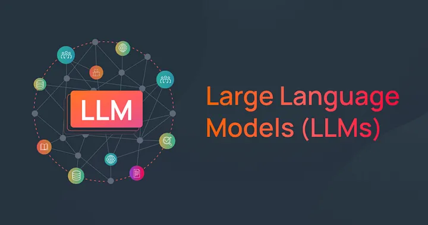

# Building 

## References

- [How to Build an LLM From Scratch with Python?](https://medium.com/aimonks/how-to-build-an-llm-from-scratch-with-python-cb3cd9807e45)
- [Create a Large Language Model from Scratch with Python – Tutorial](https://www.youtube.com/watch?v=UU1WVnMk4E8)
- [Build your own Large Language Model (LLM) From Scratch Using PyTorch](https://medium.com/towards-artificial-intelligence/build-your-own-large-language-model-llm-from-scratch-using-pytorch-9e9945c24858)
- [Step-by-Step Guide to Creating Your Own Large Language Model](https://medium.com/sciforce/step-by-step-guide-to-your-own-large-language-model-2b3fed6422d0)