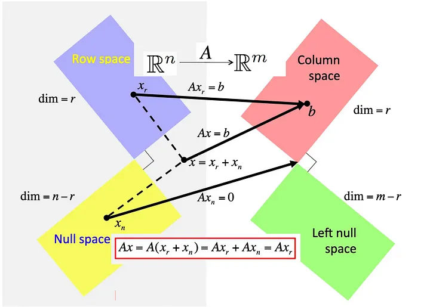

# Mathematics of ML

## References

- [The Fundamental Mathematics of Machine Learning](https://pub.towardsai.net/the-fundamental-mathematics-of-machine-learning-39c2418d19c6)
- [Probability Theory for Data Science and Machine Learning Engineers](https://pub.towardsai.net/probability-theory-for-data-science-and-machine-learning-engineers-0be974204c68)
- [From Basic Gates to Deep Neural Networks: The Definitive Perceptron Tutorial](https://towardsdatascience.com/the-definitive-perceptron-guide-fd384eb93382)
- [30 Days Machine Learning Projects Challenge](https://medium.com/@iabbasali/list/30-days-machine-learning-projects-challenge-ac968b44770f)