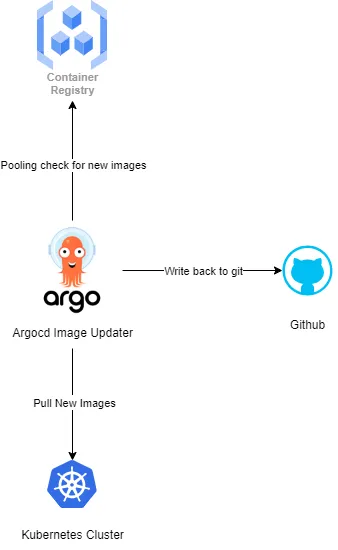

# ArgoCD Image Updater



## References

 - [https://argocd-image-updater.readthedocs.io/en/stable/install/installation/](https://argocd-image-updater.readthedocs.io/en/stable/install/installation/)
 - [How to Base64 Encode Kubernetes Secrets](https://www.cloudytuts.com/tutorials/kubernetes/how-to-base64-encode-kubernetes-secrets/)
 - [argoproj-labs/argocd-image-updater](https://github.com/argoproj-labs/argocd-image-updater/tree/master/config)
 - [ArgoCD Image Updater](https://medium.com/@topahadzi/argocd-image-updater-c169697b2072)
 - [ArgoCD + Image Updater](https://medium.com/@jerome.decoster/argocd-image-updater-56cd94651393)
 - [Update strategies](https://argocd-image-updater.readthedocs.io/en/stable/basics/update-strategies/)

## Setup

## Strategy

  ```
  annotations:
    argocd-image-updater.argoproj.io/image-list: docker.io/donb4iu/mynginx_docs:latest
    argocd-image-updater.argoproj.io/api.update-strategy: digest
    argocd-image-updater.argoproj.io/myapp.force-update: "true"
    argocd-image-updater.argoproj.io/api.pull-secret: pullsecret:argocd/argocd-image-updater-secret
    ```

```
latest - Update to the most recently built image¶
Warning

As of November 2020, Docker Hub has introduced pull limits for accounts on the free plan and unauthenticated requests. The latest update strategy will perform manifest pulls for determining the most recently pushed tags, and these will count into your pull limits. So unless you are not affected by these pull limits, it is not recommended to use the latest update strategy with images hosted on Docker Hub.
```

```
Tags and digests

Note that the digest update strategy will use image digests for updating the image tags in your applications, so the image running in your application will appear as some/image@sha256:<somelonghashstring> instead of some/image:latest. So in your running system, the tag information will be effectively lost.

For example, the following specification would always update the image for an application on each new push of the image some/image with the tag latest:


argocd-image-updater.argoproj.io/image-list: myimage=some/image:latest
argocd-image-updater.argoproj.io/myimage.update-strategy: digest
```

### Add Image updater
#### #( 07/08/24@ 1:43PM )( donbuddenbaum@donbs-imac ):~
   kubectl apply -n argocd -f https://raw.githubusercontent.com/argoproj-labs/argocd-image-updater/stable/manifests/install.yaml

```
serviceaccount/argocd-image-updater created
role.rbac.authorization.k8s.io/argocd-image-updater created
rolebinding.rbac.authorization.k8s.io/argocd-image-updater created
configmap/argocd-image-updater-config created
configmap/argocd-image-updater-ssh-config created
secret/argocd-image-updater-secret created
deployment.apps/argocd-image-updater created
```

#### update configmaps

- argocd-image-updater-config
```
data:
  # log.level can be one of trace, debug, info, warn or error
  log.level: debug
  ```
- argocd-cm
```
data:
  # ...
  accounts.image-updater: apiKey
  ```
- argocd-rbac-cm
```
p, role:image-updater, applications, get, */*, allow
p, role:image-updater, applications, update, */*, allow
g, image-updater, role:image-updater
```
- argocd.token in a secret named argocd-image-updater-secret
    - echo -n 'super-secret-password' | base64
    - printf instead: var=$(printf '%s:%s' "$username" "$password" | base64)


#### #( 07/08/24@ 5:35PM )( donbuddenbaum@donbs-imac ):~
  kubectl create secret generic argocd-image-updater-secret --from-literal argocd.token=$var --dry-run -o yaml |
  
  kubectl -n argocd apply -f -
```
W0708 17:37:04.010061   15122 helpers.go:704] --dry-run is deprecated and can be replaced with --dry-run=client.
secret/argocd-image-updater-secret configured
```

#### #( 07/08/24@ 5:37PM )( donbuddenbaum@donbs-imac ):~
   kubectl -n argocd rollout restart deployment argocd-image-updater

    deployment.apps/argocd-image-updater restarted

### #( 07/23/24@12:28AM )( donbuddenbaum@donbs-imac ):~/Documents/Kalaxy2/yaml/nginx-docs/k8s-doc-to-nginx@main✗✗✗
   kubectl apply -f argocd-image-updater.yaml

    application.argoproj.io/kalaxy2 configured

## Logs

### #( 07/22/24@11:32PM )( donbuddenbaum@donbs-imac ):~/Documents/Kalaxy2/yaml/nginx-docs/k8s-doc-to-nginx@main✗✗✗
   kubectl logs --selector app.kubernetes.io/name=argocd-image-updater \
        --namespace argocd \
        --follow


```
time="2024-07-23T03:43:35Z" level=info msg="Starting image update cycle, considering 0 annotated application(s) for update"
time="2024-07-23T03:43:35Z" level=info msg="Processing results: applications=0 images_considered=0 images_skipped=0 images_updated=0 errors=0"
time="2024-07-23T03:45:35Z" level=warning msg="skipping app 'kalaxy2' of type 'Directory' because it's not of supported source type" application=kalaxy2
