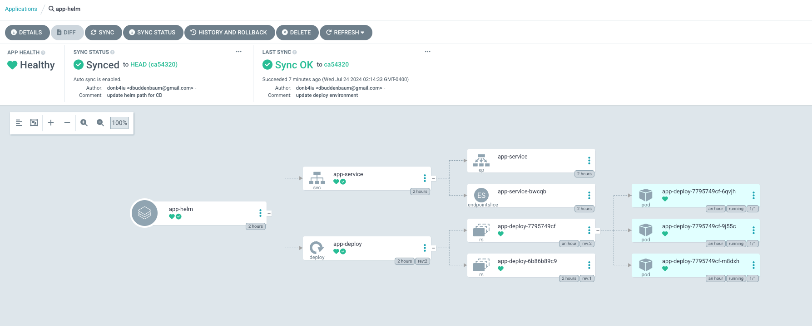
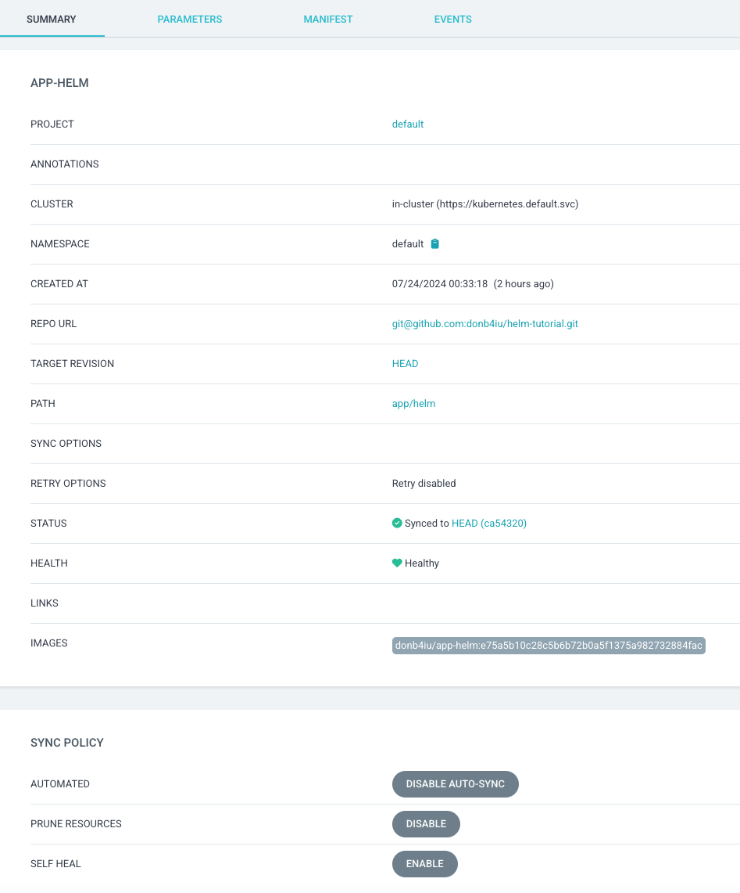
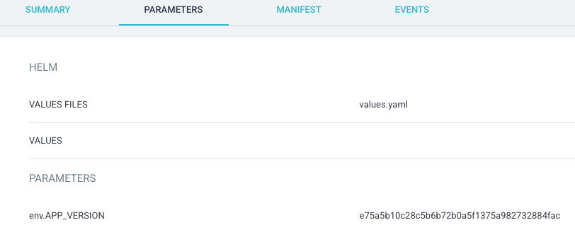
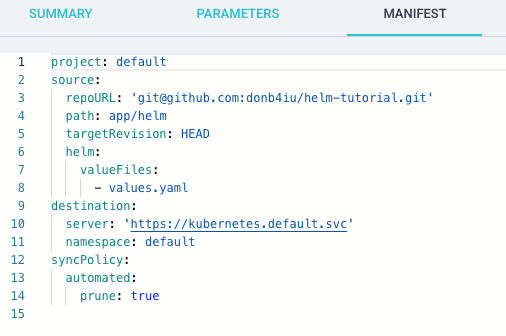
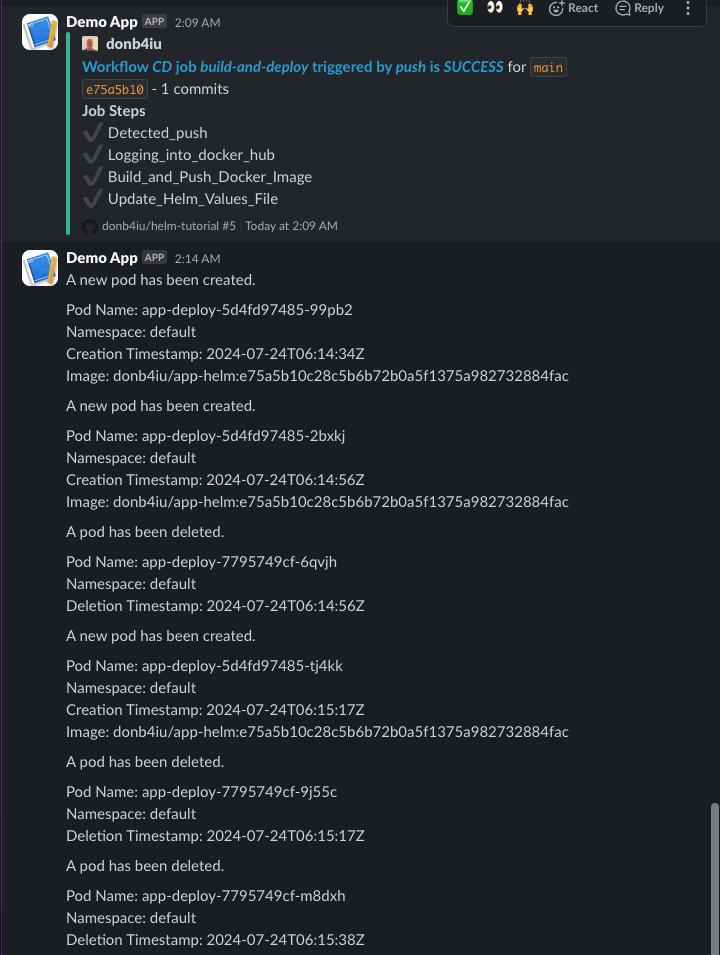

# Readme

## References

- [ArgoCD Image updater -](https://medium.com/@megaurav25/argocd-image-updater-fbc93dc15e34)

- [Deploy using ArgoCD and Github Actions](https://medium.com/@mssantossousa/deploy-using-argocd-and-github-actions-888f7370e480)

- [Private Repositories](https://argo-cd.readthedocs.io/en/stable/user-guide/private-repositories/)

- [Template everything with Helm](https://medium.com/@maorfr/template-everything-with-helm-48e5a32ff72d
)

## ArgoCD

## Execution

## Slack

[slack](https://donb4iu.slack.com/archives/C07C97QB1S7)