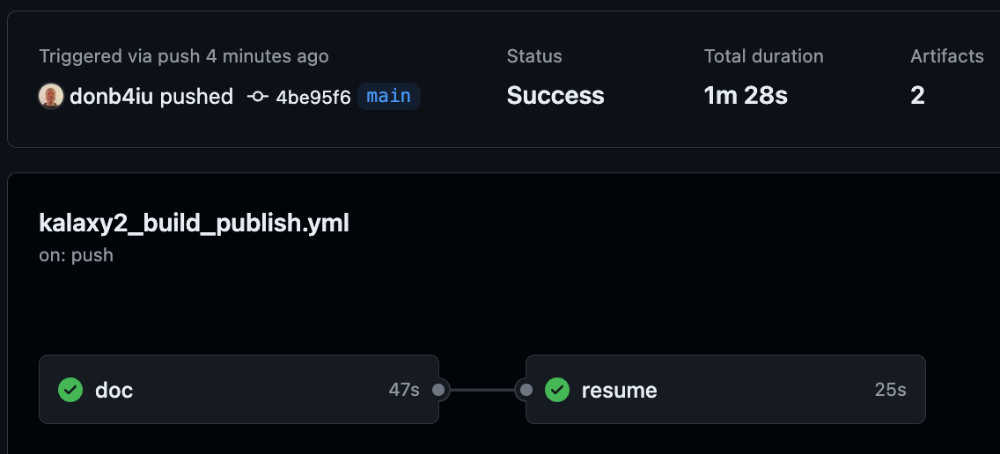
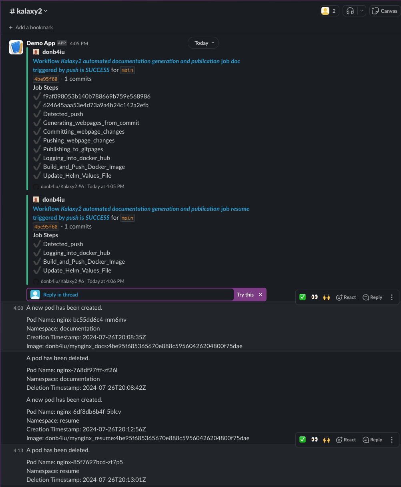

# Kalaxy2 Automation

## References

### Components used
- [git actions](../automation/github/actions.md)
- [helm](../automation/helm/helm.md)
- [argocd](../cicd/argocd.md)
- [shell operator](../operations/shell_operator.md)
- [crossplane](../operations/crossplane.md)
- [slack](../automation/slack/slack.md)

## Definition

### Step 1

[Documentation](../websites_generation/dauxio_kalaxy2.md)

### Step 2

[Resume](../websites_generation/resume.md)

## Execution

[Kalaxy2 build and publish](https://github.com/donb4iu/Kalaxy2/actions)
