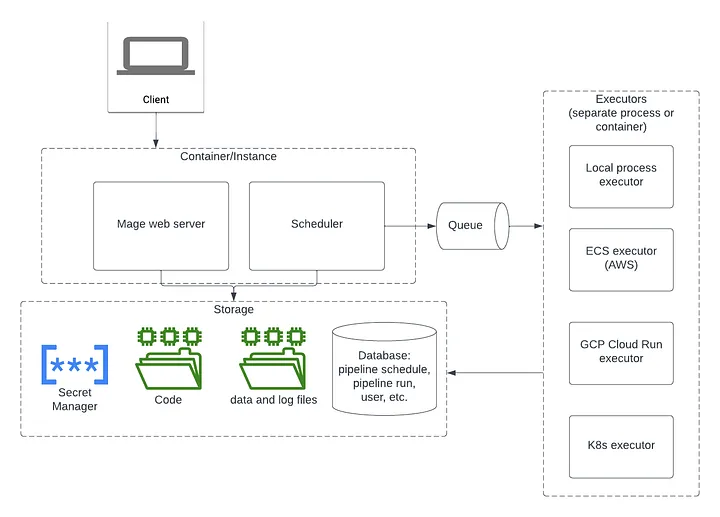

# MageAI

## References

- [MageAI : The modernised way of creating data pipeline.](https://levelup.gitconnected.com/mageai-the-modernised-way-of-creating-data-pipeline-810bf0d99716)
- [🛠️ ETL Mage Ai, the Airflow replacement](https://towardsdev.com/etl-mage-the-airflow-replacement-06f46c567248)

## Architecture

