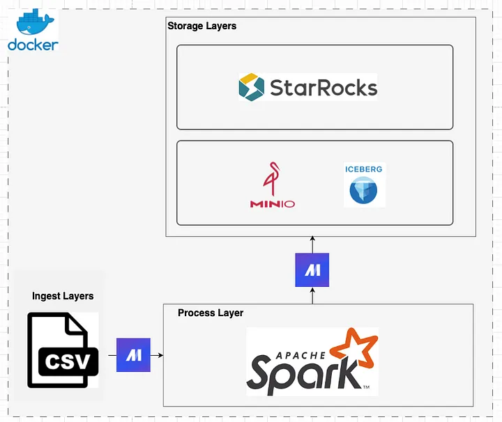
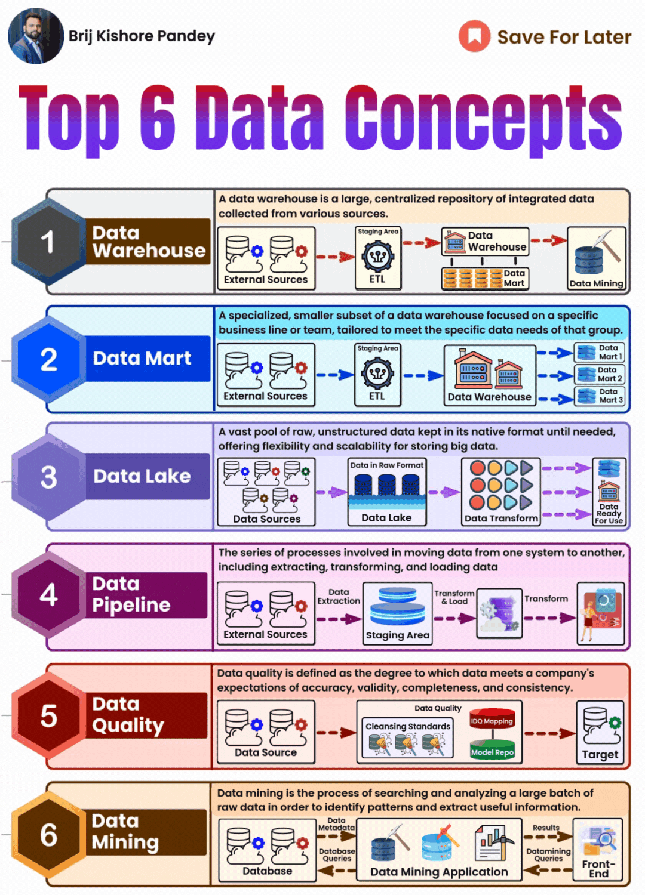

# ML Pipeline workflows

## Architecture

## References

- [An End-to-End ML Workflow: From Notebook to Kubeflow Pipelines with MiniKF & Kale](https://medium.com/kubeflow/an-end-to-end-ml-workflow-from-notebook-to-kubeflow-pipelines-with-minikf-kale-72244d245d53)

- [Provisioning Kubeflow on macOS with MicroK8s](https://medium.com/dan-on-coding/installing-kubeflow-on-macos-with-microk8s-8a4ba4bd2ef)

- [Mage](../etl/mage_etl.md)

- [Building a Local Data Lake from scratch with MinIO, Iceberg, Spark, StarRocks, Mage, and Docker](https://blog.det.life/building-a-local-data-lake-from-scratch-with-minio-iceberg-spark-starrocks-mage-and-docker-c12436e6ff9d)

