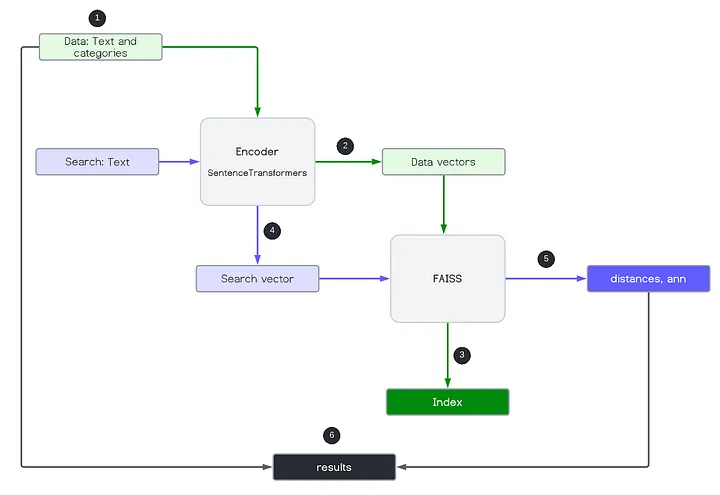

# FAISS

Euclidean distance (L2)

## References

- [How to Use FAISS to Build Your First Similarity Search](https://medium.com/loopio-tech/how-to-use-faiss-to-build-your-first-similarity-search-bf0f708aa772)

## Architecture

