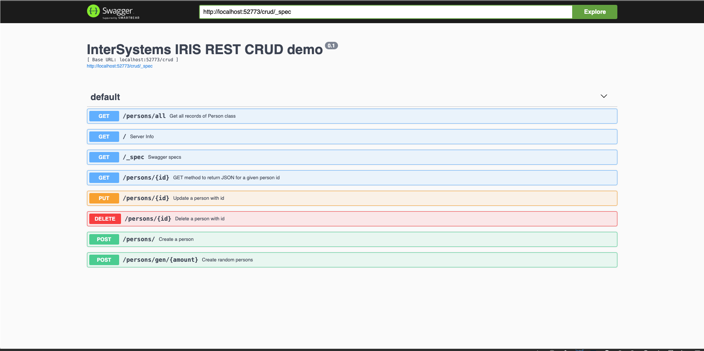
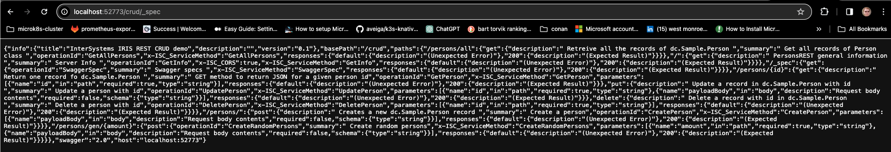
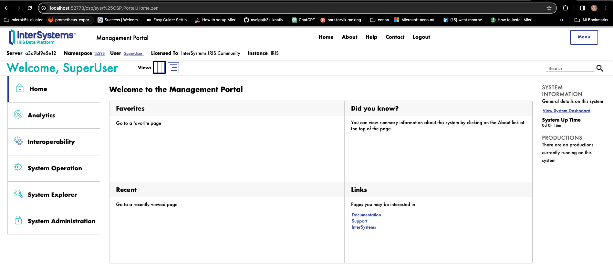
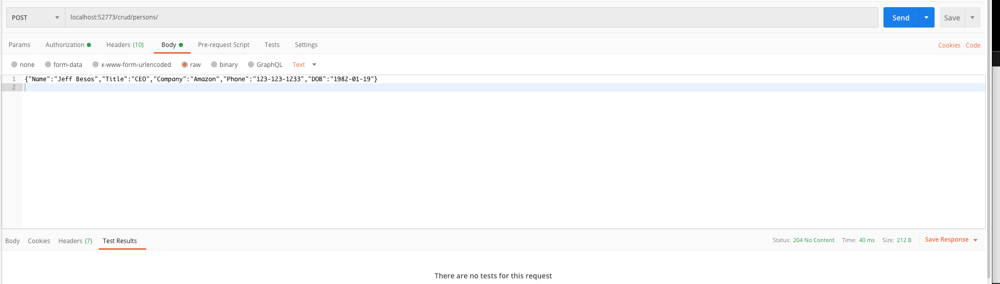
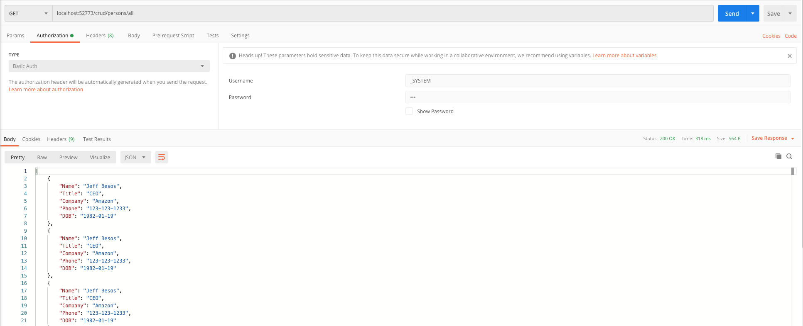

# IRIS Rest API

## Reference

- [github template](https://github.com/intersystems-community/iris-rest-api-template)

- [intersystems - iris-rest-api-template - tutorial](https://community.intersystems.com/post/tutorial-deploy-your-dockerized-application-aws)

- [iris-rest-api-template - template](https://openexchange.intersystems.com/package/iris-rest-api-template)

- [Building a REST API with InterSystem IRIS](https://youtu.be/02I_4AjBNpc?si=He0oULlE15m3kzn_)

## API
### Swagger

 http://localhost:52773/swagger-ui/index.html 
- _SYSTEM
- SYS

#### Individual APIs

#### Management API

### Transactions (Postman)

#### Put

#### Get

