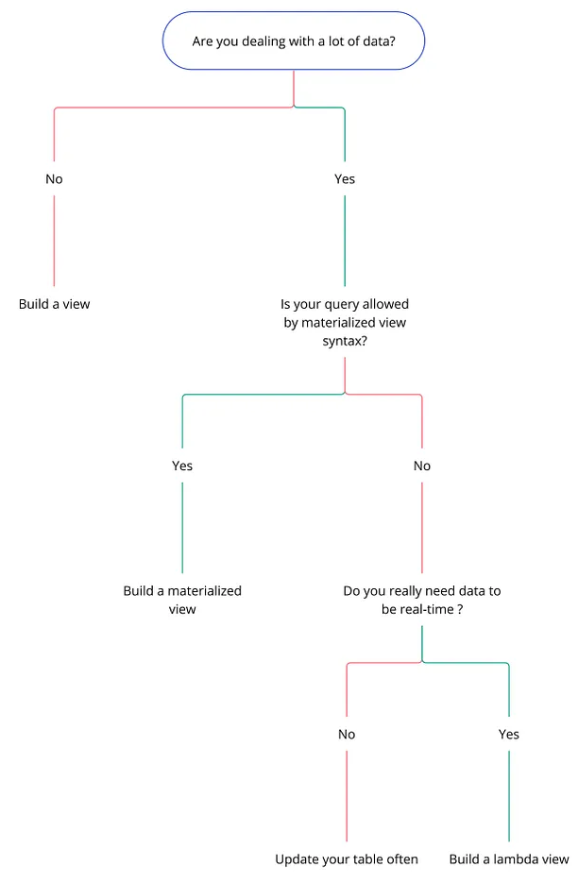
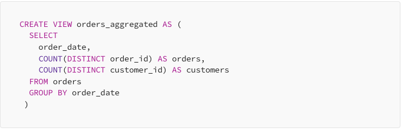
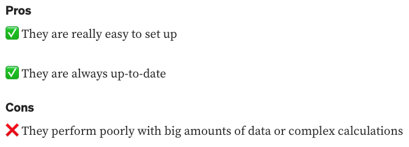
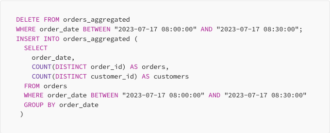
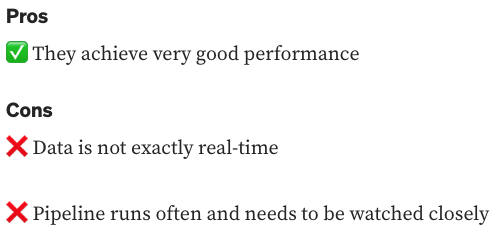
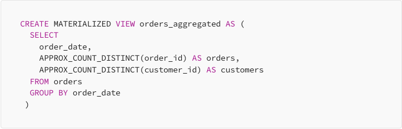
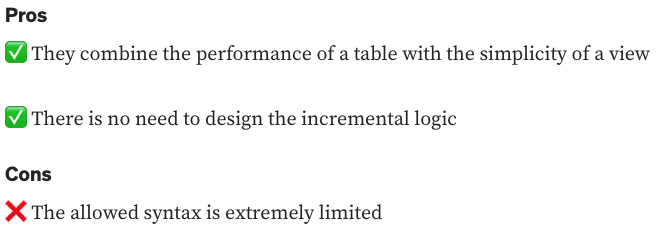
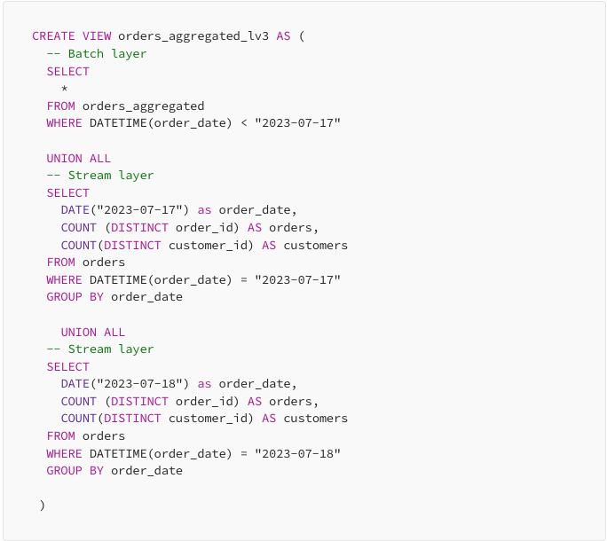
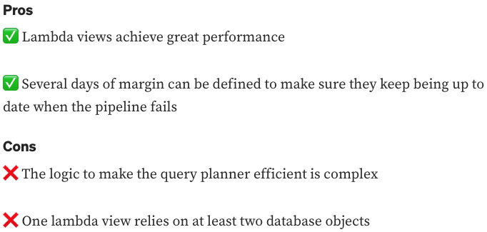

# Performant Data Models

## References

 - [A Guide to Building Performant Real-Time Data Models](https://towardsdatascience.com/a-guide-to-building-performant-real-time-data-models-d60b37bb07dc)

 ## Options

 

 ### Views

 

 

 ### Often-Refreshed Tables

 

 

 ### Materialized Views

 

 

 ### Lambda View

 

 
