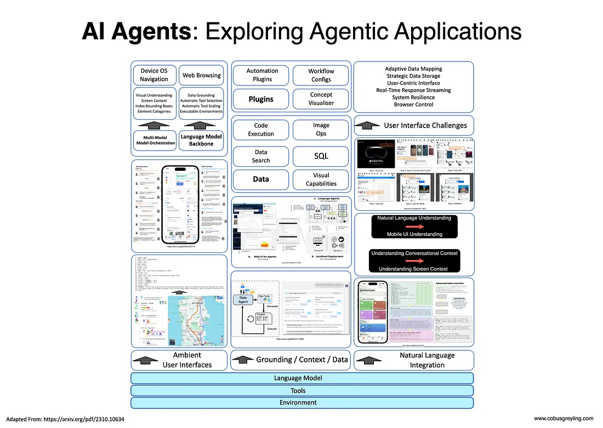
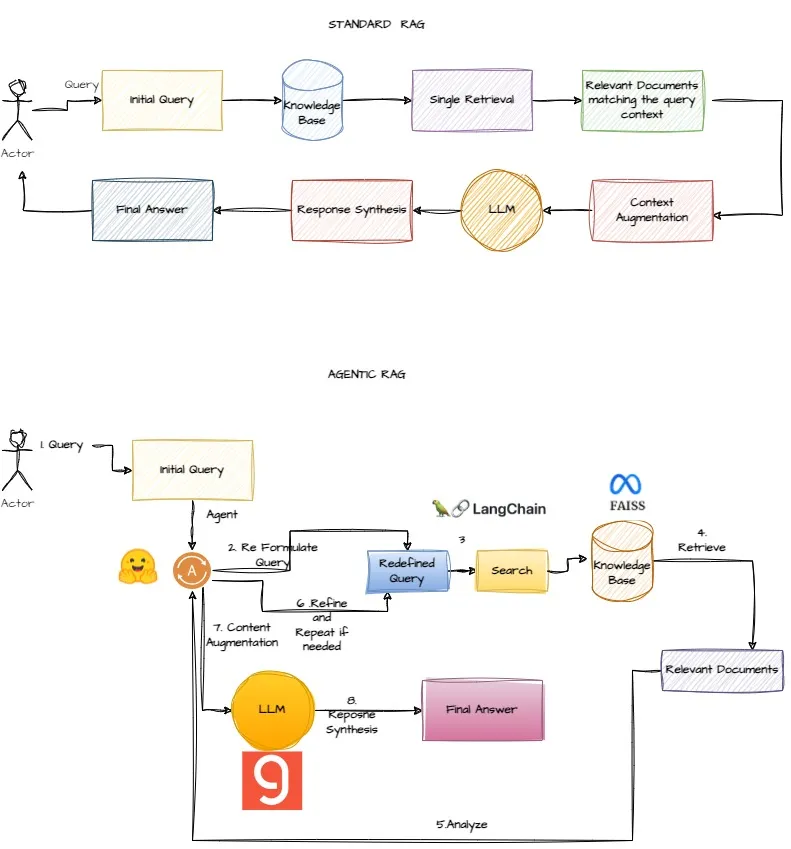

# Agent

## References

- [How LLM Agent works?](https://medium.com/@plthiyagu/how-llm-agent-works-e4301e979f17)

- [AI Agents: Exploring Agentic Applications](https://medium.com/@cobusgreyling/ai-agents-exploring-agentic-applications-cbb4512b61e4)

- [Build an Agentic RAG using HuggingFace Transformers Agent](https://medium.com/the-ai-forum/build-an-agentic-rag-using-huggingface-transformer-agent-ec741f09ddcc)