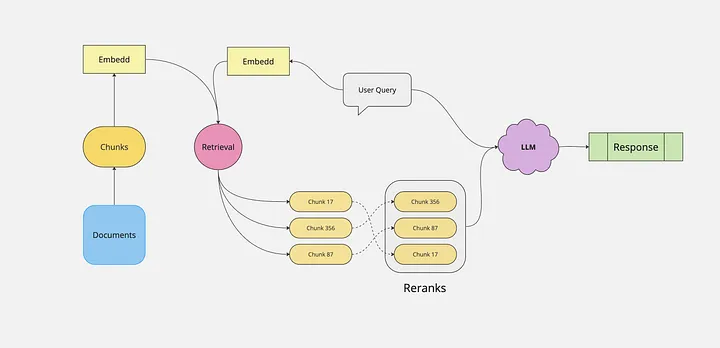

# Embeddings

## Reference

- [all-MiniLM-L6-v2](https://huggingface.co/sentence-transformers/all-MiniLM-L6-v2)

- [[Bug]: Fail: [ONNXRuntimeError] : 1 : FAIL : Non-zero status code returned while running CoreML #2013](https://github.com/chroma-core/chroma/issues/2013)

- [Mastering RAG: How to Select an Embedding Model](https://www.rungalileo.io/blog/mastering-rag-how-to-select-an-embedding-model)

- [Mastering the Art of Embeddings: Choosing the Right Model for Your RAG Architecture](https://medium.com/@eordaxd/mastering-the-art-of-embeddings-choosing-the-right-model-for-your-rag-architecture-38e15a9adcbc)

- [Guide to Multimodal RAG for Images and Text](https://medium.com/kx-systems/guide-to-multimodal-rag-for-images-and-text-10dab36e3117)