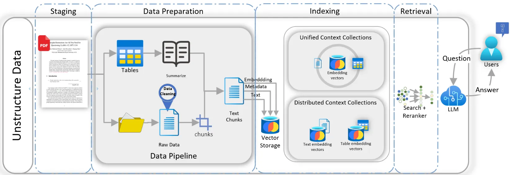

# Retrieval Augmented Generation

## References

- [Tabular Data, RAG, & LLMs: Improve Results Through Data Table Prompting](https://medium.com/p/bcb42678914b)
- [Improve your Tabular Data Ingestion for RAG with Reranking](https://medium.com/intel-tech/improve-your-tabular-data-ingestion-for-rag-with-reranking-bebcf52cdde3)
- [Microsoft’s GraphRAG + AutoGen + Ollama + Chainlit = Local & Free Multi-Agent RAG Superbot](https://ai.gopubby.com/microsofts-graphrag-autogen-ollama-chainlit-fully-local-free-multi-agent-rag-superbot-61ad3759f06f)