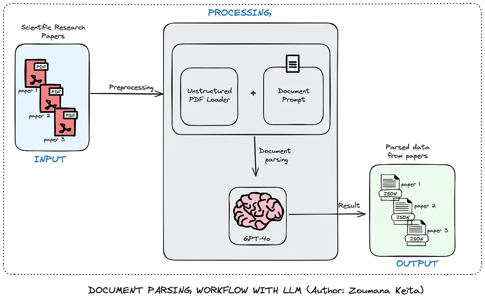
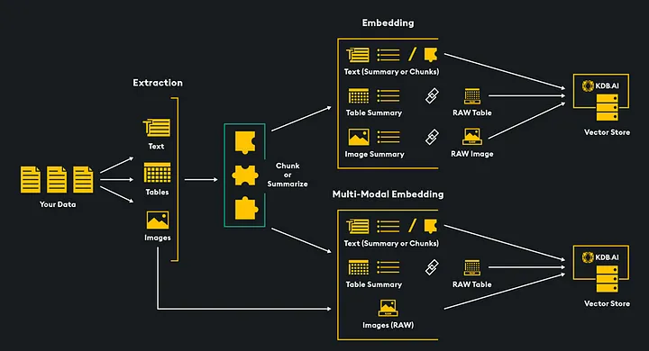
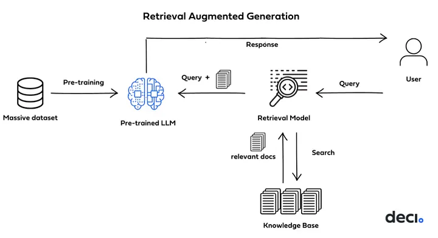
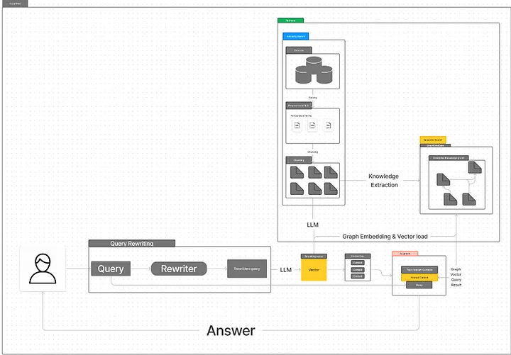
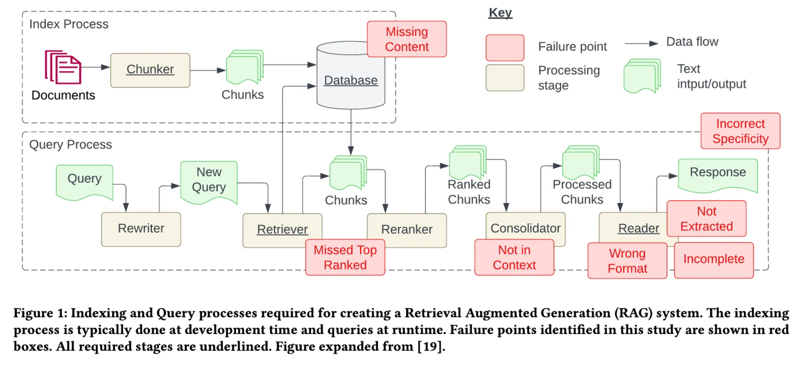
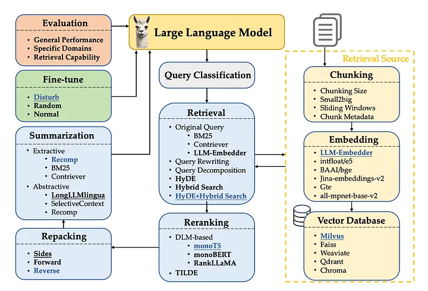

# Retrieval Augmented Generation

## References

- [Tabular Data, RAG, & LLMs: Improve Results Through Data Table Prompting](https://medium.com/p/bcb42678914b)

- [Microsoft’s GraphRAG + AutoGen + Ollama + Chainlit = Local & Free Multi-Agent RAG Superbot](https://ai.gopubby.com/microsofts-graphrag-autogen-ollama-chainlit-fully-local-free-multi-agent-rag-superbot-61ad3759f06f)

- [Document Parsing Using Large Language Models — With Code](https://towardsdatascience.com/document-parsing-using-large-language-models-with-code-9229fda09cdf)

- [Running Local LLMs is More Useful and Easier Than You Think](https://towardsdatascience.com/running-local-llms-is-more-useful-and-easier-than-you-think-f735631272ad)

- [The LLM Triangle Principles to Architect Reliable AI Apps](https://towardsdatascience.com/the-llm-triangle-principles-to-architect-reliable-ai-apps-d3753dd8542e)

- [Guide to Multimodal RAG for Images and Text](https://medium.com/kx-systems/guide-to-multimodal-rag-for-images-and-text-10dab36e3117)

- [LangGraph + Adaptive Rag + LLama3 Python Project: Easy AI/Chat for your Docs](https://medium.com/gitconnected/langgraph-adaptive-rag-llama3-python-project-easy-ai-chat-for-your-docs-2967b2f5066a)
- [GaoDalie/LangGraph_Example](https://github.com/GaoDalie/LangGraph_Example)

- [Implementing RAG in LangChain with Chroma: A Step-by-Step Guide](https://medium.com/@callumjmac/implementing-rag-in-langchain-with-chroma-a-step-by-step-guide-16fc21815339)

### Series

- [Tabular Data, RAG, & LLMs: Improve Results Through Data Table Prompting](https://medium.com/intel-tech/tabular-data-rag-llms-improve-results-through-data-table-prompting-bcb42678914b)
- [Improve your Tabular Data Ingestion for RAG with Reranking](https://medium.com/intel-tech/improve-your-tabular-data-ingestion-for-rag-with-reranking-bebcf52cdde3)

1. [Building LLM Applications: Introduction (Part 1) Vipra Singh](https://medium.com/@vipra_singh/building-llm-applications-introduction-part-1-1c90294b155b#4d28)

### Rag Grapgh

- [From RAG to GraphRAG , What is the GraphRAG and why i use it?](https://medium.com/@jeongiitae/from-rag-to-graphrag-what-is-the-graphrag-and-why-i-use-it-f75a7852c10c)

- [Building LLM Applications: Advanced RAG (Part 10)](https://medium.com/@vipra_singh/building-llm-applications-advanced-rag-part-10-ec0fe735aeb1)

### RAG Problems

### Chunk Size

- [Evaluating the Ideal Chunk Size for a RAG System using LlamaIndex](https://www.llamaindex.ai/blog/evaluating-the-ideal-chunk-size-for-a-rag-system-using-llamaindex-6207e5d3fec5)

### Tokenizers

- [Summary of the tokenizers](https://huggingface.co/docs/transformers/tokenizer_summary)

- [Tokenizer
Learn about language model tokenization
 ](https://platform.openai.com/tokenizer)

 ### Best Practices

 

 - [The Best Practices of RAG](https://medium.com/towards-artificial-intelligence/the-best-practices-of-rag-300e313322e6)