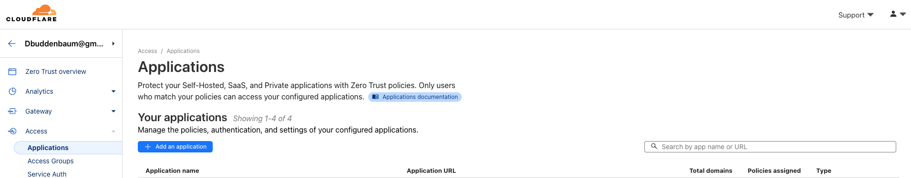

# CloudFlare

## References

- [EXPOSE your home network to the INTERNET!! (it's safe)](https://youtu.be/ey4u7OUAF3c?si=pG8kaM5rGudSARnF)
- [donb4iu.com - squarespace](https://account.squarespace.com/domains/managed/donb4iu.com)
- [cloudflare dashboard](https://dash.cloudflare.com/64f1cb9607a2e06c58a36f507317a457)
- [cloudflare docs](https://developers.cloudflare.com/)
- [Enable or Disable systemd Services in Ubuntu](https://learnubuntu.com/enable-disable-systemd-services/)

- [Overview](https://developers.cloudflare.com/cloudflare-one/connections/connect-networks/downloads/)

- [Authentication and Authorization](../authentication_authorization/ssh.md)

## [Add tunnel](https://one.dash.cloudflare.com/64f1cb9607a2e06c58a36f507317a457/networks/tunnels)

## Setup Apps



## Install on FileServer

### dbuddenbaum@donb-ms7821:~$ 
curl -L --output cloudflared.deb https://github.com/cloudflare/cloudflared/releases/latest/download/cloudflared-linux-amd64.deb &&  sudo dpkg -i cloudflared.deb &&  sudo 
```
cloudflared service install eyJhIjoiNjRmMWNiOTYwN2EyZTA2YzU4YTM2ZjUwNzMxN2E0NTciLCJ0IjoiZDliZGU5OTUtZjVhMy00MDVmLWJhZGYtM2ZhYWNkZGFhMDlhIiwicyI6IllUUTNNR1E1TVdJdE4yUTFOeTAwTjJSa0xUZ3lOemd0WkdNME1HSmtNR00xTURabCJ9
  % Total    % Received % Xferd  Average Speed   Time    Time     Time  Current
                                 Dload  Upload   Total   Spent    Left  Speed
  0     0    0     0    0     0      0      0 --:--:-- --:--:-- --:--:--     0
  0     0    0     0    0     0      0      0 --:--:-- --:--:-- --:--:--     0
100 16.9M  100 16.9M    0     0  8224k      0  0:00:02  0:00:02 --:--:-- 10.6M
[sudo] password for dbuddenbaum:
(Reading database ... 189635 files and directories currently installed.)
Preparing to unpack cloudflared.deb ...
Unpacking cloudflared (2024.4.1) over (2024.4.1) ...
Setting up cloudflared (2024.4.1) ...
Processing triggers for man-db (2.9.1-1) ...
2024-05-01T00:26:31Z INF Using Systemd
2024-05-01T00:26:31Z ERR error generating service template error="cloudflared service is already installed at /etc/systemd/system/cloudflared.service; if you are running a cloudflared tunnel, you can point it to multiple origins, avoiding the need to run more than one cloudflared service in the same machine; otherwise if you are really sure, you can do `cloudflared service uninstall` to clean up the existing service and then try again this command"
cloudflared service is already installed at /etc/systemd/system/cloudflared.service; if you are running a cloudflared tunnel, you can point it to multiple origins, avoiding the need to run more than one cloudflared service in the same machine; otherwise if you are really sure, you can do `cloudflared service uninstall` to clean up the existing service and then try again this command
```
### dbuddenbaum@donb-ms7821:~$ 
systemctl enable cloudflared

```
==== AUTHENTICATING FOR org.freedesktop.systemd1.manage-unit-files ===
Authentication is required to manage system service or unit files.
Authenticating as: Don Buddenbaum,,, (dbuddenbaum)
Password:
==== AUTHENTICATION COMPLETE ===
Created symlink /etc/systemd/system/multi-user.target.wants/cloudflared.service → /etc/systemd/system/cloudflared.service.
==== AUTHENTICATING FOR org.freedesktop.systemd1.reload-daemon ===
Authentication is required to reload the systemd state.
Authenticating as: Don Buddenbaum,,, (dbuddenbaum)
Password:
==== AUTHENTICATION COMPLETE ===
```
## Check Cloud Flared Status

385  systemctl status cloudflared
386  sudo cloudflared service uninstall

## LinkedIn Authorization