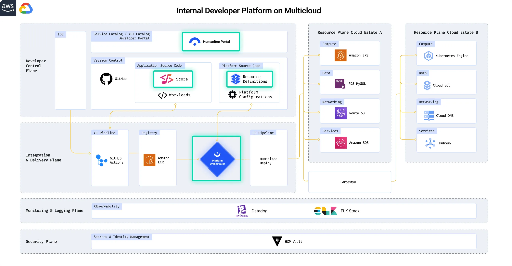

# AI Ideas

## References

- [Andrew Ng On AI Agentic Workflows And Their Potential For Driving AI Progress](https://www.youtube.com/watch?v=q1XFm21I-VQ&t=821s)
- [Vision Agent is a library that helps you utilize agent frameworks to generate code to solve your vision task. Many current vision problems can easily take hours or days to solve, you need to find the right model, figure out how to use it and program it to accomplish the task you want. Vision Agent aims to provide an in-seconds experience by allowing users to describe their problem in text and have the agent framework generate code to solve the task for them. Check out our discord for updates and roadmaps!
](https://github.com/landing-ai/vision-agent)

- [Reference architectures for Internal Developer Platforms](https://humanitec.com/reference-architectures)

