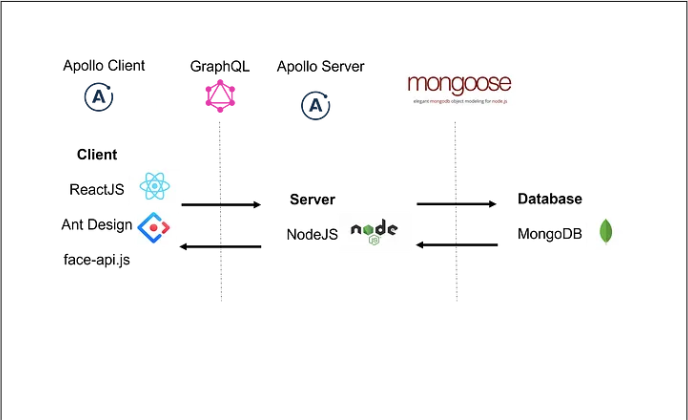
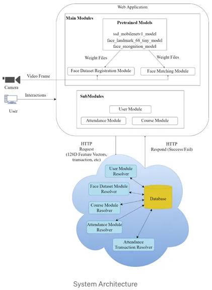
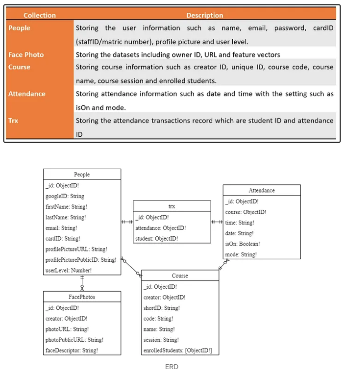

# Face Recognition

## References

- [DeepFace: A Library for Face Recognition and Facial Analysis](https://medium.com/@byte-explorer/deepface-a-library-for-face-recognition-and-facial-analysis-144222eb60bc)

- [Part I: Implement a Face Recognition Attendance System with face-api.js](https://medium.com/analytics-vidhya/implement-a-face-recognition-attendance-system-with-face-api-js-part-i-2d16f32cfe47)

- [Part II: Implement a Face Recognition Attendance System with face-api.js](https://medium.com/analytics-vidhya/implement-a-face-recognition-attendance-system-with-face-api-js-part-ii-4854639ee4c7)

- [Part III: Implement a Face Recognition Attendance System with face-api.js](https://medium.com/analytics-vidhya/implement-a-face-recognition-attendance-system-with-face-api-js-part-iii-4ed3ffc49479)

- [Part IV: Serverless Deployment with Netlify Lambda (ReactJS FE + GraphQL BE)](https://medium.com/@cheahwen1997/implement-a-face-recognition-attendance-system-with-face-api-js-946a1615236d)


- [Part V: Kubernetes Deployment with Minikube For A Full Stack Application (React + NodeJS + GraphQL)](https://medium.com/@cheahwen1997/part-v-kubernetes-deployment-with-minikube-for-a-full-stack-application-react-nodejs-82406b325b50)

## Architecture

### Tech Stack


The overview architecture is the client-server and linked to the MongoDB. 
* The client side will carry out all the procedure of face recognition such as face detection, facial landmark detection, feature extraction and feature matching. 
* The extracted feature is sent over to the server and stored into the database. 
* During the matching process, all the feature vectors are fetched accordingly to match with the detected feature vectors.

### System Design Overview

Design for the education institution/college/university. In the attendance system, there are 2 user roles which are lecturer and student. 
* The lecturer can:
   * add course, 
   * view course info, 
   * create the attendance, 
   * change the attendance system, 
   * join the attendance room (Face Matching occurs) and 
   * view attendance report. 
* The student can:
   * enrol course, 
   * view course info, 
   * upload face image (Face Registration occurs) , 
   * join attendance room and
   * view attendance report.


### Basic Requirements

1. Attendance Form
2. Attendance Transaction with Timestamp Display (Record earliest timestamp)
3. Activate/Deactivation of Attendance Transaction
4. Attendance Report

### System Architecture

The system is a client-server architecture which contains several modules such as face registration module, face matching module, user module, attendance module and course module. Each module is backed by the resolver in the server to handle the respective GraphQL request query.



### Database Design

There is a total of 5 collections, namely “People”, “Face Photo”, “Course”, “Attendance” and “Trx”.



## Setup

### Dockerfile

    docker buildx create --use
    docker buildx build --platform linux/amd64,linux/arm64 -f Dockerfile -t donb4iu/attendlytical-client --push .

    
    
**run in attendlytical repo @ /Users/donbuddenbaum/Documents/rPi4/Attendlytical/client**


#### #( 06/13/24@ 3:54PM )( donbuddenbaum@donbs-imac ):~/Documents/rPi4/Attendlytical/client@main✗✗✗
   
   docker buildx create --use

    gifted_burnell

#### #( 06/13/24@ 3:55PM )( donbuddenbaum@donbs-imac ):~/Documents/rPi4/Attendlytical/client@main✗✗✗
   
   docker buildx build --platform linux/amd64,linux/arm64 -f Dockerfile -t donb4iu/attendlytical-client --push .

```
[+] Building 1017.6s (21/21) FINISHED                                                                                                               docker-container:gifted_burnell
 => [internal] booting buildkit                                                                                                                                                4.1s
 => => pulling image moby/buildkit:buildx-stable-1                                                                                                                             1.6s
 => => creating container buildx_buildkit_gifted_burnell0                                                                                                                      2.5s
 => [internal] load build definition from Dockerfile                                                                                                                           0.1s
 => => transferring dockerfile: 334B                                                                                                                                           0.0s
 => [linux/arm64 internal] load metadata for docker.io/library/node:16-alpine                                                                                                  2.3s
 => [linux/amd64 internal] load metadata for docker.io/library/node:16-alpine                                                                                                  2.2s
 => [auth] library/node:pull token for registry-1.docker.io                                                                                                                    0.0s
 => [internal] load .dockerignore                                                                                                                                              0.1s
 => => transferring context: 96B                                                                                                                                               0.0s
 => [linux/amd64 1/6] FROM docker.io/library/node:16-alpine@sha256:a1f9d027912b58a7c75be7716c97cfbc6d3099f3a97ed84aa490be9dee20e787                                            7.9s
 => => resolve docker.io/library/node:16-alpine@sha256:a1f9d027912b58a7c75be7716c97cfbc6d3099f3a97ed84aa490be9dee20e787                                                        0.0s
 => => sha256:d9059661ce70092af66d2773666584fc8addcb78a2be63f720022f4875577ea9 452B / 452B                                                                                     0.3s
 => => sha256:eee371b9ce3ffdbb8aa703b9a14d318801ddc3468f096bb6cfeabbeb715147f9 36.63MB / 36.63MB                                                                               4.1s
 => => sha256:7264a8db6415046d36d16ba98b79778e18accee6ffa71850405994cffa9be7de 3.40MB / 3.40MB                                                                                 1.7s
 => => sha256:93b3025fe10392717d06ec0d012a9ffa2039d766a322aac899c6831dd93382c2 2.34MB / 2.34MB                                                                                 0.7s
 => => extracting sha256:7264a8db6415046d36d16ba98b79778e18accee6ffa71850405994cffa9be7de                                                                                      0.5s
 => => extracting sha256:eee371b9ce3ffdbb8aa703b9a14d318801ddc3468f096bb6cfeabbeb715147f9                                                                                      2.8s
 => => extracting sha256:93b3025fe10392717d06ec0d012a9ffa2039d766a322aac899c6831dd93382c2                                                                                      0.1s
 => => extracting sha256:d9059661ce70092af66d2773666584fc8addcb78a2be63f720022f4875577ea9                                                                                      0.0s
 => [linux/arm64 1/6] FROM docker.io/library/node:16-alpine@sha256:a1f9d027912b58a7c75be7716c97cfbc6d3099f3a97ed84aa490be9dee20e787                                           27.0s
 => => resolve docker.io/library/node:16-alpine@sha256:a1f9d027912b58a7c75be7716c97cfbc6d3099f3a97ed84aa490be9dee20e787                                                        0.0s
 => => sha256:6574fa54520867ff3b1634aa74c4749441c37892c2ee032cf292b798e4ee6770 448B / 448B                                                                                     0.2s
 => => sha256:9d78f986cf6a87dbf98f64d646b5cfe3df77e1ce63b3097dd49a2ce2ac83d092 2.34MB / 2.34MB                                                                                 0.4s
 => => sha256:ec2c8699950ec39d29e23b3e0880c1ceb06f9f62a698385f880207e6f600df29 36.45MB / 36.45MB                                                                              22.6s
 => => sha256:9fda8d8052c61740409c4bea888859c141fd8cc3f58ac61943144ff6d1681b2d 3.33MB / 3.33MB                                                                                 0.9s
 => => extracting sha256:9fda8d8052c61740409c4bea888859c141fd8cc3f58ac61943144ff6d1681b2d                                                                                      0.4s
 => => extracting sha256:ec2c8699950ec39d29e23b3e0880c1ceb06f9f62a698385f880207e6f600df29                                                                                      3.5s
 => => extracting sha256:9d78f986cf6a87dbf98f64d646b5cfe3df77e1ce63b3097dd49a2ce2ac83d092                                                                                      0.3s
 => => extracting sha256:6574fa54520867ff3b1634aa74c4749441c37892c2ee032cf292b798e4ee6770                                                                                      0.0s
 => [internal] load build context                                                                                                                                              1.0s
 => => transferring context: 15.16MB                                                                                                                                           0.9s
 => [linux/amd64 2/6] RUN mkdir -p /home/node/app/node_modules && chown -R node:node /home/node/app                                                                            0.7s
 => [linux/amd64 3/6] WORKDIR /home/node/app                                                                                                                                   0.0s
 => [linux/amd64 4/6] COPY --chown=node:node package*.json ./                                                                                                                  0.1s
 => [linux/amd64 5/6] RUN npm install --legacy-peer-deps                                                                                                                     127.8s
 => [linux/arm64 2/6] RUN mkdir -p /home/node/app/node_modules && chown -R node:node /home/node/app                                                                            0.8s
 => [linux/arm64 3/6] WORKDIR /home/node/app                                                                                                                                   0.1s
 => [linux/arm64 4/6] COPY --chown=node:node package*.json ./                                                                                                                  0.1s
 => [linux/arm64 5/6] RUN npm install --legacy-peer-deps                                                                                                                     798.2s
 => [linux/amd64 6/6] COPY --chown=node:node . .                                                                                                                               1.7s
 => [linux/arm64 6/6] COPY --chown=node:node . .                                                                                                                               1.4s
 => exporting to image                                                                                                                                                       182.3s
 => => exporting layers                                                                                                                                                       34.2s
 => => exporting manifest sha256:324880f43e043e01c26d00d158da59a9c08cf16a7531668f183dee7a85e25b53                                                                              0.0s
 => => exporting config sha256:602412009279d60a71b681564de96024d6d11d28e9989678957f9e1a9557f9ef                                                                                0.0s
 => => exporting attestation manifest sha256:5bad34d7fb101e2c4eb0966a67d4c07f9a51b480327230284cf22774ffc3ad7c                                                                  0.0s
 => => exporting manifest sha256:6496728cec4c0d2ee0d322395c47087ed74af2b84aec379d7518283d72f358b9                                                                              0.0s
 => => exporting config sha256:351e41c848794aa33d17b3554b14deed6fe6547a5e5880f38cb0fb7ad9f92656                                                                                0.0s
 => => exporting attestation manifest sha256:a475ced0e9e35d0914d6b799a7b2d90aa58b5ab197be24abc20b8c9bd1842a97                                                                  0.0s
 => => exporting manifest list sha256:24a427f16e9c1cdfee89f19da16125fbbe057dc42e50b6006928cef02d23fb9d                                                                         0.0s
 => => pushing layers                                                                                                                                                        146.6s
 => => pushing manifest for docker.io/donb4iu/attendlytical-client:latest@sha256:24a427f16e9c1cdfee89f19da16125fbbe057dc42e50b6006928cef02d23fb9d                              1.3s
 => [auth] donb4iu/attendlytical-client:pull,push token for registry-1.docker.io                                                                                               0.0s

Build multi-platform images faster with Docker Build Cloud: https://docs.docker.com/go/docker-build-cloud
```

### Client Deployment

#### #( 06/13/24@ 4:32PM )( donbuddenbaum@donbs-imac ):~/Documents/Kalaxy2/yaml/face_recognition/client@main✗✗✗
   kubectl apply -f ns.yaml

    namespace/attendlytical created
#### #( 06/13/24@ 4:33PM )( donbuddenbaum@donbs-imac ):~/Documents/Kalaxy2/yaml/face_recognition/client@main✗✗✗
   kubectl apply -f configmap.yaml

    configmap/client-config created
#### #( 06/13/24@ 4:33PM )( donbuddenbaum@donbs-imac ):~/Documents/Kalaxy2/yaml/face_recognition/client@main✗✗✗
   kubectl apply -f deployment.yaml


### Server Deployment

#### #( 06/14/24@11:15PM )( donbuddenbaum@donbs-imac ):~/Documents/Kalaxy2/yaml/face_recognition/server@main✗✗✗
   
kubectl apply -f mongo-config.yml

kubectl apply -f mongo-secret.yml

kubectl apply -f mongo-pvc.yml

kubectl apply -f mongo.yml

kubectl apply -f mongo-express.yml

kubectl apply -f cloudinary-secret.yml

kubectl apply -f attendlytical-server.yml


```
configmap/mongo-config created
secret/mongo-secret created
persistentvolumeclaim/mongo-data-pvc created
deployment.apps/mongo-deployment created
service/mongo-service created
deployment.apps/mongo-express-deployment created
service/mongo-express-service created
secret/cloudinary-secret created
deployment.apps/server-deployment created
service/server-service created
```
