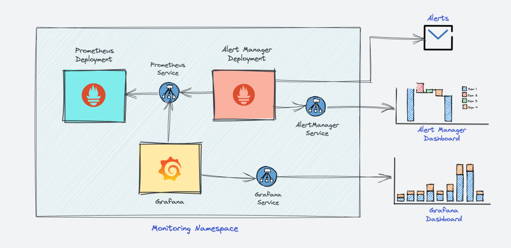

# Prometheus

## Achitecture


architecture


kubernetes architecture

## References

- [How to Setup Prometheus Monitoring On Kubernetes Cluster](https://devopscube.com/setup-prometheus-monitoring-on-kubernetes/)

- [Observability With Microk8s](https://betterprogramming.pub/observability-with-microk8s-14c1f0ff5183)

- [How to create a ServiceMonitor in Microk8s: Observability Tutorial](https://nuculabs.dev/p/how-to-create-a-servicemonitor-in-microk8s-observability-tutorial)

 - [Comprehensive Beginner’s Guide to Kube-Prometheus in Kubernetes: Monitoring, Alerts, & Integration](https://medium.com/@joudwawad/comprehensive-beginners-guide-to-kube-prometheus-in-kubernetes-monitoring-alerts-integration-4ade4fa8fa8c)

## Updating Config

### #( 08/22/24@ 5:17PM )( donbuddenbaum@donbs-imac ):~/Documents/Kalaxy2/yaml/prometheus_monitoring@main✗✗✗
   helm list --all-namespaces

```
WARNING: Kubernetes configuration file is group-readable. This is insecure. Location: /Users/donbuddenbaum/.kube/config
WARNING: Kubernetes configuration file is world-readable. This is insecure. Location: /Users/donbuddenbaum/.kube/config
NAME           	NAMESPACE             	REVISION	UPDATED                                	STATUS  	CHART                       	APP VERSION
crossplane     	crossplane-system     	1       	2024-07-17 18:33:10.697757 -0400 EDT   	deployed	crossplane-1.16.0           	1.16.0
csi-driver-nfs 	kube-system           	1       	2024-04-09 22:37:39.312209084 -0400 EDT	deployed	csi-driver-nfs-v4.6.0       	v4.6.0
gpu-operator   	gpu-operator-resources	1       	2024-08-22 13:18:13.167784687 -0400 EDT	deployed	gpu-operator-v23.9.1        	v23.9.1
kube-prom-stack	observability         	1       	2024-03-08 19:55:55.297727979 -0500 EST	deployed	kube-prometheus-stack-45.5.0	v0.63.0
loki           	observability         	1       	2024-03-08 19:56:53.469804886 -0500 EST	deployed	loki-stack-2.9.9            	v2.6.1
ollama-release 	default               	1       	2024-08-14 18:36:58.034887 -0400 EDT   	deployed	server-0.1.0                	1.1.0
tempo          	observability         	1       	2024-03-08 19:56:56.360463135 -0500 EST	deployed	tempo-1.0.0                 	2.0.0
```

### #( 08/22/24@ 5:26PM )( donbuddenbaum@donbs-imac ):~/Documents/Kalaxy2/yaml/prometheus_monitoring@main✗✗✗
   helm upgrade -f values.yaml kube-prom-stack prometheus-community/kube-prometheus-stack -n observability

```
WARNING: Kubernetes configuration file is group-readable. This is insecure. Location: /Users/donbuddenbaum/.kube/config
WARNING: Kubernetes configuration file is world-readable. This is insecure. Location: /Users/donbuddenbaum/.kube/config
W0822 17:26:59.003470    2069 warnings.go:70] unknown field "spec.automountServiceAccountToken"
W0822 17:26:59.363267    2069 warnings.go:70] unknown field "spec.automountServiceAccountToken"
W0822 17:26:59.363291    2069 warnings.go:70] unknown field "spec.scrapeConfigNamespaceSelector"
W0822 17:26:59.363296    2069 warnings.go:70] unknown field "spec.scrapeConfigSelector"
Error: UPGRADE FAILED: cannot patch "kube-prom-stack-kube-prome-kube-controller-manager" with kind Service: Service "kube-prom-stack-kube-prome-kube-controller-manager" is invalid: [spec.ipFamilyPolicy: Invalid value: "RequireDualStack": this cluster is not configured for dual-stack services, spec.ipFamilies[1]: Invalid value: "IPv6": not configured on this cluster] && cannot patch "kube-prom-stack-kube-prome-kube-scheduler" with kind Service: Service "kube-prom-stack-kube-prome-kube-scheduler" is invalid: [spec.ipFamilyPolicy: Invalid value: "RequireDualStack": this cluster is not configured for dual-stack services, spec.ipFamilies[1]: Invalid value: "IPv6": not configured on this cluster]
```
