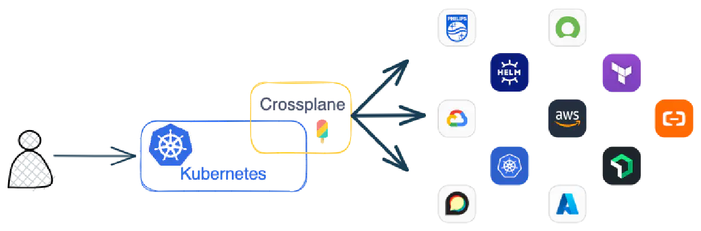

# Crossplane




## Reference

- [Crossplane Providers and Configurations for  your control plane](https://marketplace.upbound.io/)

- [Crossplane is an open source Kubernetes extension that transforms your Kubernetes cluster into a universal control plane.](https://docs.crossplane.io/latest/)

- [Introducing provider-http: Empowering Crossplane with HTTP Interactions](https://blog.crossplane.io/introducing-provider-http-empowering-crossplane-with-http-interactions/)

- [Send or schedule a Slack message](https://api.slack.com/messaging/sending)

- [Step-by-step guide to working with Crossplane and Kubernetes](https://www.techtarget.com/searchitoperations/tutorial/Step-by-step-guide-to-working-with-Crossplane-and-Kubernetes)

- [Introduction to Crossplane](https://medium.com/nerd-for-tech/introduction-to-crossplane-2f873ae0f9f3)

- [Getting Started with Crossplane: A Glimpse Into the Future | Tutorial (part 1)](https://gist.github.com/vfarcic/732bf76feb51489add89567433019460)

## Install Kubernetes

### #( 07/17/24@ 6:32PM )( donbuddenbaum@donbs-imac ):~
   helm repo add crossplane-stable https://charts.crossplane.io/stable

```
WARNING: Kubernetes configuration file is group-readable. This is insecure. Location: /Users/donbuddenbaum/.kube/config
WARNING: Kubernetes configuration file is world-readable. This is insecure. Location: /Users/donbuddenbaum/.kube/config
"crossplane-stable" has been added to your repositories
#( 07/17/24@ 6:32PM )( donbuddenbaum@donbs-imac ):~
   helm repo update

WARNING: Kubernetes configuration file is group-readable. This is insecure. Location: /Users/donbuddenbaum/.kube/config
WARNING: Kubernetes configuration file is world-readable. This is insecure. Location: /Users/donbuddenbaum/.kube/config
Hang tight while we grab the latest from your chart repositories...
...Successfully got an update from the "kubernetes-dashboard" chart repository
...Successfully got an update from the "traefik" chart repository
...Successfully got an update from the "crossplane-stable" chart repository
...Successfully got an update from the "gatekeeper" chart repository
...Successfully got an update from the "jetstack" chart repository
...Successfully got an update from the "stable" chart repository
Update Complete. ⎈Happy Helming!⎈
```

### #( 07/17/24@ 6:32PM )( donbuddenbaum@donbs-imac ):~
   helm install crossplane \
--namespace crossplane-system \
--create-namespace crossplane-stable/crossplane

```
WARNING: Kubernetes configuration file is group-readable. This is insecure. Location: /Users/donbuddenbaum/.kube/config
WARNING: Kubernetes configuration file is world-readable. This is insecure. Location: /Users/donbuddenbaum/.kube/config
NAME: crossplane
LAST DEPLOYED: Wed Jul 17 18:33:10 2024
NAMESPACE: crossplane-system
STATUS: deployed
REVISION: 1
TEST SUITE: None
NOTES:
Release: crossplane

Chart Name: crossplane
Chart Description: Crossplane is an open source Kubernetes add-on that enables platform teams to assemble infrastructure from multiple vendors, and expose higher level self-service APIs for application teams to consume.
Chart Version: 1.16.0
Chart Application Version: 1.16.0

Kube Version: v1.29.5
```

### #( 07/17/24@ 6:33PM )( donbuddenbaum@donbs-imac ):~
   kubectl get deployments -n crossplane-system

```
NAME                      READY   UP-TO-DATE   AVAILABLE   AGE
crossplane                1/1     1            1           119s
crossplane-rbac-manager   1/1     1            1           119s
```
## Install CLI

### #( 07/17/24@ 6:47PM )( donbuddenbaum@donbs-imac ):~
   curl -sL "https://raw.githubusercontent.com/crossplane/crossplane/master/install.sh" | sh

```
crossplane CLI downloaded successfully! Run the following commands to finish installing it:

sudo mv crossplane /usr/local/bin
crossplane --help

Visit https://crossplane.io to get started. 🚀
Have a nice day! 👋
```

### #( 07/17/24@ 6:52PM )( donbuddenbaum@donbs-imac ):~
   sudo mv crossplane /usr/local/bin

Password:
### #( 07/17/24@ 6:52PM )( donbuddenbaum@donbs-imac ):~
   crossplane --help

```
Usage: crossplane <command>

A command line tool for interacting with Crossplane.

Commands:
  xpkg build        Build a new package.
  xpkg install      Install a package in a control plane.
  xpkg login        Login to the default package registry.
  xpkg logout       Logout of the default package registry.
  xpkg push         Push a package to a registry.
  xpkg update       Update a package in a control plane.
  beta convert deployment-runtime
                    Convert a ControllerConfig to a DeploymentRuntimeConfig.
  beta convert pipeline-composition
                    Convert a Patch-and-Transform Composition to a Function
                    Pipeline Composition.
  beta render       Render a composite resource (XR).
  beta top          Display resource (CPU/memory) usage by Crossplane related
                    pods.
  beta trace        Trace a Crossplane resource to get a detailed output of its
                    relationships, helpful for troubleshooting.
  beta xpkg init    Initialize a new package from a template.
  beta validate     Validate Crossplane resources.
  version           Print the client and server version information for the
                    current context.

Flags:
  -h, --help       Show context-sensitive help.
      --verbose    Print verbose logging statements.

Run "crossplane <command> --help" for more information on a command.
```

### #( 07/17/24@ 6:52PM )( donbuddenbaum@donbs-imac ):~
   crossplane xpkg install provider xpkg.upbound.io/crossplane-contrib/provider-http:v0.2.0

    provider/crossplane-contrib-provider-http created

## Post Message to Slack
### #( 07/17/24@ 7:16PM )( donbuddenbaum@donbs-imac ):~
   curl -X POST -H 'Content-type: application/json' --data '{"text":"Hello World, Again!"}' https://hooks.slack.com/services/{token}