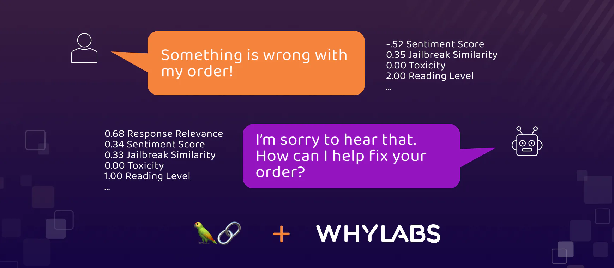
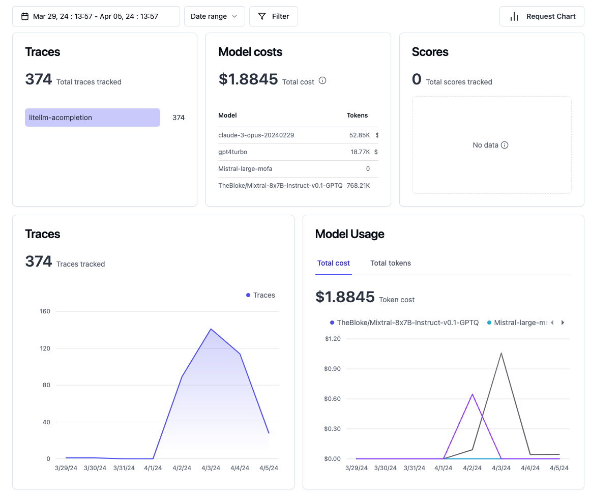
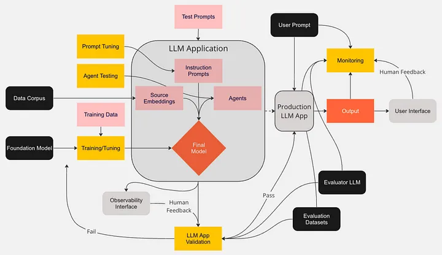

# Monitoring LLMS

## References

- [Monitoring LLM Performance with LangChain and LangKit](https://whylabs.ai/blog/posts/monitoring-llm-performance-with-langchain-and-langkit)

- [whylabs
/
langkit](https://github.com/whylabs/langkit/blob/main/langkit/examples/Langchain_OpenAI_LLM_Monitoring_with_WhyLabs.ipynb?ref=content.whylabs.ai)

- [Open Source
LLM Engineering Platform
Traces, evals, prompt management and metrics to debug and improve your LLM application.](https://langfuse.com/)

- [Monitoring with Langfuse](https://docs.openwebui.com/tutorial/langfuse)

- [LLM Monitoring and Observability — A Summary of Techniques and Approaches for Responsible AI](https://towardsdatascience.com/llm-monitoring-and-observability-c28121e75c2f)

- [Open source tool for monitoring large language models (LLMs)](https://whylabs.ai/langkit)