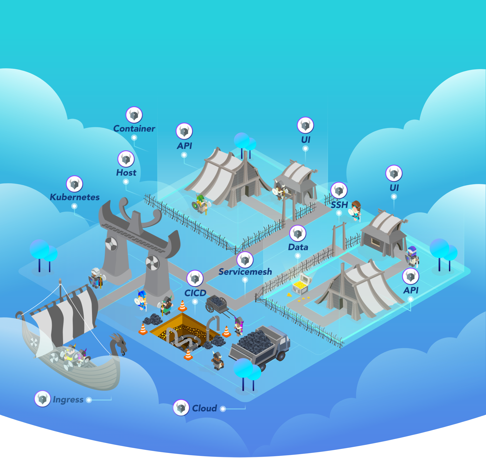
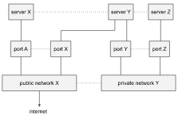
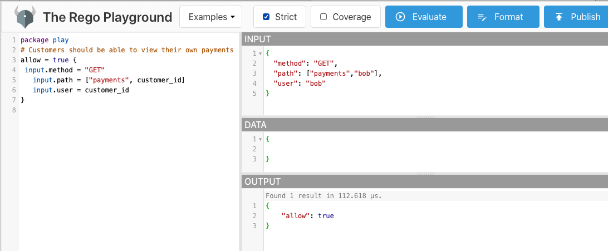

# Open Policy Agent (OPA)

## References

- [Policy-based control for cloud native environments _**Flexible, fine-grained control for administrators across the stack**_ <br/> <br/> ](https://www.openpolicyagent.org/)

- [Open Policy Introduction <br/> ](https://www.openpolicyagent.org/docs/latest/#overview)
  - [Kubernetes Overview & Architecture](https://www.openpolicyagent.org/docs/latest/kubernetes-introduction/)
  - [Policy Language](https://www.openpolicyagent.org/docs/latest/policy-language/)
  - [First look to OPA(Open Policy Agent)](https://medium.com/trendyol-tech/first-look-to-opa-open-policy-agent-3542810941c9)
  

- [Introducing Policy As Code: The Open Policy Agent (OPA)](https://medium.com/swlh/introducing-policy-as-code-the-open-policy-agent-opa-a0c2ca7f59aa)
- [Enforce Organizational Policies and Security Best Practices to your Kubernetes Clusters By Using OPA Gatekeeper](https://medium.com/trendyol-tech/enforce-organizational-policies-and-security-best-practices-to-your-kubernetes-clusters-by-using-dfc085528e07)

- [**Differences between OPA and Gatekeeper for Kubernetes Admission Control**](https://www.infracloud.io/blogs/opa-and-gatekeeper/)
 
- [Dynamic Admission Control](https://kubernetes.io/docs/reference/access-authn-authz/extensible-admission-controllers/)


## Example

- [Network Server Example <br/> ](https://www.openpolicyagent.org/docs/latest/#putting-it-together)

## Alternatives

- [Day 6 — Open Policy Agent(OPA) vs Kyverno <br/> ](https://medium.com/@devopslearning/day-6-open-policy-agent-opa-vs-kyverno-7604b5ecddd9)

## OPA Playground for Debugging

- [The Rego Playground <br/> ](https://play.openpolicyagent.org)

## Generating and Testing Constraints written in OPA Rego

- [Konstraint <br/> ](https://github.com/plexsystems/konstraint)
- [ Conftest](https://github.com/open-policy-agent/conftest)

## Installation of Gatekeeper (OPA Kubernetes Implementation)

- [How to use Gatekeeper](https://open-policy-agent.github.io/gatekeeper/website/docs/howto/)
- [open-policy-agent / gatekeeper](https://github.com/open-policy-agent/gatekeeper#installation-instructions)

### #( 12/07/22@ 6:20PM )( donbuddenbaum@donbs-imac ):~/Documents/rPi4/kalaxy@main✗✗✗

helm repo add gatekeeper https://open-policy-agent.github.io/gatekeeper/charts
helm install gatekeeper/gatekeeper --name-template=gatekeeper --namespace gatekeeper-system --create-namespace

```
WARNING: Kubernetes configuration file is group-readable. This is insecure. Location: /Users/donbuddenbaum/.kube/config
WARNING: Kubernetes configuration file is world-readable. This is insecure. Location: /Users/donbuddenbaum/.kube/config
"gatekeeper" has been added to your repositories
WARNING: Kubernetes configuration file is group-readable. This is insecure. Location: /Users/donbuddenbaum/.kube/config
WARNING: Kubernetes configuration file is world-readable. This is insecure. Location: /Users/donbuddenbaum/.kube/config
NAME: gatekeeper
LAST DEPLOYED: Wed Dec  7 18:21:02 2022
NAMESPACE: gatekeeper-system
STATUS: deployed
REVISION: 1
TEST SUITE: None
```
### #( 12/07/22@ 6:21PM )( donbuddenbaum@donbs-imac ):~/Documents/rPi4/kalaxy@main✗✗✗
kubectl create clusterrolebinding cluster-admin-binding \
--clusterrole cluster-admin \
--user dbuddenbaum

    clusterrolebinding.rbac.authorization.k8s.io/cluster-admin-binding created

### Demo Basic

#### #( 12/07/22@ 6:59PM )( donbuddenbaum@donbs-imac ):~/Documents/rPi4/gatekeeper/demo/basic@master✔
./demo.sh

```
$ kubectl apply -f sync.yaml
config.config.gatekeeper.sh/config created
$ kubectl create ns no-label
namespace/no-label created
$ cat templates/k8srequiredlabels_template.yaml
apiVersion: templates.gatekeeper.sh/v1
kind: ConstraintTemplate
metadata:
name: k8srequiredlabels
spec:
crd:
spec:
names:
kind: K8sRequiredLabels
validation:
# Schema for the `parameters` field
openAPIV3Schema:
type: object
properties:
labels:
type: array
items:
type: string
targets:
- target: admission.k8s.gatekeeper.sh
rego: |
package k8srequiredlabels

        violation[{"msg": msg, "details": {"missing_labels": missing}}] {
          provided := {label | input.review.object.metadata.labels[label]}
          required := {label | label := input.parameters.labels[_]}
          missing := required - provided
          count(missing) > 0
          msg := sprintf("you must provide labels: %v", [missing])
        }
$ kubectl apply -f templates/k8srequiredlabels_template.yaml
constrainttemplate.templates.gatekeeper.sh/k8srequiredlabels created
$ cat constraints/all_ns_must_have_gatekeeper.yaml
apiVersion: constraints.gatekeeper.sh/v1beta1
kind: K8sRequiredLabels
metadata:
name: ns-must-have-gk
spec:
match:
kinds:
- apiGroups: [""]
kinds: ["Namespace"]
parameters:
labels: ["gatekeeper"]
$ kubectl apply -f constraints/all_ns_must_have_gatekeeper.yaml
k8srequiredlabels.constraints.gatekeeper.sh/ns-must-have-gk created
$ kubectl apply -f bad/bad_ns.yaml
Error from server (Forbidden): error when creating "bad/bad_ns.yaml": admission webhook "validation.gatekeeper.sh" denied the request: [ns-must-have-gk] you must provide labels: {"gatekeeper"}
$ cat good/good_ns.yaml
apiVersion: v1
kind: Namespace
metadata:
name: good-ns
labels:
"gatekeeper": "true"
$ kubectl apply -f good/good_ns.yaml
namespace/good-ns created
$ cat templates/k8suniquelabel_template.yaml
apiVersion: templates.gatekeeper.sh/v1
kind: ConstraintTemplate
metadata:
name: k8suniquelabel
spec:
crd:
spec:
names:
kind: K8sUniqueLabel
validation:
# Schema for the `parameters` field
openAPIV3Schema:
type: object
properties:
label:
type: string
targets:
- target: admission.k8s.gatekeeper.sh
rego: |
package k8suniquelabel

        make_apiversion(kind) = apiVersion {
          g := kind.group
          v := kind.version
          g != ""
          apiVersion = sprintf("%v/%v", [g, v])
        }

        make_apiversion(kind) = apiVersion {
          kind.group == ""
          apiVersion = kind.version
        }

        identical_namespace(obj, review) {
          obj.metadata.namespace == review.namespace
          obj.metadata.name == review.name
          obj.kind == review.kind.kind
          obj.apiVersion == make_apiversion(review.kind)
        }

        identical_cluster(obj, review) {
          obj.metadata.name == review.name
          obj.kind == review.kind.kind
          obj.apiVersion == make_apiversion(review.kind)
        }

        violation[{"msg": msg, "details": {"value": val, "label": label}}] {
          label := input.parameters.label
          val := input.review.object.metadata.labels[label]
          cluster_objs := [o | o = data.inventory.cluster[_][_][_]; not identical_cluster(o, input.review)]
          ns_objs := [o | o = data.inventory.namespace[_][_][_][_]; not identical_namespace(o, input.review)]
          all_objs := array.concat(cluster_objs, ns_objs)
          all_values := {val | obj = all_objs[_]; val = obj.metadata.labels[label]}
          count({val} - all_values) == 0
          msg := sprintf("label %v has duplicate value %v", [label, val])
        }
$ kubectl apply -f templates/k8suniquelabel_template.yaml
constrainttemplate.templates.gatekeeper.sh/k8suniquelabel created
$ kubectl apply -f constraints/all_ns_gatekeeper_label_unique.yaml
k8suniquelabel.constraints.gatekeeper.sh/ns-gk-label-unique created
$ cat good/no_dupe_ns.yaml
apiVersion: v1
kind: Namespace
metadata:
name: no-dupes
labels:
"gatekeeper": "not_duplicated"
$ kubectl apply -f good/no_dupe_ns.yaml
namespace/no-dupes created
$ cat bad/no_dupe_ns_2.yaml
apiVersion: v1
kind: Namespace
metadata:
name: no-dupes-2
labels:
"gatekeeper": "not_duplicated"
$ kubectl apply -f bad/no_dupe_ns_2.yaml
Error from server (Forbidden): error when creating "bad/no_dupe_ns_2.yaml": admission webhook "validation.gatekeeper.sh" denied the request: [ns-gk-label-unique] label gatekeeper has duplicate value not_duplicated
$ kubectl get k8srequiredlabels ns-must-have-gk -o yaml
apiVersion: constraints.gatekeeper.sh/v1beta1
kind: K8sRequiredLabels
metadata:
annotations:
kubectl.kubernetes.io/last-applied-configuration: |
{"apiVersion":"constraints.gatekeeper.sh/v1beta1","kind":"K8sRequiredLabels","metadata":{"annotations":{},"name":"ns-must-have-gk"},"spec":{"match":{"kinds":[{"apiGroups":[""],"kinds":["Namespace"]}]},"parameters":{"labels":["gatekeeper"]}}}
creationTimestamp: "2022-12-08T00:02:30Z"
generation: 1
name: ns-must-have-gk
resourceVersion: "99667690"
selfLink: /apis/constraints.gatekeeper.sh/v1beta1/k8srequiredlabels/ns-must-have-gk
uid: acc63e94-da9e-46ed-bf69-10f1e44daa4d
spec:
match:
kinds:
- apiGroups:
- ""
kinds:
- Namespace
parameters:
labels:
- gatekeeper
status:
auditTimestamp: "2022-12-08T00:05:37Z"
byPod:
- constraintUID: acc63e94-da9e-46ed-bf69-10f1e44daa4d
  enforced: true
  id: gatekeeper-audit-9b7795dcf-bh2k6
  observedGeneration: 1
  operations:
    - audit
    - mutation-status
    - status
- constraintUID: acc63e94-da9e-46ed-bf69-10f1e44daa4d
  enforced: true
  id: gatekeeper-controller-manager-78b8774b7c-74hpv
  observedGeneration: 1
  operations:
    - mutation-webhook
    - webhook
- constraintUID: acc63e94-da9e-46ed-bf69-10f1e44daa4d
  enforced: true
  id: gatekeeper-controller-manager-78b8774b7c-w55kq
  observedGeneration: 1
  operations:
    - mutation-webhook
    - webhook
- constraintUID: acc63e94-da9e-46ed-bf69-10f1e44daa4d
  enforced: true
  id: gatekeeper-controller-manager-78b8774b7c-wc7m5
  observedGeneration: 1
  operations:
    - mutation-webhook
    - webhook
      totalViolations: 19
      violations:
- enforcementAction: deny
  group: ""
  kind: Namespace
  message: 'you must provide labels: {"gatekeeper"}'
  name: whoami
  version: v1
- enforcementAction: deny
  group: ""
  kind: Namespace
  message: 'you must provide labels: {"gatekeeper"}'
  name: community-grid
  version: v1
- enforcementAction: deny
  group: ""
  kind: Namespace
  message: 'you must provide labels: {"gatekeeper"}'
  name: boinc
  version: v1
- enforcementAction: deny
  group: ""
  kind: Namespace
  message: 'you must provide labels: {"gatekeeper"}'
  name: mysql
  version: v1
- enforcementAction: deny
  group: ""
  kind: Namespace
  message: 'you must provide labels: {"gatekeeper"}'
  name: kube-ops
  version: v1
- enforcementAction: deny
  group: ""
  kind: Namespace
  message: 'you must provide labels: {"gatekeeper"}'
  name: ingress-nginx
  version: v1
- enforcementAction: deny
  group: ""
  kind: Namespace
  message: 'you must provide labels: {"gatekeeper"}'
  name: traefik
  version: v1
- enforcementAction: deny
  group: ""
  kind: Namespace
  message: 'you must provide labels: {"gatekeeper"}'
  name: mysite
  version: v1
- enforcementAction: deny
  group: ""
  kind: Namespace
  message: 'you must provide labels: {"gatekeeper"}'
  name: default
  version: v1
- enforcementAction: deny
  group: ""
  kind: Namespace
  message: 'you must provide labels: {"gatekeeper"}'
  name: kube-public
  version: v1
- enforcementAction: deny
  group: ""
  kind: Namespace
  message: 'you must provide labels: {"gatekeeper"}'
  name: openebs
  version: v1
- enforcementAction: deny
  group: ""
  kind: Namespace
  message: 'you must provide labels: {"gatekeeper"}'
  name: kube-node-lease
  version: v1
- enforcementAction: deny
  group: ""
  kind: Namespace
  message: 'you must provide labels: {"gatekeeper"}'
  name: documentation
  version: v1
- enforcementAction: deny
  group: ""
  kind: Namespace
  message: 'you must provide labels: {"gatekeeper"}'
  name: devops-tools
  version: v1
- enforcementAction: deny
  group: ""
  kind: Namespace
  message: 'you must provide labels: {"gatekeeper"}'
  name: kube-system
  version: v1
- enforcementAction: deny
  group: ""
  kind: Namespace
  message: 'you must provide labels: {"gatekeeper"}'
  name: metallb-system
  version: v1
- enforcementAction: deny
  group: ""
  kind: Namespace
  message: 'you must provide labels: {"gatekeeper"}'
  name: gatekeeper-system
  version: v1
- enforcementAction: deny
  group: ""
  kind: Namespace
  message: 'you must provide labels: {"gatekeeper"}'
  name: no-label
  version: v1
- enforcementAction: deny
  group: ""
  kind: Namespace
  message: 'you must provide labels: {"gatekeeper"}'
  name: monitoring
  version: v1
  $ THE END
  k8suniquelabel.constraints.gatekeeper.sh "ns-gk-label-unique" deleted
  k8srequiredlabels.constraints.gatekeeper.sh "ns-must-have-gk" deleted
  Error from server (NotFound): error when deleting "constraints/all_ns_must_have_gatekeeper_dryrun.yaml": k8srequiredlabels.constraints.gatekeeper.sh "ns-must-have-gk-dryrun" not found
  constrainttemplate.templates.gatekeeper.sh "k8srequiredlabels" deleted
  constrainttemplate.templates.gatekeeper.sh "k8suniquelabel" deleted
  Error from server (NotFound): error when deleting "templates/k8srequiredlabels_template_external_data.yaml": constrainttemplates.templates.gatekeeper.sh "k8srequiredlabels" not found
  namespace "good-ns" deleted
  namespace "no-dupes" deleted
  namespace "no-label" deleted
  config.config.gatekeeper.sh "config" deleted
```


