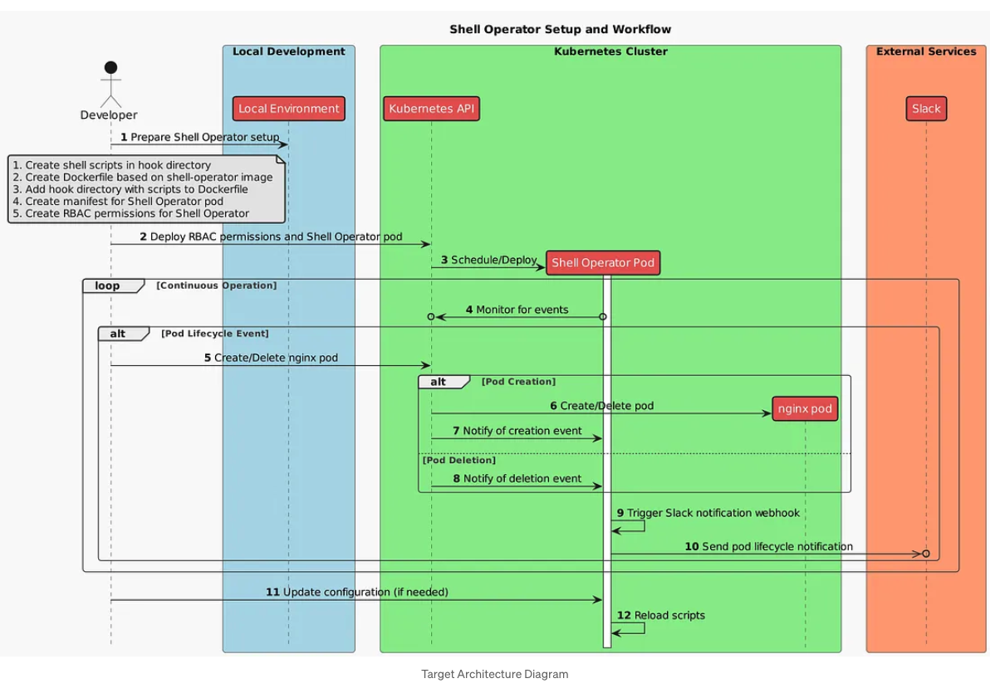

# Shell Operator



## References

- [Automate Kubernetes with Shell-Operator](https://itnext.io/automate-kubernetes-with-shell-operator-1ae5b50408ae)
- [Piotr1215/shell-operator-demo](https://github.com/Piotr1215/shell-operator-demo)
- [provider-http](https://github.com/crossplane-contrib/provider-http)


## Build Docker image for operator

    docker buildx create --use

    docker buildx build --platform linux/amd64,linux/arm64 -f yaml/shell_operator/Dockerfile -t donb4iu/shell-operator-hooks:latest --push .

### #( 07/16/24@ 7:15PM )( donbuddenbaum@donbs-imac ):~/Documents/Kalaxy2@main✗✗✗
   docker buildx create --use

    ecstatic_cray
### #( 07/16/24@ 7:16PM )( donbuddenbaum@donbs-imac ):~/Documents/Kalaxy2@main✗✗✗
   docker buildx build --platform linux/amd64,linux/arm64 -f yaml/shell_operator/Dockerfile -t donb4iu/shell-operator-hooks:latest --push .

```
[+] Building 59.4s (15/15) FINISHED                                                                                                                 docker-container:ecstatic_cray
 => [internal] booting buildkit                                                                                                                                              16.1s
 => => pulling image moby/buildkit:buildx-stable-1                                                                                                                           14.2s
 => => creating container buildx_buildkit_ecstatic_cray0                                                                                                                      1.9s
 => [internal] load build definition from Dockerfile                                                                                                                          0.1s
 => => transferring dockerfile: 152B                                                                                                                                          0.0s
 => [linux/arm64 internal] load metadata for docker.io/flant/shell-operator:latest                                                                                            1.6s
 => [linux/amd64 internal] load metadata for docker.io/flant/shell-operator:latest                                                                                            1.4s
 => [auth] flant/shell-operator:pull token for registry-1.docker.io                                                                                                           0.0s
 => [internal] load .dockerignore                                                                                                                                             0.0s
 => => transferring context: 2B                                                                                                                                               0.0s
 => [internal] load build context                                                                                                                                             0.2s
 => => transferring context: 3.55kB                                                                                                                                           0.0s
 => [linux/amd64 1/3] FROM docker.io/flant/shell-operator:latest@sha256:78badc3b889781e4b74d465936688dd9ce56211d3200409e7d9e7bdd30e81562                                      9.7s
 => => resolve docker.io/flant/shell-operator:latest@sha256:78badc3b889781e4b74d465936688dd9ce56211d3200409e7d9e7bdd30e81562                                                  0.0s
 => => sha256:8ea74afb5906ad96cd567632bb02367f0ced919ac31418429825893e7443fc6b 331.80kB / 331.80kB                                                                            0.6s
 => => sha256:fb0eb53e5ca2d71cdb1cfee432e18ba63ff058da64955976113730c1c7a72108 13.90MB / 13.90MB                                                                              4.9s
 => => sha256:dd79b5b6ba20162a1e8e8d290ce410037b8a697154bafb98f6c802b885563cbe 16.68MB / 16.68MB                                                                              3.8s
 => => sha256:82b00235610d160010c61f0c272b3e83ba7973da54f16e2be449c45d13ed5865 1.84kB / 1.84kB                                                                                0.2s
 => => sha256:ec99f8b99825a742d50fb3ce173d291378a46ab54b8ef7dd75e5654e2a296e99 3.62MB / 3.62MB                                                                                1.5s
 => => extracting sha256:ec99f8b99825a742d50fb3ce173d291378a46ab54b8ef7dd75e5654e2a296e99                                                                                     0.5s
 => => extracting sha256:dd79b5b6ba20162a1e8e8d290ce410037b8a697154bafb98f6c802b885563cbe                                                                                     1.7s
 => => extracting sha256:82b00235610d160010c61f0c272b3e83ba7973da54f16e2be449c45d13ed5865                                                                                     0.0s
 => => extracting sha256:ad658c28cd77506acfcd495fef1970e3dd5cb06be4fd12cac59d1e6c3625b122                                                                                     0.0s
 => => extracting sha256:8ea74afb5906ad96cd567632bb02367f0ced919ac31418429825893e7443fc6b                                                                                     0.1s
 => => extracting sha256:fb0eb53e5ca2d71cdb1cfee432e18ba63ff058da64955976113730c1c7a72108                                                                                     1.5s
 => [linux/arm64 1/3] FROM docker.io/flant/shell-operator:latest@sha256:78badc3b889781e4b74d465936688dd9ce56211d3200409e7d9e7bdd30e81562                                     11.3s
 => => resolve docker.io/flant/shell-operator:latest@sha256:78badc3b889781e4b74d465936688dd9ce56211d3200409e7d9e7bdd30e81562                                                  0.0s
 => => sha256:fcc14534468ff49db2060cd52eb22c5e72c771860741d4789522d54665df418e 12.58MB / 12.58MB                                                                              2.2s
 => => sha256:d7fb639546e19a61a0ea5d5e6bd4103920420820580b6ac68655045c5b5a19ba 322.29kB / 322.29kB                                                                            0.4s
 => => sha256:ad658c28cd77506acfcd495fef1970e3dd5cb06be4fd12cac59d1e6c3625b122 496B / 496B                                                                                    0.4s
 => => sha256:b4c2b5c3a7b1649e0f19c68a492de9579297a57c53cd65e1f6db06354ac6f232 1.84kB / 1.84kB                                                                                0.5s
 => => sha256:fbbcca973eda7a5b37f8c47f28a5febec30f2f44bd2768dd63dbf4820585388b 15.36MB / 15.36MB                                                                              6.0s
 => => sha256:a258b2a6b59a7aa244d8ceab095c7f8df726f27075a69fca7ad8490f3f63148a 4.09MB / 4.09MB                                                                                2.0s
 => => extracting sha256:a258b2a6b59a7aa244d8ceab095c7f8df726f27075a69fca7ad8490f3f63148a                                                                                     0.6s
 => => extracting sha256:fbbcca973eda7a5b37f8c47f28a5febec30f2f44bd2768dd63dbf4820585388b                                                                                     1.8s
 => => extracting sha256:b4c2b5c3a7b1649e0f19c68a492de9579297a57c53cd65e1f6db06354ac6f232                                                                                     0.0s
 => => extracting sha256:ad658c28cd77506acfcd495fef1970e3dd5cb06be4fd12cac59d1e6c3625b122                                                                                     0.0s
 => => extracting sha256:d7fb639546e19a61a0ea5d5e6bd4103920420820580b6ac68655045c5b5a19ba                                                                                     0.1s
 => => extracting sha256:fcc14534468ff49db2060cd52eb22c5e72c771860741d4789522d54665df418e                                                                                     2.6s
 => [linux/amd64 2/3] COPY yaml/shell_operator/documentation_operator/hooks /hooks                                                                                            1.6s
 => [linux/arm64 2/3] COPY yaml/shell_operator/documentation_operator/hooks /hooks                                                                                            0.3s
 => [linux/amd64 3/3] RUN chmod +x /hooks/*                                                                                                                                   0.4s
 => [linux/arm64 3/3] RUN chmod +x /hooks/*                                                                                                                                   0.2s
 => exporting to image                                                                                                                                                       28.1s
 => => exporting layers                                                                                                                                                       0.2s
 => => exporting manifest sha256:ccd62ec5cf91eaf0c81e4d39f29df1d7638a8c59cc5b5747982649030b51da25                                                                             0.0s
 => => exporting config sha256:6892e6523ea659a7963164e2e21234be58597b3ba10d7cb31e4e59e444750afa                                                                               0.0s
 => => exporting attestation manifest sha256:6c69e7d4b98afbdb33411dae0d5a667d929cc9286dcd96a6c6874163680e130a                                                                 0.0s
 => => exporting manifest sha256:148bbc1cc78799a189f7f8d1fdbdf20297ca6aed92c5ada22b19866b194692cd                                                                             0.0s
 => => exporting config sha256:458ba3a5ec90eed730e27c8c25fae5d96d3a06f5a359ae3e2f7aa441df986182                                                                               0.0s
 => => exporting attestation manifest sha256:542e648e1e465d0bb8dfdade89e5bdc21d18f89888880dce61032f59879ce927                                                                 0.0s
 => => exporting manifest list sha256:762a8bdf7203431411c70d6d461a5bc1b9d2fafdd32249a6af9c48ba1bdc6a77                                                                        0.0s
 => => pushing layers                                                                                                                                                        26.1s
 => => pushing manifest for docker.io/donb4iu/shell-operator-hooks:latest@sha256:762a8bdf7203431411c70d6d461a5bc1b9d2fafdd32249a6af9c48ba1bdc6a77                             1.5s
 => [auth] donb4iu/shell-operator-hooks:pull,push token for registry-1.docker.io
 ```

## Setup Operator

### #( 07/16/24@ 7:53PM )( donbuddenbaum@donbs-imac ):~/Documents/Kalaxy2@main✗✗✗
   kubectl apply -f yaml/shell_operator/documentation_operator/service-account.yaml

kubectl apply -f yaml/shell_operator/documentation_operator/cluster-role.yaml

kubectl apply -f yaml/shell_operator/documentation_operator/cluster-role-binding.yaml

kubectl apply -f yaml/shell_operator/documentation_operator/shell-operator-pod.yaml

```
serviceaccount/monitor-pods-acc created
clusterrole.rbac.authorization.k8s.io/pod-manager-clusterrole created
clusterrolebinding.rbac.authorization.k8s.io/monitor-pods-acc-clusterrolebinding created
pod/shell-operator created
```