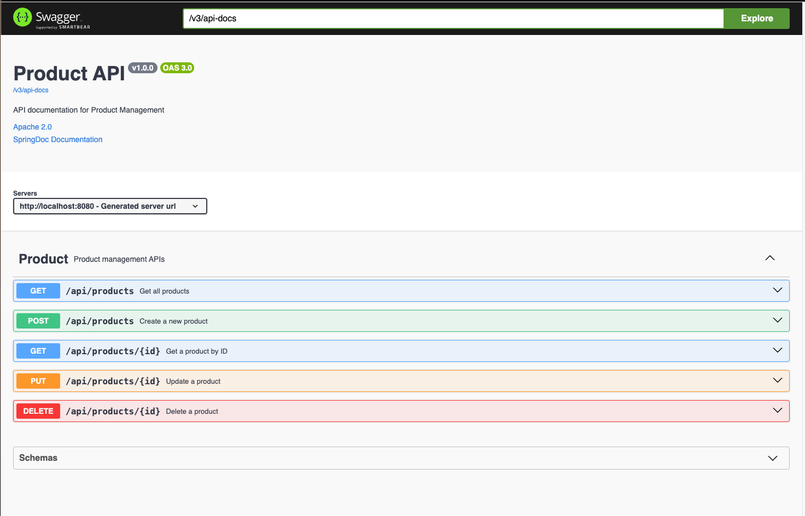

# Swagger

## References

- [Automating API Testing with Swagger: Techniques and Tools](https://reintech.io/blog/automating-api-testing-with-swagger)
- [swagger-codegen contains a template-driven engine to generate documentation, API clients and server stubs in different languages by parsing your OpenAPI / Swagger definition](https://github.com/swagger-api/swagger-codegen)
- [Generate REST Client with Swagger Codegen](https://howtodoinjava.com/swagger2/code-generation-for-rest-api/)
- [10x in Flutter development with Swagger Codegen](https://medium.com/gogox-technology/10x-in-flutter-development-with-swagger-codegen-ef758a9cbd21)
- [Jenkins CI/CD Pipeline for Swagger Generation](https://codepal.ai/cicd-pipeline-writer/query/HVCyVEE4/jenkins-cicd-pipeline)
- [How to validate OpenAPI definitions in Swagger Editor using GitHub Actions](https://swagger.io/blog/api-design/validate-openapi-definitions-swagger-editor/)
- [SwaggerHub: Centralizing API Management and Design](https://medium.com/cloud-native-daily/swaggerhub-centralizing-api-management-and-design-be10f2d992aa)

## Swagger

		<dependency>
      		<groupId>org.springdoc</groupId>
     		 <artifactId>springdoc-openapi-starter-webmvc-ui</artifactId>
     		 <version>2.6.0</version>
   		</dependency>

