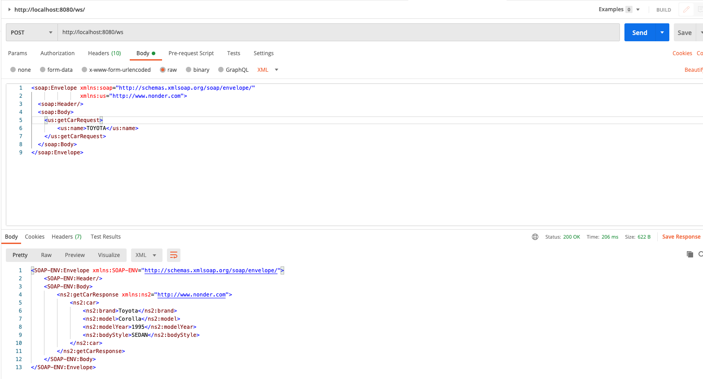
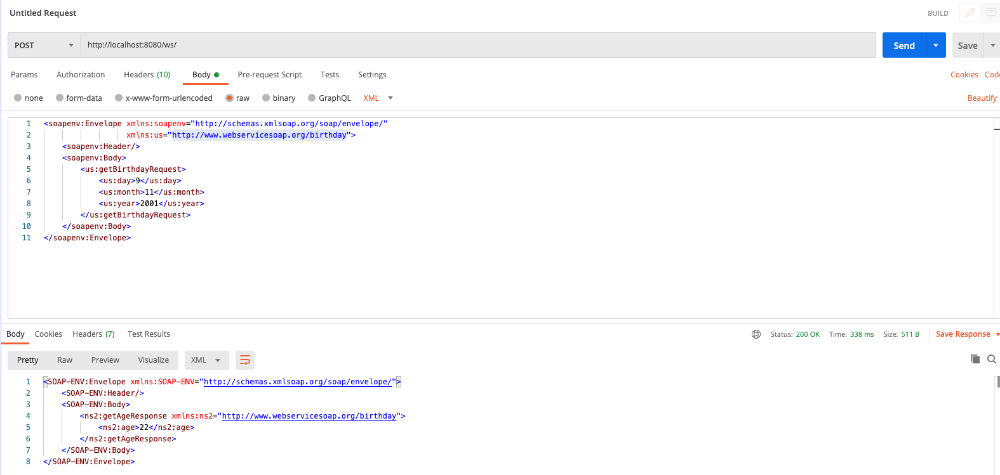
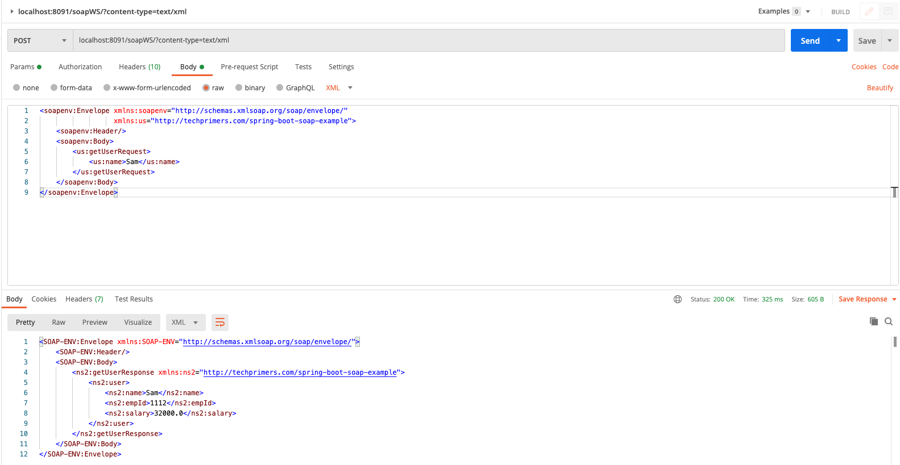

# Java Webservies

## References

- [Java 11 SOAP Service: Resolving Issues](https://medium.com/@nihatonder87/java-11-soap-service-resolving-issues-4e78d21b1aa3)
- [SOAP service implementation using Java 11: https://github.com/nihatonder/soap-service-java-11](https://github.com/nihatonder/soap-service-java-11)
- [Swagger/OpenAPI: Standard for Designing and Documenting APIs](https://medium.com/p/156aaa48876f)

## Execution

### Cars
[soap-service-java-11](https://github.com/donb4iu/soap-service-java-11) 

### Birthday
[SpringWebserviceSOAP](https://github.com/donb4iu/SpringWebserviceSOAP)

### Employee
[spring-boot-soap-example](https://github.com/donb4iu/spring-boot-soap-example)
