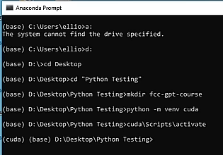

# Anaconda


## References

- [Anaconda Documentation](https://docs.anaconda.com/)

- [Create a Large Language Model from Scratch with Python – Tutorial](https://www.youtube.com/watch?v=UU1WVnMk4E8)

## Setup

### Windows
```
Run the following command when conda is activated:

conda config --set auto_activate_base false

```
### Activating Cuda support


### Unbuntu

### Activating Cuda
(base) (10/18/24@09:58:27)dbuddenbaum@amd64-01:~/Documents/multichat$ source ~/Documents/cuda/bin/activate
(cuda) (base) (10/18/24@10:03:19)dbuddenbaum@amd64-01:~/Documents/multichat$ 