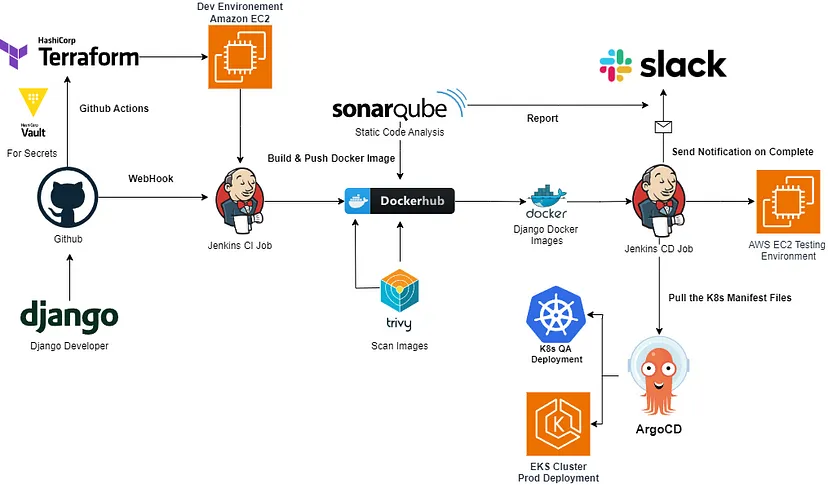

# Django CICD eCommerce Kubernetes

## References

- [Technical Guide: End-to-End CI/CD DevOps with Jenkins, Terraform, Docker, Kubernetes, SonarQube, ArgoCD, AWS EC2, EKS, and GitHub Actions (Django Deployment)](https://medium.com/django-unleashed/technical-guide-end-to-end-ci-cd-devops-with-jenkins-docker-kubernetes-argocd-github-actions-fee466fe949e#0a13)

## App Setup

### (3.12.0-venv) #( 05/28/24@ 3:59PM )( donbuddenbaum@donbs-imac ):~/Documents
   django-admin startproject django_multitenant_saas_ecommerce_kubernetes

### (3.12.0-venv) #( 05/28/24@ 4:10PM )( donbuddenbaum@donbs-imac ):~/Documents/django_multitenant_saas_ecommerce_kubernetes

   ls -la

```
total 8
drwxr-xr-x   4 donbuddenbaum  staff   128 May 28 16:06 .
drwx------@ 99 donbuddenbaum  staff  3168 May 28 16:06 ..
drwxr-xr-x   7 donbuddenbaum  staff   224 May 28 16:06 django_multitenant_saas_ecommerce_kubernetes
-rwxr-xr-x   1 donbuddenbaum  staff   700 May 28 16:06 manage.py
```

### (3.12.0-venv) #( 05/28/24@ 4:17PM )( donbuddenbaum@donbs-imac ):~/Documents/django_multitenant_saas_ecommerce_kubernetes
   python manage.py runserver

```
Watching for file changes with StatReloader
Performing system checks...

System check identified no issues (0 silenced).

You have 18 unapplied migration(s). Your project may not work properly until you apply the migrations for app(s): admin, auth, contenttypes, sessions.
Run 'python manage.py migrate' to apply them.
May 28, 2024 - 20:30:19
Django version 5.0.6, using settings 'django_multitenant_saas_ecommerce_kubernetes.settings'
Starting development server at http://127.0.0.1:8000/
Quit the server with CONTROL-C.

[28/May/2024 20:31:16] "GET / HTTP/1.1" 200 10629
Not Found: /favicon.ico
[28/May/2024 20:31:17] "GET /favicon.ico HTTP/1.1" 404 2148
```

### (3.12.0-venv) #( 05/28/24@ 4:59PM )( donbuddenbaum@donbs-imac ):~/Documents/django_multitenant_saas_ecommerce_kubernetes
   **mkdir apps/app first**

   python manage.py startapp app apps/app
   
   python manage.py startapp home apps/home