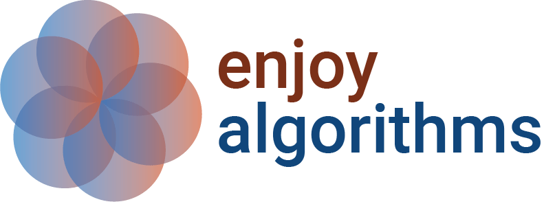

# Glossary

## A

### Easy Algorithms
- [](https://www.enjoyalgorithms.com/)

## E

### Education

- [ ](https://www.analyticsvidhya.com/blog/)

## F

### Force delete resource in Kubernetes

```
   kubectl delete job finetune-job-qvqmh --grace-period=0 --force -n vllm
```

## G

### Github
- [GitHub Actions](https://docs.github.com/en/actions)  
- [renamining master to main](https://www.git-tower.com/learn/git/faq/git-rename-master-to-main/)

## I

- [Nginx vs. Traefik: Which one you should choose?](https://medium.com/@thekubeguy/nginx-vs-traefik-which-one-you-should-choose-e6e841b56634)

## J

- [Top 8 magic commands in Jupyter Notebook](https://towardsdatascience.com/top-8-magic-commands-in-jupyter-notebook-c1582e813560)

## K
### Kaggle
- [Kaggle: The Machine Learning Community](https://www.kaggle.com/) 

### Kubernetes
- [My Top 50 Kubernetes Notes for DevOps Engineers — Detailed Q&A](https://medium.com/@thecloudarchitect/my-top-50-kubernetes-notes-for-devops-engineers-detailed-q-a-9d9c375c0076)

## 

## M

### MicroK8s
- [configuration](../setup/notes.md)
- [customization](../setup/microk8s.md)
- [installation](../setup/README.md)

## N

### Nginx
- [Nginx](#i)
- [Setup](../setup/microk8s.md)

## P    

### Papers with code

- [Portals](https://portal.paperswithcode.com/)
- [  PapersWithCode API
 v1 ](https://paperswithcode.com/api/v1/docs/)

## T

- [Traefik](#i)

## Token

### Dashboard
    kubectl -n kube-system create token <user> --duration=720h

## S

### Secrets

- [[Kubernetes] – How to create a Secret with base64 encode values? Is it safe to store confidential info?](https://dev4devs.com/2019/10/22/kubernetes-how-to-create-a-secret-with-base64-encode-values-is-it-safe-to-store-confidential-information/)