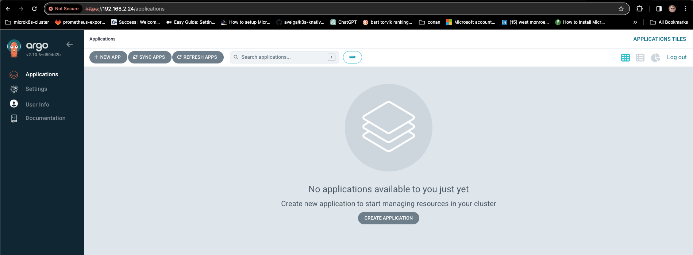

# Argo CD

## Reference

- [Addons in the Community Repository](https://microk8s.io/docs/addons)

- [Argo CD - Declarative GitOps CD for Kubernetes](https://argo-cd.readthedocs.io/en/stable/)

- [ArgoCD Example Apps](https://github.com/argoproj/argocd-example-apps)

## Source

### dbuddenbaum@amd64-03:~$ ***microk8s enable community***
```
Infer repository core for addon community

Cloning into '/var/snap/microk8s/common/addons/community'...
done.
Community repository is now enabled
```
## Setup

### #( 04/09/24@11:33PM )( donbuddenbaum@donbs-imac ):~/Documents/Kalaxy2/yaml/microk8s/nfs@main✗✗✗
   kubectl create namespace argocd
namespace/argocd created

### #( 04/09/24@11:33PM )( donbuddenbaum@donbs-imac ):~/Documents/Kalaxy2/yaml/microk8s/nfs@main✗✗✗
   kubectl apply -n argocd -f https://raw.githubusercontent.com/argoproj/argo-cd/stable/manifests/install.yaml

```
customresourcedefinition.apiextensions.k8s.io/applications.argoproj.io created
customresourcedefinition.apiextensions.k8s.io/applicationsets.argoproj.io created
customresourcedefinition.apiextensions.k8s.io/appprojects.argoproj.io created
serviceaccount/argocd-application-controller created
serviceaccount/argocd-applicationset-controller created
serviceaccount/argocd-dex-server created
serviceaccount/argocd-notifications-controller created
serviceaccount/argocd-redis created
serviceaccount/argocd-repo-server created
serviceaccount/argocd-server created
role.rbac.authorization.k8s.io/argocd-application-controller created
role.rbac.authorization.k8s.io/argocd-applicationset-controller created
role.rbac.authorization.k8s.io/argocd-dex-server created
role.rbac.authorization.k8s.io/argocd-notifications-controller created
role.rbac.authorization.k8s.io/argocd-server created
clusterrole.rbac.authorization.k8s.io/argocd-application-controller created
clusterrole.rbac.authorization.k8s.io/argocd-applicationset-controller created
clusterrole.rbac.authorization.k8s.io/argocd-server created
rolebinding.rbac.authorization.k8s.io/argocd-application-controller created
rolebinding.rbac.authorization.k8s.io/argocd-applicationset-controller created
rolebinding.rbac.authorization.k8s.io/argocd-dex-server created
rolebinding.rbac.authorization.k8s.io/argocd-notifications-controller created
rolebinding.rbac.authorization.k8s.io/argocd-server created
clusterrolebinding.rbac.authorization.k8s.io/argocd-application-controller created
clusterrolebinding.rbac.authorization.k8s.io/argocd-applicationset-controller created
clusterrolebinding.rbac.authorization.k8s.io/argocd-server created
configmap/argocd-cm created
configmap/argocd-cmd-params-cm created
configmap/argocd-gpg-keys-cm created
configmap/argocd-notifications-cm created
configmap/argocd-rbac-cm created
configmap/argocd-ssh-known-hosts-cm created
configmap/argocd-tls-certs-cm created
secret/argocd-notifications-secret created
secret/argocd-secret created
service/argocd-applicationset-controller created
service/argocd-dex-server created
service/argocd-metrics created
service/argocd-notifications-controller-metrics created
service/argocd-redis created
service/argocd-repo-server created
service/argocd-server created
service/argocd-server-metrics created
deployment.apps/argocd-applicationset-controller created
deployment.apps/argocd-dex-server created
deployment.apps/argocd-notifications-controller created
deployment.apps/argocd-redis created
deployment.apps/argocd-repo-server created
deployment.apps/argocd-server created
statefulset.apps/argocd-application-controller created
networkpolicy.networking.k8s.io/argocd-application-controller-network-policy created
networkpolicy.networking.k8s.io/argocd-applicationset-controller-network-policy created
networkpolicy.networking.k8s.io/argocd-dex-server-network-policy created
networkpolicy.networking.k8s.io/argocd-notifications-controller-network-policy created
networkpolicy.networking.k8s.io/argocd-redis-network-policy created
networkpolicy.networking.k8s.io/argocd-repo-server-network-policy created
```

### #( 04/09/24@11:37PM )( donbuddenbaum@donbs-imac ):~/Documents/Kalaxy2/yaml/microk8s/nfs@main✗✗✗
   kubectl patch svc argocd-server -n argocd -p '{"spec": {"type": "LoadBalancer"}}'
service/argocd-server patched
 
### #( 04/09/24@11:38PM )( donbuddenbaum@donbs-imac ):~/Documents/Kalaxy2/yaml/microk8s/nfs@main✗✗✗
   kubectl get services --all-namespaces

```
NAMESPACE        NAME                                                 TYPE           CLUSTER-IP       EXTERNAL-IP    PORT(S)                                                                                                                       AGE
argocd           argocd-applicationset-controller                     ClusterIP      10.152.183.100   <none>         7000/TCP,8080/TCP                                                                                                             3m
argocd           argocd-dex-server                                    ClusterIP      10.152.183.223   <none>         5556/TCP,5557/TCP,5558/TCP                                                                                                    3m
argocd           argocd-metrics                                       ClusterIP      10.152.183.60    <none>         8082/TCP                                                                                                                      3m
argocd           argocd-notifications-controller-metrics              ClusterIP      10.152.183.185   <none>         9001/TCP                                                                                                                      3m
argocd           argocd-redis                                         ClusterIP      10.152.183.241   <none>         6379/TCP                                                                                                                      3m
argocd           argocd-repo-server                                   ClusterIP      10.152.183.134   <none>         8081/TCP,8084/TCP                                                                                                             3m
argocd           argocd-server                                        LoadBalancer   10.152.183.253   192.168.2.24   80:31274/TCP,443:32169/TCP                                                                                                    3m
argocd           argocd-server-metrics                                ClusterIP      10.152.183.73    <none>         8083/TCP                                                                                                                      2m59s
default          kubernetes                                           ClusterIP      10.152.183.1     <none>         443/TCP                                                                                                                       32d
ingress          ingress                                              LoadBalancer   10.152.183.172   192.168.2.21   80:31990/TCP,443:32252/TCP                                                                                                    29d
kube-system      dashboard-metrics-scraper                            ClusterIP      10.152.183.110   <none>         8000/TCP                                                                                                                      29d
kube-system      k8s-dashboard                                        LoadBalancer   10.152.183.107   192.168.2.20   443:31584/TCP                                                                                                                 32d
kube-system      kube-dns                                             ClusterIP      10.152.183.10    <none>         53/UDP,53/TCP,9153/TCP                                                                                                        32d
kube-system      kube-prom-stack-kube-prome-coredns                   ClusterIP      None             <none>         9153/TCP                                                                                                                      32d
kube-system      kube-prom-stack-kube-prome-kube-controller-manager   ClusterIP      None             <none>         10257/TCP                                                                                                                     32d
kube-system      kube-prom-stack-kube-prome-kube-etcd                 ClusterIP      None             <none>         2381/TCP                                                                                                                      32d
kube-system      kube-prom-stack-kube-prome-kube-proxy                ClusterIP      None             <none>         10249/TCP                                                                                                                     32d
kube-system      kube-prom-stack-kube-prome-kube-scheduler            ClusterIP      None             <none>         10259/TCP                                                                                                                     32d
kube-system      kube-prom-stack-kube-prome-kubelet                   ClusterIP      None             <none>         10250/TCP,10255/TCP,4194/TCP                                                                                                  32d
kube-system      kubernetes-dashboard                                 ClusterIP      10.152.183.47    <none>         443/TCP                                                                                                                       29d
kube-system      metrics-server                                       ClusterIP      10.152.183.244   <none>         443/TCP                                                                                                                       32d
metallb-system   webhook-service                                      ClusterIP      10.152.183.40    <none>         443/TCP                                                                                                                       32d
observability    alertmanager-operated                                ClusterIP      None             <none>         9093/TCP,9094/TCP,9094/UDP                                                                                                    32d
observability    grafana-dashboard                                    LoadBalancer   10.152.183.114   192.168.2.22   80:31096/TCP                                                                                                                  29d
observability    kube-prom-stack-grafana                              ClusterIP      10.152.183.128   <none>         80/TCP                                                                                                                        32d
observability    kube-prom-stack-kube-prome-alertmanager              ClusterIP      10.152.183.138   <none>         9093/TCP                                                                                                                      32d
observability    kube-prom-stack-kube-prome-operator                  ClusterIP      10.152.183.200   <none>         443/TCP                                                                                                                       32d
observability    kube-prom-stack-kube-prome-prometheus                ClusterIP      10.152.183.69    <none>         9090/TCP                                                                                                                      32d
observability    kube-prom-stack-kube-state-metrics                   ClusterIP      10.152.183.167   <none>         8080/TCP                                                                                                                      32d
observability    kube-prom-stack-prometheus-node-exporter             ClusterIP      10.152.183.159   <none>         9100/TCP                                                                                                                      32d
observability    loki                                                 ClusterIP      10.152.183.226   <none>         3100/TCP                                                                                                                      32d
observability    loki-headless                                        ClusterIP      None             <none>         3100/TCP                                                                                                                      32d
observability    loki-memberlist                                      ClusterIP      None             <none>         7946/TCP                                                                                                                      32d
observability    prometheus-dashboard                                 LoadBalancer   10.152.183.196   192.168.2.23   80:32457/TCP                                                                                                                  29d
observability    prometheus-operated                                  ClusterIP      None             <none>         9090/TCP                                                                                                                      32d
observability    tempo                                                ClusterIP      10.152.183.59    <none>         3100/TCP,16687/TCP,16686/TCP,6831/UDP,6832/UDP,14268/TCP,14250/TCP,9411/TCP,55680/TCP,55681/TCP,4317/TCP,4318/TCP,55678/TCP   32d
```

## Login

### #( 04/09/24@11:58PM )( donbuddenbaum@donbs-imac ):~
   brew install argocd

```   
Running `brew update --auto-update`...
.
.
.
==> Downloading https://ghcr.io/v2/homebrew/core/argocd/manifests/2.10.6
####################################################################################################################################################################################################################################################### 100.0%
==> Fetching argocd
==> Downloading https://ghcr.io/v2/homebrew/core/argocd/blobs/sha256:5992447e29db9177fdf758a81633ceb432e8e116ef76b63e9df09abaa7a15cce
####################################################################################################################################################################################################################################################### 100.0%
==> Pouring argocd--2.10.6.ventura.bottle.tar.gz
==> Caveats
zsh completions have been installed to:
  /usr/local/share/zsh/site-functions
==> Summary
🍺  /usr/local/Cellar/argocd/2.10.6: 8 files, 159.3MB
==> Running `brew cleanup argocd`...
```

### #( 04/09/24@11:59PM )( donbuddenbaum@donbs-imac ):~
   argocd admin initial-password -n argocd




## Examples

