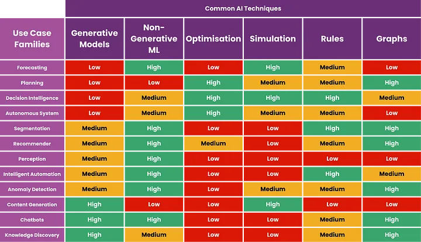

# Machine Learning

## References

- [Do Not Use LLM or Generative AI For These Use Cases](https://medium.com/towards-artificial-intelligence/do-not-use-llm-or-generative-ai-for-these-use-cases-a819ae2d9779)

- [Machine Learning Mastery: 5 ML Projects that taught me more than any degree.](https://medium.com/@yeaske/machine-learning-mastery-5-ml-projects-that-taught-me-more-than-any-degree-78baa24a2b3f)

 - [Top 10 Kaggle ML Projects to Become Data Scientists in 2024](https://medium.com/@analyticsinsightsubmissions/top-10-kaggle-ml-projects-to-become-data-scientists-in-2024-b423d2294f7c)